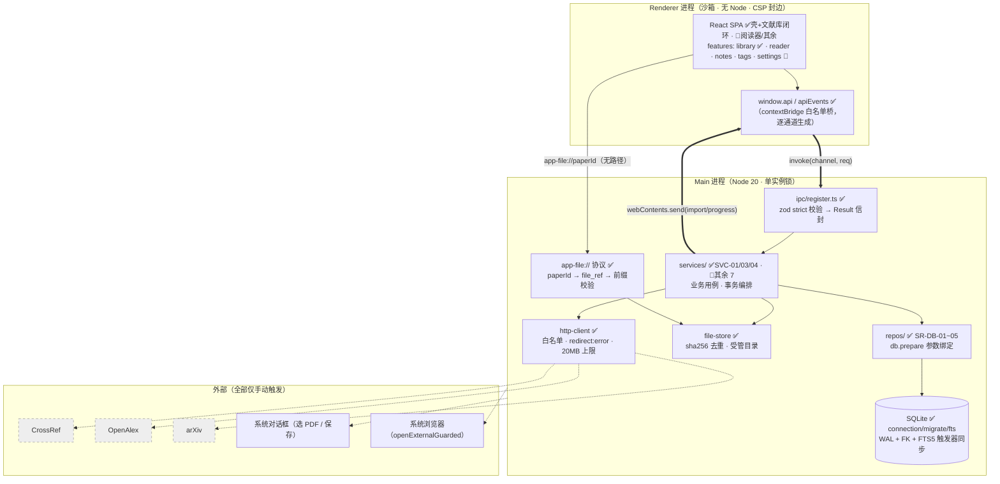
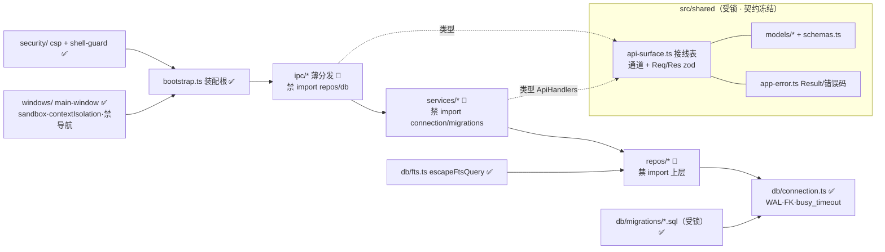
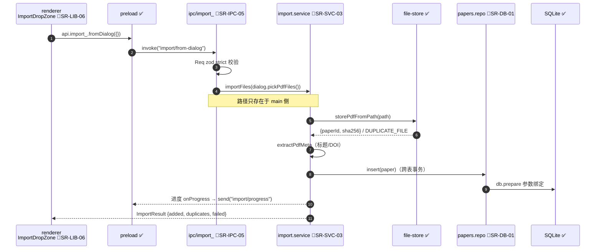
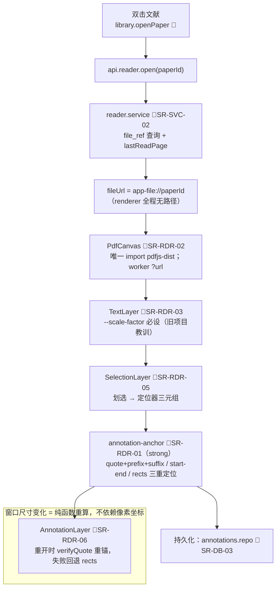
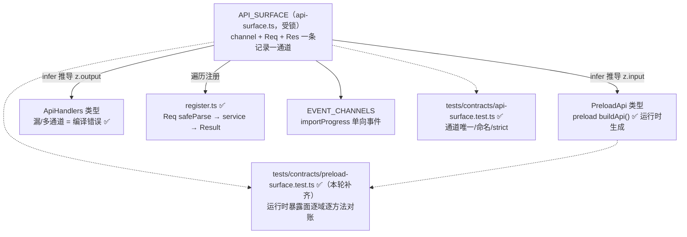
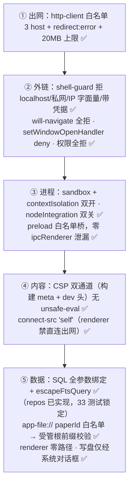
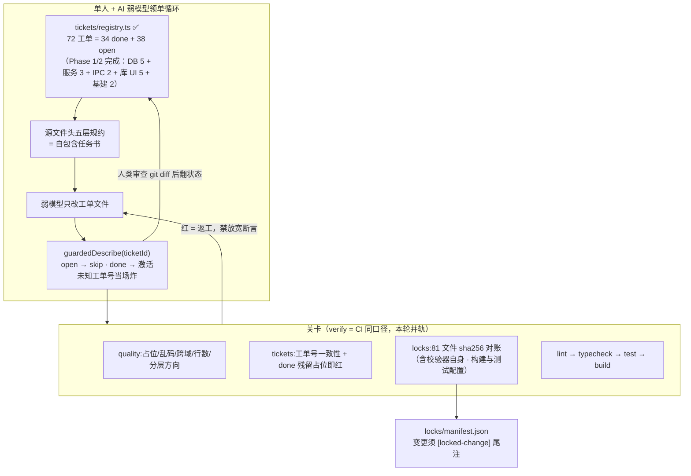
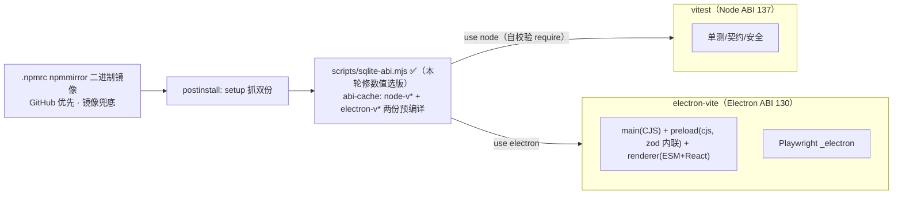

# 架构（architecture）

> 本文 ≤300 行的活文档；模块职责的正本在**每个源文件的头部规约注释**里（工单号索引）。

## 1. 进程与分层

```
Renderer (React SPA, sandbox, 无 Node)
   │ 只经 window.api（preload contextBridge 白名单）
Main (Node)
   ipc/ 薄分发 ──→ services/ 业务用例 ──→ repos/ 数据访问 ──→ db/ (SQLite)
   file-store 受管文件   app-file:// 协议   http-client（host 白名单）
shared/ = 两进程共同 import 的唯一契约（类型 + zod 同源，冻结）
```

依赖规则（ESLint + check-quality 双重强制）：
- `renderer → shared`；`renderer ↛ main/preload/electron/node`（glob 含裸目录形式）
- `main → shared`；main 内 `ipc → services → repos → db` 禁跨层：ipc 禁 import repos/db；
  services 禁 import connection/migrations 与 main/ipc；**db 禁反向 import services/ipc
  及一切上层**。方向性规则由 `check-quality.mjs` 按解析后绝对路径强制（ESLint glob
  分不清 `shared/ipc` 契约与 `main/ipc` 层）
- renderer 内 features 域之间禁止互相 import（共享下沉 `renderer/shared`），由 `check-quality.mjs` 扫描

## 2. 数据流示例（导入一篇 PDF）

1. renderer：`window.api.import_.fromDialog({})`（无任何路径）
2. main ipc/import_：`dialog.pickPdfFiles()` → `services.import_.importFiles(paths)`
3. service：`fileStore.storePdfFromPath`（sha256 去重 + 受管目录）→ `extractPdfMeta`（标题/DOI）→ `repos.papers.insert`
4. 进度：service `onProgress` → bootstrap 注入的 `webContents.send('import/progress/event')`
5. renderer 读 PDF：`api.reader.open` 返回 `app-file://<paperId>` → 协议在 main 侧查 file_ref、前缀校验后流式返回

## 3. 契约机制（防漂移的核心）

- `src/shared/ipc/api-surface.ts` 是 IPC 的**单一接线表**：通道名 + Req/Res zod schema。
- preload 按表生成桥（**CJS `.cjs` 输出**——沙箱渲染器不支持 ESM preload；zod 打进
  bundle）；`ipc/register.ts` 按表注册（zod 校验→service→Result 折叠，横切只写一次）；
  service 接口类型 `ApiHandlers` 由表推导——漏/多通道 = 编译错误。事件桥形状
  `PreloadEvents` 与全局声明 `env.d.ts` 同源，禁止两处手写。
- 所有响应 = `{ok:true,data} | {ok:false,error:{code,message}}`；`AppErrorCode` 封闭枚举。
- CSP 单真相源：策略只在 `src/main/security/csp.ts`，构建期 cspMetaPlugin 注入
  index.html meta（生产 file:// 下 meta 是实际防线），源码 html 禁止手写。
- 契约文件受锁（sha256 对账），改动需 [locked-change]。

## 4. 骨架期机制（工单填充模式）

- 每个文件头部五层规约（行为/接口/架构/生命周期/文化）= 弱模型的自包含任务书。
- 未完成实现 = `unimplementedObject(ticket)`（方法调用时抛）或 UI 占位（`data-ticket` 徽标）。
- `tickets/registry.ts` 控制测试激活：`guardedDescribe(ticketId)` 在工单 open 时 skip，
  翻 done 即激活——main 恒绿、防"不实现就翻状态"；**未知工单号当场抛错**（防整组
  测试静默消失），tests 内只允许引用真实存在的工单号。
- 三道 CI 关卡：quality（占位/乱码/跨域引用 + 行数分级 repo≤300/组件≤250 + 分层
  方向解析检查）、tickets（工单号一致性，**含 tests 目录扫描**）、locks（sha256 对账，
  行尾由 `.gitattributes` 强制 LF）。

## 5. 关键设计决策

见 `docs/adr/`：AD-1 Electron 单语言；AD-2 pdf.js 库 API 路线（含 Phase 3 决策门）；
AD-3 FTS5 触发器同步（trigram）；AD-4 工单/锁机制；AD-5 版本钉选（弱模型训练数据友好）；
AD-6 Electron 升级延期至打包门。阶段编排见 `docs/ROADMAP.md`。

## 6. 数据模型

7 张表 + 3 个 FTS5（external content + 触发器）：papers / collections / paper_collections / tags / paper_tags / annotations / notes。标注定位器采用 W3C Web Annotation 思路（quote/prefix/suffix + startOffset/endOffset + rects + sortKey）。迁移只追加（`db/migrations/`，受锁）。

## 7. 架构图纸（2026-08-21 修复轮起；状态标注：✅已实现 / 🚧占位待工单）

### 7.1 系统全景（三进程 + 外部边界）



### 7.2 主进程分层与依赖方向（违者 CI 红）



### 7.3 数据流 A：导入一篇 PDF（Phase 2 目标链路）



### 7.4 数据流 B：阅读与标注锚定（Phase 3/4 目标链路）



### 7.5 契约机制：一张接线表长出三方（防漂移核心）



### 7.6 安全边界（纵深，由外向内）



### 7.7 治理体系：工单 → 实现 → 关卡 → 状态闭环



### 7.8 构建与 ABI 双轨（Windows 环境事实）


