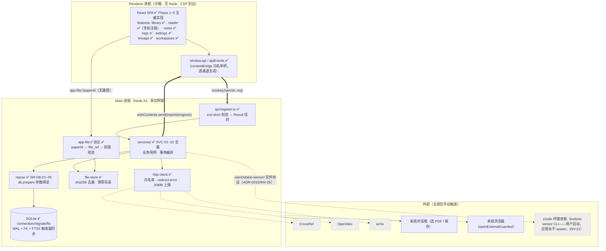
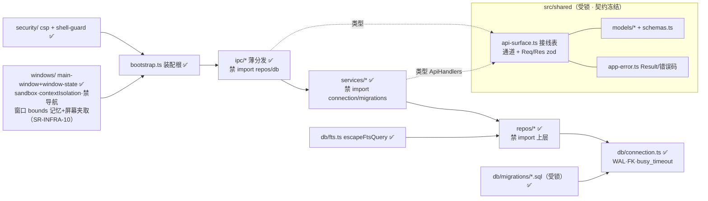
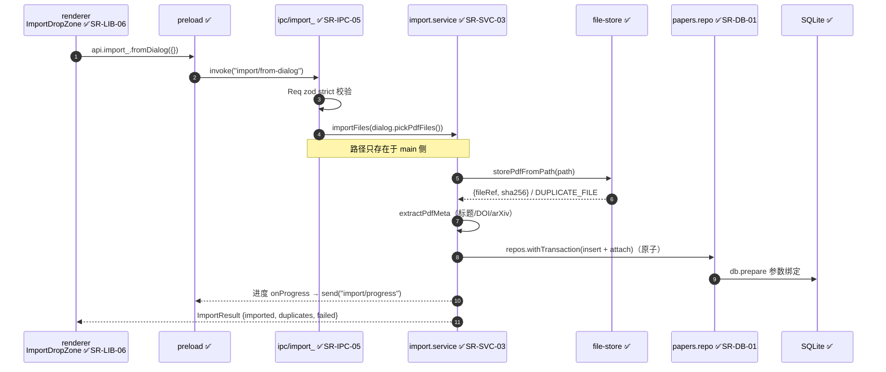
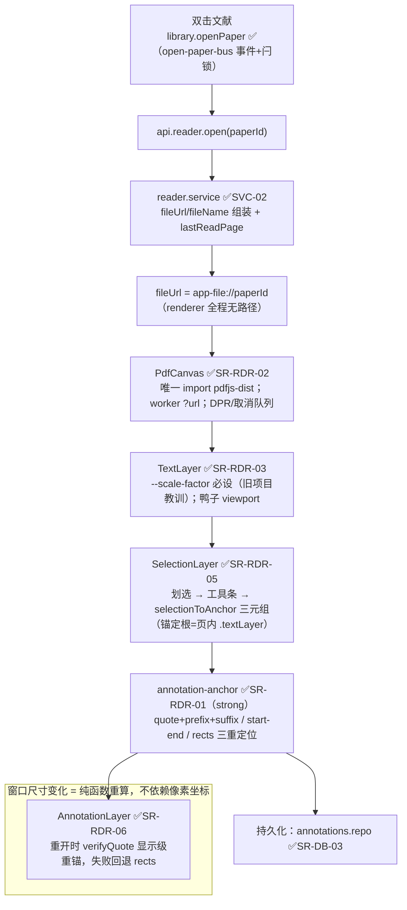
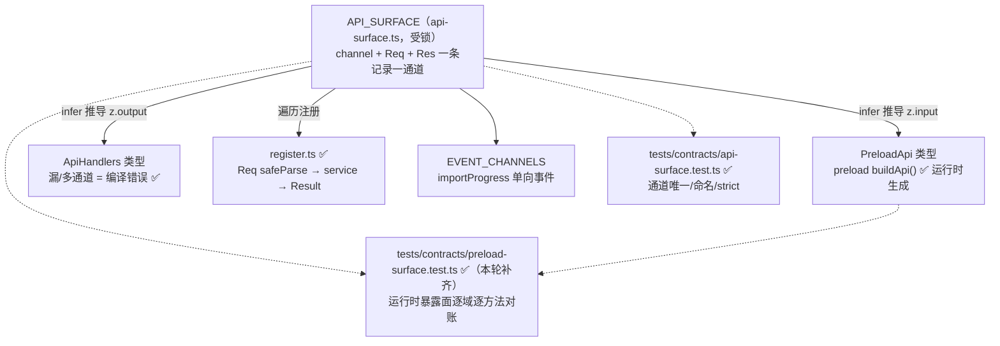
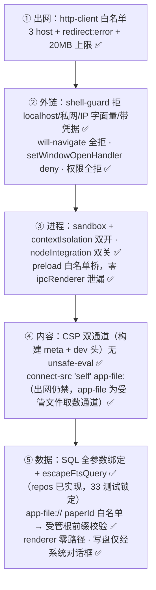
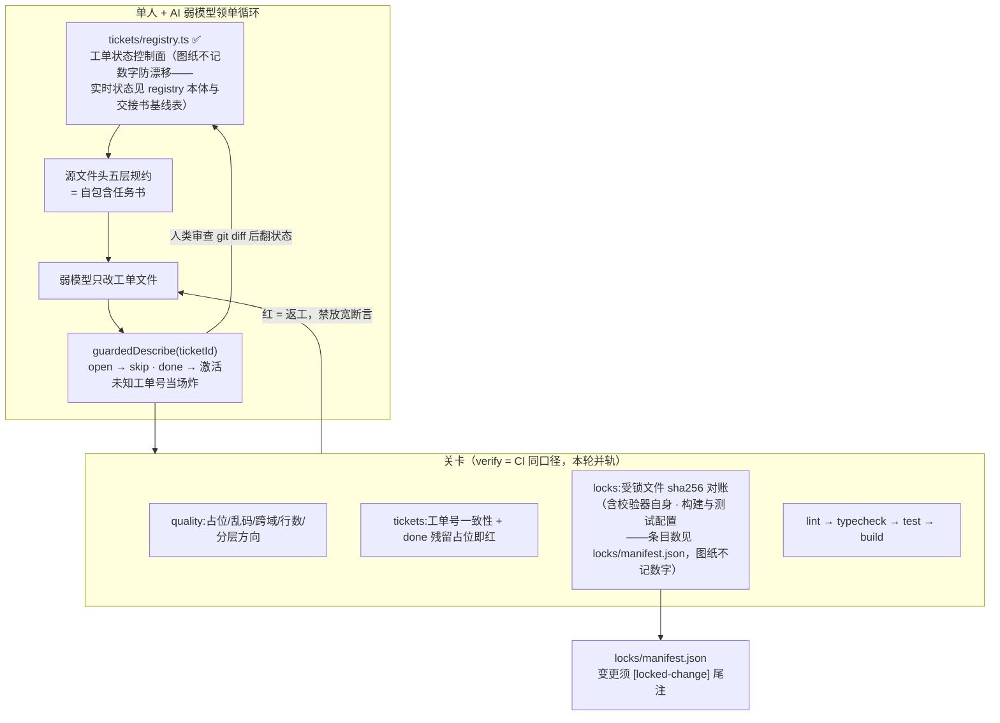

# 架构（architecture）

> 本文 ≤300 行的活文档；模块职责的正本在**每个源文件的头部规约注释**里（工单号索引）。

## 1. 进程与分层

```
Renderer (React SPA, sandbox, 无 Node)
   │ 只经 window.api（preload contextBridge 白名单）
Main (Node)
   ipc/ 薄分发 ──→ services/ 业务用例 ──→ repos/ 数据访问 ──→ db/ (SQLite)
   workspace-layout（数据目录解析）+ data-layer.container（可重建 facade——switch 热换，ADR-0018）
   file-store 受管文件   app-file:// 协议   http-client（host 白名单）
shared/ = 两进程共同 import 的唯一契约（类型 + zod 同源，冻结）
```

依赖规则（ESLint + check-quality 双重强制）：
- `renderer → shared`；`renderer ↛ main/preload/electron/node`（glob 含裸目录形式）
- `main → shared`；main 内 `ipc → services → repos → db` 禁跨层：ipc 禁 import repos/db；
  services 禁 import connection/migrations 与 main/ipc；**db 禁反向 import services/ipc
  及一切上层**。方向性规则由 `check-quality.mjs` 按解析后绝对路径强制（ESLint glob
  分不清 `shared/ipc` 契约与 `main/ipc` 层）
- renderer 内 features 域之间禁止互相 import（共享下沉 `renderer/shared`），由 `check-quality.mjs` 扫描

## 2. 数据流示例

导入全链时序图见 §7.3（进程/路径/事务/事件边界一步到位）；阅读与标注锚定链见 §7.4。

## 3. 契约机制（防漂移的核心）

- `src/shared/ipc/api-surface.ts` 是 IPC 的**单一接线表**：通道名 + Req/Res zod schema。
- preload 按表生成桥（**CJS `.cjs` 输出**——沙箱渲染器不支持 ESM preload；zod 打进
  bundle）；`ipc/register.ts` 按表注册（zod 校验→service→Result 折叠，横切只写一次）；
  service 接口类型 `ApiHandlers` 由表推导——漏/多通道 = 编译错误。事件桥形状
  `PreloadEvents` 与全局声明 `env.d.ts` 同源，禁止两处手写。
- 所有响应 = `{ok:true,data} | {ok:false,error:{code,message}}`；`AppErrorCode` 封闭枚举。
- CSP 单真相源：策略只在 `src/main/security/csp.ts`，构建期 cspMetaPlugin 注入
  index.html meta（生产 file:// 下 meta 是实际防线），源码 html 禁止手写。
- 契约文件受锁（sha256 对账），改动需 [locked-change]。
- **通道名→HTTP 路由天然映射（L2 锁线）**：api-surface 通道名「域/方法」天然映射
  `/api/域/方法`——Word/WPS 插件与服务端可共用同一命名（接线表即路由表，
  插件侧零新命名面）。

## 4. 骨架期机制（工单填充模式）

- 每个文件头部五层规约（行为/接口/架构/生命周期/文化）= 弱模型的自包含任务书。
- 未完成实现 = 占位桩（调用即抛，工单 done 即删——机制名与删除义务见 DEVELOPMENT §2）或 UI 占位（`data-ticket` 徽标）。
- `tickets/registry.ts` 控制测试激活：`guardedDescribe(ticketId)` 在工单 open 时 skip，
  翻 done 即激活——main 恒绿、防"不实现就翻状态"；**未知工单号当场抛错**（防整组
  测试静默消失），tests 内只允许引用真实存在的工单号，且 guardedDescribe 的工单号
  必须与测试文件 import 的被测文件绑定（check-tickets 第 5 关，防挂错块永久 skip）。
- 防线清单起步于三道 CI 关卡，现已成长为一组（接线单源=package.json verify 链+ci.yml）：
  - 本地 `npm run verify` 八段链：quality → test-surface（测试面指纹门，INV-63）
    → tickets → locks → lint → typecheck → test → build。
  - quality 多段：占位/乱码/跨域/行数分级 repo≤300·组件≤250/分层方向解析
    +B-1 同值双常量棘轮+B-5 AST tsx inline 色+6c C-4c CSS var() 语义锚
    +第 9 段 e2e 截图负锚（INV-64）。
  - tickets：工单号一致性/绑定对账（含 tests 目录扫描）/B4 防线（规则 6 以
    ROADMAP 退役页 `### P7-X：` 锚段集为 decidedScopes——退役页机器输入）。
  - locks：受锁文件 sha256 对账（行尾由 `.gitattributes` 强制 LF；scripts 下
    全部 .mjs/.ps1 自动入锁面）。
  - 独立本地关卡：`npm run lint:model-names`（src 禁外部模型代号词表——**未串
    verify/CI 链，收口自跑义务**，AGENTS 完成定义段）；CI 另有尾注检查
    （[dep-change]/[locked-change]）、npm audit、[test-refactor] 范围闸。

## 5. 关键设计决策（ADR 索引——决策正文=`docs/adr/`：背景/候选/裁决/后果+随件修订记录）

| 编号 | 主题 |
| --- | --- |
| 0001 | Electron 单语言（纯 TypeScript 全栈） |
| 0002 | pdf.js 库 API 路线（非 embed/自绘替换——决策门 13 断言实证） |
| 0003 | FTS5 触发器同步外部内容表（trigram） |
| 0004 | 工单注册表与受锁机制（registry+locks） |
| 0005 | 版本钉选向训练数据倾斜（弱模型适配——版本以 package.json 为单源） |
| 0006 | Electron 升级门（已执行 42.9.3——prebuild 矩阵核查先行） |
| 0007 | 已登记取舍与地雷（登记性地雷在册） |
| 0008 | notes.store 五模块级结构维持分布式状态机（不坍缩） |
| 0009 | 零依赖性质测试（固定种子手写攻击序列） |
| 0010 | **永久空号**——预留「INV-11/07 lint 化评估」，后经 F-LINT-01/CSS-03/F-LINT-04 实装，编号不复用 |
| 0011 | md 语料接口契约（导出五件套——幂等 sha 口径） |
| 0012 | 引文图数据模型（自动引文网络图维持不做——与人工策展 lineage 不复用表） |
| 0013 | 备份/恢复姿态（不做自动机制+手动指引） |
| 0014 | lineage 图数据模型（人工策展时间树——DDL 演进注记见该件） |
| 0015 | AI 笔记回灌与伴随进程文件协议（含 observe 通道追认） |
| 0016 | 闲时会话预裁决表 |
| 0017 | 三屋模式默认（IPC 通道名冻结） |
| 0018 | 课题隔离=库级分目录（workspaces/<id>/ 一库一文件仓） |
| 0019 | 划选反馈原生路线（自绘并集层，三轮修订） |
| 0020 | 应用改名与 userData 目录迁移（四分支幂等迁移） |

跨模块不变量=docs/invariants.md（「什么必须永远成立」；ADR 记「为什么」）；域结构速览见 §8。

## 6. 数据模型

11 张表 + 3 个 FTS5（external content+触发器）：papers/collections/paper_collections/
tags/paper_tags/annotations/notes（001 基座七表）+ai_notes（003）+lineage_nodes/
lineage_edges（004）+lineage_graph_meta（010——图级 KV 配置：lineTypes 线型组
JSON 串，updated_at 应用层写 ISO）；演进列 005~010（cited_by 缓存/lineage kind 列——
UNIQUE(from,to)=004 既有/lineage tags/reading_seconds 加→删反转 F-TIME-02/
lineage month+slot+sub——month CHECK 1..12、slot 窗口函数存量回填=T3-P5 脉络
数据层 v2）。标注定位器=W3C Web Annotation
思路（quote/prefix/suffix+startOffset/endOffset+rects+sortKey）。迁移只追加（受锁）。
契约面可选增量（T3-P3，2026-09-27）：paperSummarySchema +`citedByCount?`
（ENR-01 cited_by_count 缓存下探列表行——密度列表引用列，null 整键省略）；
paperDetailSchema +`lineage?: {year, month, edgeCount}`（service 层组合装配
——library.service detail 按 paper_id 查 lineage_nodes/edges 双端计数，month
恒 null=P5 落位后自新）；**T3-P5（2026-09-27）契约增量**：paperSummarySchema
+`lineage?: {year, month, catalogNo}`（list join 装配——INV-76 呈现序编号）+
paperDetail.lineage +`catalogNo`（month 真值透传——P3 时代「恒 null」已摘）+
lineage 域 kind 四值（tree/inferred/ref/manual——INV-27 修订版）+LineTypeGroup
线型组+upsertLineTypes 第 7 通道（图级整体替换）+lineage.json 第六件套导出
（INV-77）；文献库视图随 T3-P3 改密度列表（六列结构 INV-73——序号列/年月列
双源级联随 T3-P5 兑现）+316px 规格表抽屉，旧卡片网格族退役。

## 7. 架构图纸（2026-08-21 修复轮起，2026-08-22 Phase 5 收官全图转 ✅）

### 7.1 系统全景（三进程 + 外部边界）


```mermaid
flowchart TB
  subgraph R["Renderer 进程（沙箱 · 无 Node · CSP 封边）"]
    direction TB
    UI["React SPA ✅ Phase 1~5 全量实现<br/>features: library ✅ · reader ✅（含标注链） · notes ✅ · tags ✅ · settings ✅ · lineage ✅ · workspaces ✅"]
    WA["window.api / apiEvents ✅<br/>（contextBridge 白名单桥，逐通道生成）"]
    UI --> WA
  end

  subgraph M["Main 进程（Node 24 · 单实例锁）"]
    direction TB
    REG["ipc/register.ts ✅<br/>zod strict 校验 → Result 信封"]
    SVC["services/ ✅ SVC-01~10 全量<br/>业务用例 · 事务编排"]
    REPO["repos/ ✅ SR-DB-01~05<br/>db.prepare 参数绑定"]
    DB[("SQLite ✅ connection/migrate/fts<br/>WAL + FK + FTS5 触发器同步")]
    PROTO["app-file:// 协议 ✅<br/>paperId → file_ref → 前缀校验"]
    FSTORE["file-store ✅<br/>sha256 去重 · 受管目录"]
    HTTP["http-client ✅<br/>白名单 · redirect:error · 20MB 上限"]
  end

  subgraph E["外部（全部仅手动触发）"]
    CR["CrossRef"]:::ext
    OA["OpenAlex"]:::ext
    AX["arXiv"]:::ext
    DLG["系统对话框（选 PDF / 保存）"]
    BRW["系统浏览器（openExternalGuarded）"]
    ZC["zcode 伴随进程（tools/ai-sensor CLI——用户启动，应用永不 spawn，INV-21）"]:::ext
  end

  WA == "invoke(channel, req)" ==> REG
  REG --> SVC --> REPO --> DB
  SVC --> FSTORE
  SVC --> HTTP -.-> CR & OA & AX
  SVC == "webContents.send(import/progress)" ==> WA
  UI -- "app-file://paperId（无路径）" --> PROTO --> FSTORE
  M -.-> DLG & BRW
  SVC -.->|"userData/ai-sensor/ 文件协议（ADR-0015/INV-26）"| ZC
  classDef ext fill:#eee,stroke:#999,stroke-dasharray: 5 5
```

### 7.2 主进程分层与依赖方向（违者 CI 红）


```mermaid
flowchart LR
  subgraph SHARED["src/shared（受锁 · 契约冻结）"]
    SURF["api-surface.ts 接线表<br/>通道 + Req/Res zod"]
    MODELS["models/* + schemas.ts"]
    ERR["app-error.ts Result/错误码"]
  end
  IPC["ipc/* 薄分发 ✅<br/>禁 import repos/db"] --> SVC2["services/* ✅<br/>禁 import connection/migrations"]
  SVC2 --> REPO2["repos/* ✅<br/>禁 import 上层"]
  REPO2 --> CONN["db/connection.ts ✅<br/>WAL·FK·busy_timeout"]
  MIG["db/migrations/*.sql（受锁）✅"] --> CONN
  FTS["db/fts.ts escapeFtsQuery ✅"] --> REPO2
  SEC["security/ csp + shell-guard ✅"] --> BOOT["bootstrap.ts 装配根 ✅"]
  WIN["windows/ main-window+window-state ✅<br/>sandbox·contextIsolation·禁导航<br/>窗口 bounds 记忆+屏幕夹取（SR-INFRA-10）"] --> BOOT
  BOOT --> IPC
  IPC -.->|类型| SURF
  SVC2 -.->|类型 ApiHandlers| SURF
  SURF --- MODELS & ERR
```

### 7.3 数据流 A：导入一篇 PDF（Phase 2 目标链路）


```mermaid
sequenceDiagram
  autonumber
  participant UI as renderer<br/>ImportDropZone ✅SR-LIB-06
  participant P as preload ✅
  participant I as ipc/import_ ✅SR-IPC-05
  participant S as import.service ✅SR-SVC-03
  participant F as file-store ✅
  participant R as papers.repo ✅SR-DB-01
  participant D as SQLite ✅

  UI->>P: api.import_.fromDialog({})
  P->>I: invoke("import/from-dialog")
  I->>I: Req zod strict 校验
  I->>S: importFiles(dialog.pickPdfFiles())
  Note over I,S: 路径只存在于 main 侧
  S->>F: storePdfFromPath(path)
  F-->>S: {fileRef, sha256} / DUPLICATE_FILE
  S->>S: extractPdfMeta（标题/DOI/arXiv）
  S->>R: repos.withTransaction(insert + attach)（原子）
  R->>D: db.prepare 参数绑定
  S-->>P: 进度 onProgress → send("import/progress")
  S-->>UI: ImportResult {imported, duplicates, failed}
```

### 7.4 数据流 B：阅读与标注锚定（Phase 3/4 目标链路）


```mermaid
flowchart TB
  A["双击文献<br/>library.openPaper ✅（open-paper-bus 事件+闩锁）"] --> B["api.reader.open(paperId)"]
  B --> C["reader.service ✅SVC-02<br/>fileUrl/fileName 组装 + lastReadPage"]
  C --> D["fileUrl = app-file://paperId<br/>（renderer 全程无路径）"]
  D --> E["PdfCanvas ✅SR-RDR-02<br/>唯一 import pdfjs-dist；worker ?url；DPR/取消队列"]
  E --> F["TextLayer ✅SR-RDR-03<br/>--scale-factor 必设（旧项目教训）；鸭子 viewport"]
  F --> G["SelectionLayer ✅SR-RDR-05<br/>划选 → 工具条 → selectionToAnchor 三元组（锚定根=页内 .textLayer）"]
  G --> H["annotation-anchor ✅SR-RDR-01（strong）<br/>quote+prefix+suffix / start-end / rects 三重定位"]
  H --> I["AnnotationLayer ✅SR-RDR-06<br/>重开时 verifyQuote 显示级重锚，失败回退 rects"]
  H --> J["持久化：annotations.repo ✅SR-DB-03"]
  subgraph NOTE["窗口尺寸变化 = 纯函数重算，不依赖像素坐标"]
    I
  end
```

### 7.5 契约机制：一张接线表长出三方（防漂移核心）


```mermaid
flowchart TB
  SRC["API_SURFACE（api-surface.ts，受锁）<br/>channel + Req + Res 一条记录一通道"]
  SRC -->|"infer 推导 z.input"| PA["PreloadApi 类型<br/>preload buildApi() ✅ 运行时生成"]
  SRC -->|"infer 推导 z.output"| AH["ApiHandlers 类型<br/>漏/多通道 = 编译错误 ✅"]
  SRC -->|"遍历注册"| RG["register.ts ✅<br/>Req safeParse → service → Result"]
  SRC --> EV["EVENT_CHANNELS<br/>importProgress 单向事件"]
  T1["tests/contracts/api-surface.test.ts ✅<br/>通道唯一/命名/strict"]
  T2["tests/contracts/preload-surface.test.ts ✅（本轮补齐）<br/>运行时暴露面逐域逐方法对账"]
  SRC -.-> T1 & T2
  PA -.-> T2
```

### 7.6 安全边界（纵深，由外向内）


```mermaid
flowchart TB
  L1["① 出网：http-client 白名单 3 host + redirect:error + 20MB 上限 ✅"]
  L2["② 外链：shell-guard 拒 localhost/私网/IP 字面量/带凭据 ✅<br/>will-navigate 全拒 · setWindowOpenHandler deny · 权限全拒 ✅"]
  L3["③ 进程：sandbox + contextIsolation 双开 · nodeIntegration 双关 ✅<br/>preload 白名单桥，零 ipcRenderer 泄漏 ✅"]
  L4["④ 内容：CSP 双通道（构建 meta + dev 头）无 unsafe-eval ✅<br/>connect-src 'self' app-file:（出网仍禁，app-file 为受管文件取数通道）✅"]
  L5["⑤ 数据：SQL 全参数绑定 + escapeFtsQuery ✅（repos 已实现，33 测试锁定）<br/>app-file:// paperId 白名单 → 受管根前缀校验 ✅<br/>renderer 零路径 · 写盘仅经系统对话框 ✅"]
  L1 --> L2 --> L3 --> L4 --> L5
```

### 7.7 治理体系：工单 → 实现 → 关卡 → 状态闭环


```mermaid
flowchart TB
  subgraph LOOP["单人 + AI 弱模型领单循环"]
    RG2["tickets/registry.ts ✅<br/>工单状态控制面（图纸不记数字防漂移——<br/>实时状态见 registry 本体与交接书基线表）"]
    SPEC["源文件头五层规约<br/>= 自包含任务书"]
    IMPL["弱模型只改工单文件"]
    GD["guardedDescribe(ticketId)<br/>open → skip · done → 激活<br/>未知工单号当场炸"]
    RG2 --> SPEC --> IMPL --> GD
    GD -->|"人类审查 git diff 后翻状态"| RG2
  end
  subgraph GATES["关卡（verify = CI 同口径，本轮并轨）"]
    Q["quality:占位/乱码/跨域/行数/分层方向"]
    T["tickets:工单号一致性 + done 残留占位即红"]
    LK["locks:受锁文件 sha256 对账<br/>（含校验器自身 · 构建与测试配置<br/>——条目数见 locks/manifest.json，图纸不记数字）"]
    V["lint → typecheck → test → build"]
  end
  GD --> GATES
  GATES -->|"红 = 返工，禁放宽断言"| IMPL
  LK --> MANIFEST["locks/manifest.json<br/>变更须 [locked-change] 尾注"]
```

### 7.8 构建与原生绑定（Windows 环境事实）

better-sqlite3 13.0.3（N-API 版，2026-09-19 F-ELE-02）：同一份
`prebuilds/win32-x64.node` 绑定跨 Node/Electron ABI 通用（vitest=Node
ABI 137 / electron-vite=Electron ABI 149——F-ELE-03 升 44 后，双运行时
无需切换）；v12 时代
双 ABI 切换机制（scripts/sqlite-abi.mjs+abi-cache）已删除退役。完整
环境事实（Volta/Node 24 锁定/Electron 42 起无 postinstall 等）=
AGENTS.md「环境事实」单源，此处不复制。

## 8. 域结构速览（2026-09-19 F-DOCGOV-01 补档——此前三大域未上图/未成节）

### 8.1 lineage（发展脉络图）

- 渲染域 `src/renderer/features/lineage/`（第四视图：[T3-P6 起纵向「年+月」
  时间线 DOM 布局=LineageTimeline 滚动容器+104×52 小卡——RT 树布局/SVG 画布
  pan/zoom 整族退役，INV-78；T3-P7A 连线层重建=EdgeOverlay[svg.tl-edges
  子组件]+lineage-routing.ts 纯函数路由三式/四检避让降级链，INV-79；
  T3-P7B 编辑交互=useEdgeComposer 状态机（mode 单源驻 Timeline，INV-80）
  +EdgeTypePopover/EdgeNewSubForm/NewSubLauncher 线型弹层（恒四组手风琴+确定性 sub id+陈旧边自闭守卫[回炉 R2/R8]+新建线型飞行窗禁建 saveStatus saving/error 禁建[回炉 R5]）
  +LineageToolbar 换装（.lg-toolbar sticky 挂 .timeline）+store 三 action
  （applyEdgeLine/linkWithLine[inferred 产生入口落位]/saveLineTypes——
  队列 FIFO 保证 lineTypes 先于引用其的 edge 写）+同道错峰；
  TimelineYears/lineage-popover-shared 拆件=组件 250 行红线落点；
  resolveLabelEntry 随 D-P7B-7 裁撤（零生产调用死代码删除）；
  T3-P8 交互收口=useCardDrag 拖拽/改月状态机 hook（pointerdown 5px 阈值
  +drag-slot 候选槽+settle FLIP 飞行 transitionend 清场——flight
  后置目标值双 rAF：React 迁组重建节点无 before-change style，同步改值不启
  过渡）+MonthPop 改月弹层（沿 popover-shared 钳制）+store
  reorderMonthSlots/moveNodeMonth 两写 action（slot 全序透写/组变 slot
  缺省归服务端 max+1；写回填后 nodes=lineageOrder 全序——INV-75 消费面
  扩）+SidePanel 重皮肤（insp-cap/徽章行/AI 评估后置章占位）+drag-hint
  双态（INV-83：拖拽互斥/跨月拒绝/飞行脱节 dimmed 已知限制）] +侧板详情）；main 域
  `services/lineage/`（树守卫两口：
  草稿导入校验+upsertEdge 运行时）+`repos/lineage.repo`（+T3-P5 行映射拆件
  `lineage.repo.rows.ts`）+`lineage.write-guards.ts`（T3-P5 month/slot 归一+
  lineTypes 静态校验拆件）。
- [T3-P2] App 壳=grid 三行（38px 顶栏/1fr 内容行/26px 状态条，App.tsx
  `.app-shell`）+72px 窄轨（`app/Rail.tsx` 七项——课题弹层 `app/WsRailPopover.tsx`
  A10 联动+下载占位）+状态条（`app/StatusBar.tsx` 哑件，App 组合根 props 注入）；
  F-UI-03 折叠 nav/SplitPane 受控面已退役（SplitPane 本体留=阅读器侧栏消费）。
  [T3-U1] 状态条自动保存槽=App 组合根 worst-of 聚合（tabDirty[保存失败残留
  语义]∪lineage saveStatus→已保存/保存中…/保存失败三态真文本，null 无可写面
  信号槽省略；失败挂 .sig=--signal 色）注入 StatusBar；FOUC 首帧兜底链=
  bootstrap `readThemeSync`（settings.service 同步读，system→light 迁移同链）
  →main-window loadURL 拼 query/loadFile {query}→`src/renderer/public/theme-boot.js`
  同步外链脚本（CSP script-src self）首帧写 dataset.theme，App effect 仍=运行时
  单点真源（两者值一致——INV-71 扩注；载入在途窗兜底=启动注入值）。
- [T3-P4] 阅读器视图（第二视图）随主题三族化：页纸底=--paper 单源（PageBox
  页盒底+canvas 承底层双位消费——light 白桥接/dark 暗纸+canvas filter 反位
  [案 A：--canvas-filter 三族+缩略图 canvas 同规则]/sepia 奶油纸，INV-74）；
  工具栏/tab 条/侧栏节标金族消费退役换 mockup .toolbar/.tabbar 语汇
  （theme-reader.css 单源）。
- 存储=迁移 004（nodes/edges+UNIQUE(from,to)）+006（kind 列）+007（tags 列）
  +010（T3-P5 脉络数据层 v2：month/slot/sub 三列+lineage_graph_meta KV
  [lineTypes 线型组]+slot 窗口函数存量回填）；边四 kind=tree/inferred/ref/
  manual（INV-27 T3-P5 修订版——inferred 同 tree 守卫先行防退化，产生入口
  =P7 编辑器+后置 AI 域；sub=样式层引用完整性三守卫）；**排序契约=
  lineageOrder 唯一纯函数**（shared/models/lineage.ts，三消费禁双实现——
  graph 读面/lineage.json 导出/library C5 join，INV-75）；catalog_no=呈现时
  确定性计算不落库（INV-76）；自动引文网络图维持不做（ADR-0012
  共存已裁决——对象不同、不复用表；T3-P5 核对=不触发 ADR-0014 v2 DAG——
  仍树+旁挂边，四 kind 行为面收在 INV-27 修订版）。
- [T3-P5] AI 可读导出=corpus 会话第六件套 lineage.json（finalizing 阶段
  manifest 终写前落盘；装配单源 `export_/lineage.assemble.ts`——递归
  alphabetical 键序+schema_version 1，INV-77）；与 ai-sensor 域解耦边界=
  2026-09-20 survey 档 §9（lineage.json=AI 评估输入预置契约——互不吞并）。
- 视口/布局/卡尺寸单源不变量=INV-36/38/41/43/44/48（指针，正文在 INV 册；其中 36/38/41/43/44 五条消费面随 T3-P6 SVG 画布退役进入退役态注记——时间线容器结构新单源=INV-78）。

### 8.2 workspaces（课题隔离）

- ADR-0018 库级分目录：`userData/workspaces/<课题 id>/` 各含 synapse.db+files/
  （完全隔离——去重/FTS/备份天然按课题）；课题指针=userData/workspace.json。
- main 装配=`workspace-layout.ts`（数据目录解析）+`data-layer.container.ts`
  （可重建 facade：switch=关旧库→重建→热换，busy 串行守卫——INV-35 四联）。
- **legacy-fresh 双态启动**：全新首启不建 workspaces/（库在 userData 根），二启
  迁移入 workspaces/default（准确语义单源=代码头注+INV-35）。渲染域=课题弹层
  （`app/WsRailPopover.tsx`，T3-P2 起取代顶栏切换器——dirty 确认→IPC switch→
  `location.reload()` 全新 stores，联动不变量=INV-72）；list 每课题条目携
  paperCount（main 根 `workspace-layout.countPapersInDir` 依赖倒置注入——
  ADR-0018 一课题一库，逐课题库 COUNT 非单库 GROUP BY）。

### 8.3 ai-sensor（AI 伴随进程域）

- ADR-0015 文件协议：`userData/ai-sensor/`（pending 任务/status.json 心跳/
  corpus-ai 产物/archive 账本——INV-26 三联）；工具侧=`tools/ai-sensor/`
  （companion.mjs+queue.mjs+SKILL.md——**应用永不 spawn**，INV-21）。
- 服务三键终态（F-SENSOR-01）：`services/ai_sensor/` 三件 ↔ ServiceBundle 三键
  平铺（ai_sensor/ai_notes_import/zcode_link）↔ `ipc/ai_sensor.ts` 七 handler
  （3+2+2）；observe 通道（六态判定单源，SR2-AI-08）2026-09-19 追认入 ADR-0015。
- 回灌事务性=INV-67（清面+重插单篇事务）；渲染消费=笔记面板 AI 面（七问分色
  只读）+设置页 zcode 联动三档（纯 fs 检测+一键装技能）。
