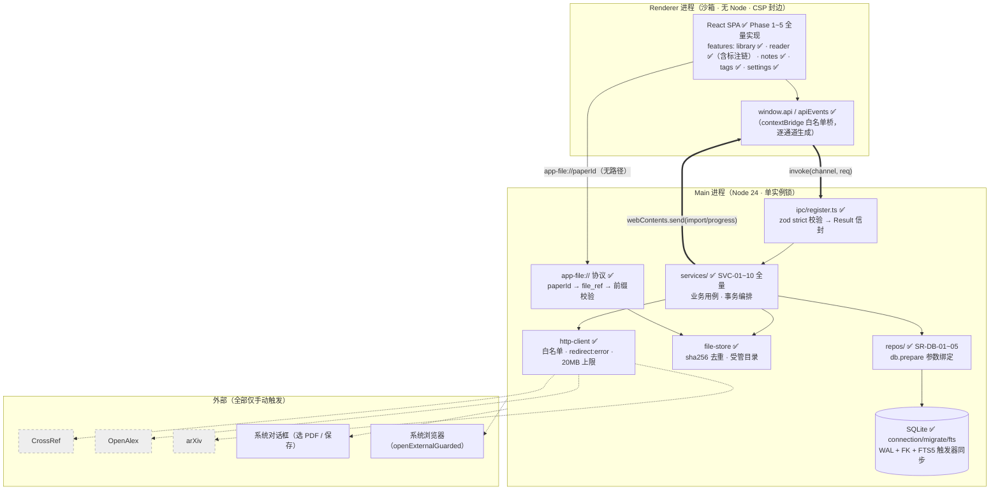
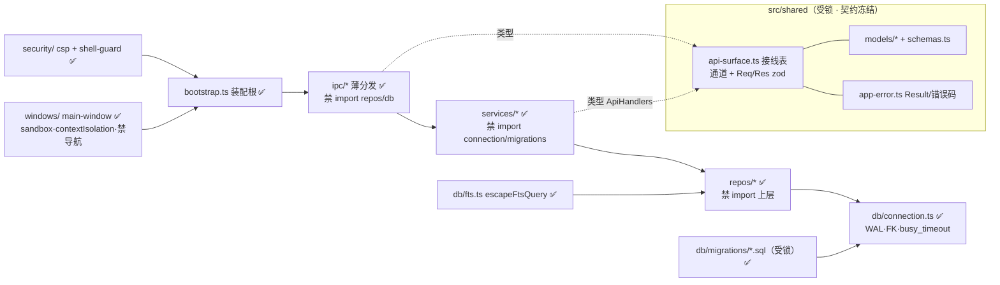
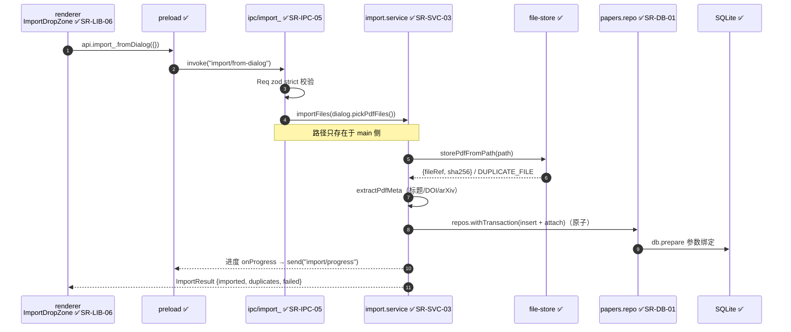
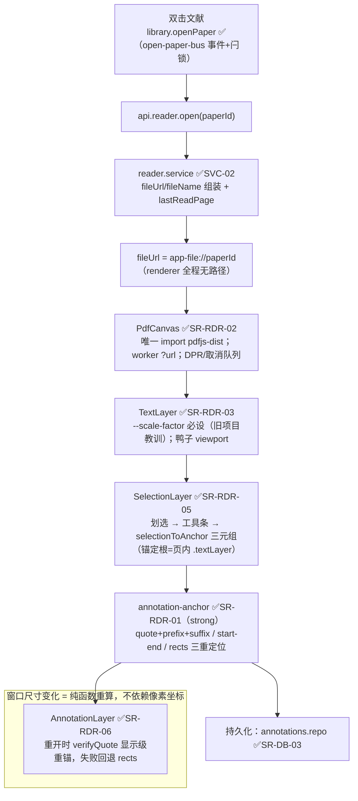
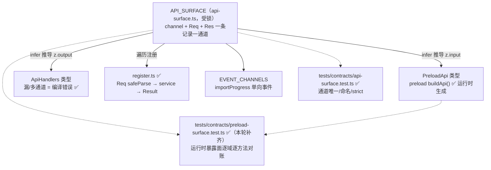
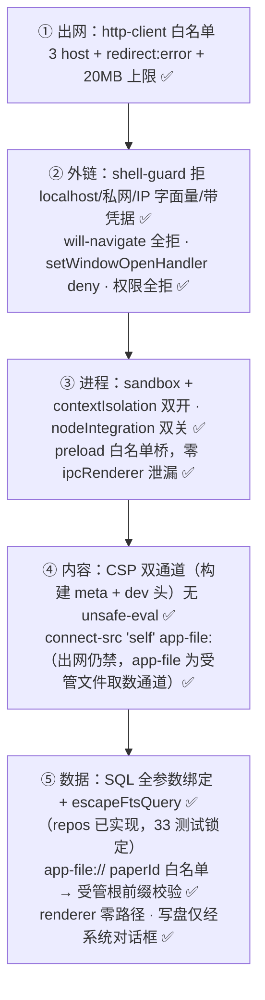
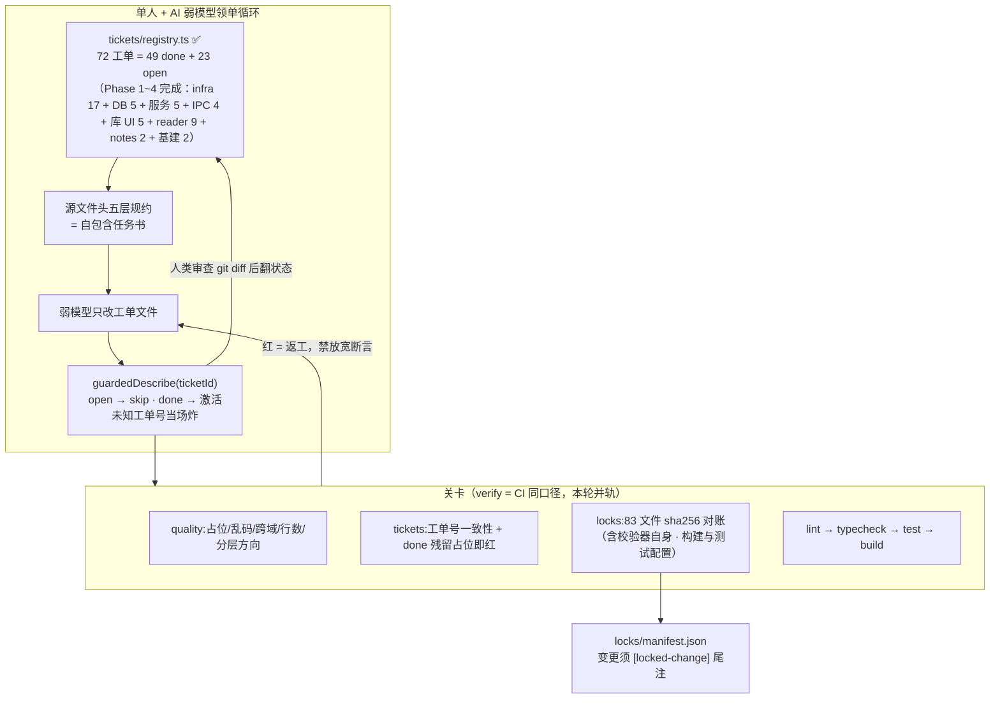
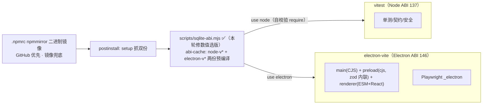

# AUDIT-C 竞态面立案——设计位任务书（Kimi K3 拟定票面）

## 0. 你的任务

你是本项目的**设计位**（第四次 Ruling 三源分工链：Kimi 拟定→deepseek 审核→
GLM 主控终裁）。任务=为 **AUDIT-C（竞态/时序面系统性排查战役）** 拟定票面
（战役设计书），供主控终裁后开批执行。

## 1. 背景

体检场（2026-09-02）终裁已定 AUDIT-C 为下场 P0-1（详见附 3 终裁书 §4）。
证据链：竞态族=**两实锤（F-ARCH1 closeOne 残留信号/LG-08 挂载时序竞态 8s
跳错 tab）+一待排（F-R3 pdfjs stream pump 竞态 pageerror）+一翻案（F-ARCH2
undo 并发，复核不成立但暴露盲区）**；机制同族=「await/事件窗口内状态被另
一方改写」的时序盲区——骨架治理（分层/lint/行数）管不到时间维度，INV 册
逐条增补本质是逐案打补丁（INV-29 增补 F-ARCH1、INV-34 增补 F-R2 等）。

## 2. 票面必答八项（产出=完整战役设计书，中文 4000~8000 字）

1. **战役定义**：AUDIT-C 的目标面一句话+不在范围的面（负面条款：与
   AUDIT-B/D/E 的边界）。
2. **排查面清点**：竞态候选面全量枚举（按模块分组：store 层异步+用户输入/
   事件订阅时序/IPC 往返窗口/文件与 DB 读写并发/pdfjs 生命周期/React 挂载
   效应序）——每面给「已实锤/已翻案/未排查」标注与证据锚（用附内材料）。
3. **方法论**：排查手法选型（静态代码链分析/注入复刻/压力序列跑/真机探针
   分段采样——本项目已有范式：受锁先红注入形态/f-l2-precheck 真机探针/
   e2e 三连跑判据）与适用条件。
4. **首波范围**（终裁已定输入）：F-R3（PdfDocProvider loadingTask 销毁与
   stream 泵竞态——扫描式连开触发 pageerror）+F-L3 排查结论（见附 4）+
   弱锚时序条目（INV-42 N6 真机未直测/INV-44 探针 waitForTimeout 脆性/
   F-ARCH4-M1 root.contains 真浏览器可达性未锚）——首波拆几张票、每张
   票的边界与依赖。
5. **分波次编排**：首波→二波→三波的内容与停点判据（预算 35-40%/场的
   LOOP 纪律约束下）。
6. **验收条款**：每张票的 DoD（含真机探针取证/注入红证/INV 登记要求——
   发现新跨模块时序不变量必须入册）。
7. **派发档位**：按 §4.5 档位表给每张票定机型（实现者/门一/门二——
   Kimi 链必保面标注）。
8. **风险与回退**：排查面过大的裁剪策略；「排查不成立（现象不可复现）」
   的处置（备案 vs 观察）。

## 3. 约束（项目宪法要点）

- 单人开发+三屋流程（实现者 TDD 红→绿→变异红证；门一 Kimi 链对抗深审；
  门二 deepseek 异构）；禁新增依赖；文件 ≤500 行（组件 ≤250）；
- 测试是锁定合约（改受锁测试走 [locked-change]+全量 verify）；
- e2e 非确定失败立案线=同用例 2 次（2026-09-02 新入册通则）；
- 明确负面清单不做（云同步/插件系统等）；排查脚本惯例=scripts/audits/
  *.mjs 探针+产物目录。

---

# 附 1：仓库现状快照与五源材料（与体检场同一包）

# 架构（architecture）

> 本文 ≤300 行的活文档；模块职责的正本在**每个源文件的头部规约注释**里（工单号索引）。

## 1. 进程与分层

```
Renderer (React SPA, sandbox, 无 Node)
   │ 只经 window.api（preload contextBridge 白名单）
Main (Node)
   ipc/ 薄分发 ──→ services/ 业务用例 ──→ repos/ 数据访问 ──→ db/ (SQLite)
   file-store 受管文件   app-file:// 协议   http-client（host 白名单）
shared/ = 两进程共同 import 的唯一契约（类型 + zod 同源，冻结）
```

依赖规则（ESLint + check-quality 双重强制）：
- `renderer → shared`；`renderer ↛ main/preload/electron/node`（glob 含裸目录形式）
- `main → shared`；main 内 `ipc → services → repos → db` 禁跨层：ipc 禁 import repos/db；
  services 禁 import connection/migrations 与 main/ipc；**db 禁反向 import services/ipc
  及一切上层**。方向性规则由 `check-quality.mjs` 按解析后绝对路径强制（ESLint glob
  分不清 `shared/ipc` 契约与 `main/ipc` 层）
- renderer 内 features 域之间禁止互相 import（共享下沉 `renderer/shared`），由 `check-quality.mjs` 扫描

## 2. 数据流示例（导入一篇 PDF）

1. renderer：`window.api.import_.fromDialog({})`（无任何路径）
2. main ipc/import_：`dialog.pickPdfFiles()` → `services.import_.importFiles(paths)`
3. service：`fileStore.storePdfFromPath`（sha256 去重 + 受管目录）→ `extractPdfMeta`（标题/DOI）→ `repos.papers.insert`
4. 进度：service `onProgress` → bootstrap 注入的 `webContents.send('import/progress/event')`
5. renderer 读 PDF：`api.reader.open` 返回 `app-file://<paperId>` → 协议在 main 侧查 file_ref、前缀校验后流式返回

## 3. 契约机制（防漂移的核心）

- `src/shared/ipc/api-surface.ts` 是 IPC 的**单一接线表**：通道名 + Req/Res zod schema。
- preload 按表生成桥（**CJS `.cjs` 输出**——沙箱渲染器不支持 ESM preload；zod 打进
  bundle）；`ipc/register.ts` 按表注册（zod 校验→service→Result 折叠，横切只写一次）；
  service 接口类型 `ApiHandlers` 由表推导——漏/多通道 = 编译错误。事件桥形状
  `PreloadEvents` 与全局声明 `env.d.ts` 同源，禁止两处手写。
- 所有响应 = `{ok:true,data} | {ok:false,error:{code,message}}`；`AppErrorCode` 封闭枚举。
- CSP 单真相源：策略只在 `src/main/security/csp.ts`，构建期 cspMetaPlugin 注入
  index.html meta（生产 file:// 下 meta 是实际防线），源码 html 禁止手写。
- 契约文件受锁（sha256 对账），改动需 [locked-change]。

## 4. 骨架期机制（工单填充模式）

- 每个文件头部五层规约（行为/接口/架构/生命周期/文化）= 弱模型的自包含任务书。
- 未完成实现 = `unimplementedObject(ticket)`（方法调用时抛）或 UI 占位（`data-ticket` 徽标）。
- `tickets/registry.ts` 控制测试激活：`guardedDescribe(ticketId)` 在工单 open 时 skip，
  翻 done 即激活——main 恒绿、防"不实现就翻状态"；**未知工单号当场抛错**（防整组
  测试静默消失），tests 内只允许引用真实存在的工单号，且 guardedDescribe 的工单号
  必须与测试文件 import 的被测文件绑定（check-tickets 第 5 关，防挂错块永久 skip）。
- 三道 CI 关卡：quality（占位/乱码/跨域引用 + 行数分级 repo≤300/组件≤250 + 分层
  方向解析检查）、tickets（工单号一致性 + 绑定对账，**含 tests 目录扫描**）、locks
  （sha256 对账，行尾由 `.gitattributes` 强制 LF）。

## 5. 关键设计决策

见 `docs/adr/`：AD-1 Electron 单语言；AD-2 pdf.js 库 API 路线（Phase 3 决策门已过：
canvas+TextLayer+选择+DPR 13 项断言全绿）；AD-3 FTS5 触发器同步（trigram）；
AD-4 工单/锁机制；AD-5 版本钉选（弱模型训练数据友好）；AD-6 Electron 升级门
（已执行：42.9.3，prebuild 矩阵核查）；AD-7 已登记取舍与地雷。阶段编排见
`docs/ROADMAP.md`。

## 6. 数据模型

7 张表 + 3 个 FTS5（external content + 触发器）：papers / collections / paper_collections / tags / paper_tags / annotations / notes。标注定位器采用 W3C Web Annotation 思路（quote/prefix/suffix + startOffset/endOffset + rects + sortKey）。迁移只追加（`db/migrations/`，受锁）。

## 7. 架构图纸（2026-08-21 修复轮起，2026-08-22 Phase 5 收官全图转 ✅）

### 7.1 系统全景（三进程 + 外部边界）



### 7.2 主进程分层与依赖方向（违者 CI 红）



### 7.3 数据流 A：导入一篇 PDF（Phase 2 目标链路）



### 7.4 数据流 B：阅读与标注锚定（Phase 3/4 目标链路）



### 7.5 契约机制：一张接线表长出三方（防漂移核心）



### 7.6 安全边界（纵深，由外向内）



### 7.7 治理体系：工单 → 实现 → 关卡 → 状态闭环



### 7.8 构建与 ABI 双轨（Windows 环境事实）




## 材料 B——不变量登记册（当前版，含弱锚备案）

# 外壳级不变量登记册（跨模块行为的单一真相源）

> **为什么存在**：骨架/工单治理的是静态结构（代码住哪、谁依赖谁），而 2026-08-23 缺陷战役
> 证明三类欠账全部长在骨架管不到的地方——时间维度（状态/竞态）、接缝（模块之间无人
> 负责的行为）、未声明的不变量（默认假设从未写下来）。本册登记这些**没有天然归属文件的
> 行为不变量**，每条注明强制方式与锚定状态。
>
> **规则**（对应 AGENTS.md「状态与不变量纪律」）：
> 1. 新增/修改跨模块行为时必须同步本册——未登记 = 未定义行为。
> 2. 每条不变量必须给出强制方式（单测 / lint / e2e / CI / 架构评审）。
> 3. 「未锚定」= 欠账：只靠人审或纯声明，无机器防线。接手任务优先补锚。

| 编号 | 不变量 | 声明处 | 强制方式 | 状态 |
| --- | --- | --- | --- | --- |
| INV-01 | 文档永不滚：所有滚动只发生在应用内 overflow 容器（main / 阅读器滚动区） | theme.css html/body/#root overflow:hidden | e2e 计算样式断言（reader-text.spec 三层 overflow 必须全 hidden） | 已锚定（2026-08-23 UBS；取证注记：内容度量可合法超出被裁剪，几何断言形状不可用——锁的是声明形状，见 95c3f3f） |
| INV-02 | 用户触发的动作失败必须可见（toast / 内联红条），禁止静默吞错 | AGENTS 文化层；U1（内联红条）/U6（store.error+watch）两个修复模式 | 人审 + 工单模板条款（规约锚定；模板=scripts/new-ticket.ps1 文化层） | **部分**（lint 化不可行有实证：blanket 空 catch 禁令误伤三处合法尽力而为——ipc/settings.ts:52/reader.store.ts:90/import.service.ts:171，见 b774d5c；规约化已落 new-ticket.ps1 文化层） |
| INV-03 | 一切含异步 load 的 store 必须有请求序号 stale-guard（旧响应/旧失败不得覆盖新状态；跨通道乱序面见 settings 版本计数变体；异步 hook 同族见 useAsync 请求令牌——被取代调用的迟到 settle 一律丢弃，loading 只由最新请求熄灭；**per-tab 变体（2026-08-24 SR2-TABS-01）：多 tab 并发加载下守卫粒度=tab 级——迟到响应三规则：①tab 已关→丢弃 ②tab 被新一轮加载顶替→丢弃 ③tab 存在且最新→写入该 tab 自身（不得覆盖展示中的其他 tab），换 tab 不失忆**） | library/notes/tags/reader 四 store 先例（闭包 loadSeq）+ settings 版本计数（仅成功落地抬升）+ useAsync runSeq + reader.store per-tab（loadSeq 总序+tabLoadSeq 字典） | 五 store 单测锁定（notes/tags/library 既有 + reader/settings 2026-08-23 UBS 补；reader 2026-08-24 SR2-TABS-01 重锚为 per-tab 18 用例）+ useAsync.test 三面锁定（迟到旧失败/迟到旧成功/loading 误熄） | 已锚定 |
| INV-04 | 保存失败不推进 savedAt（失败 = 未保存态延续，下次编辑自然重试） | notes.store 错误契约 | notes.store.test 锁定 | 已锚定 |
| INV-05 | 标注矩形两路径同口径：划选保存与重开重锚走同一 mergeLineRects 几何 | annotation-anchor.ts rectsBetweenPoints 单点收口 | 单测 + e2e 计数断言 | 已锚定 |
| INV-06 | e2e「看见」类断言必须含计算样式（颜色/opacity/blend）——几何可见 ≠ 视觉可见（教训 D1/L7 两度兑现） | reader-text.spec 先例（highlight/underline/note 三链） | e2e | 已锚定（2026-08-23 UBS 补 underline 2px 实条+底边贴合+宽度、note ≥8px 色块两链，三 kind 全覆盖） |
| INV-07 | 文件/目录路径只能出自 main 侧系统对话框（dialogs.ts），renderer 永远不传路径 | AGENTS 安全禁令 + docs/security.md:23 | 架构评审 | 未锚定（2026-08-23 UBS 复核：dialogs.ts 仍唯一路径出口，index.ts showErrorBox 为错误框非路径源；import_/export_ ipc 均经注入消费；renderer 请求 schema 无路径字段） |
| INV-08 | 出网仅白名单 host 且仅手动触发，无后台网络任务 | src/shared/constants.ts + http-client 内强制 | 常量 + 单测 + e2e CSP 断言 | 已锚定 |
| INV-09 | 渲染层禁止 Node/Electron API 与绝对文件路径 | AGENTS 安全禁令 | ESLint 强制 | 已锚定 |
| INV-10 | 标注层容器是 stacking context：混合模式必须上容器级（rect 级混合被隔离无效且矩形互相叠乘） | AnnotationLayer.tsx 注释 + 战役报告 | e2e mix-blend 断言 | 已锚定 |
| INV-11 | 类型/颜色/文案/数值单一真相源（禁止两份等价声明靠注释对齐） | AGENTS 代码组织 | 审查（lint 无对口规则） | **部分**（2026-08-23 UBS：标题 max(200) 收归 NOTE_TITLE_MAX 单源消费——已知双源残留清零；防线仍是人审，机器锚定待 lint 规则设计立项） |
| INV-12 | 受锁文件变更即时 locks:apply（manifest 与提交同步，禁跨提交延迟） | AGENTS 依赖与提交 | CI locks:check | 已锚定 |
| INV-13 | IPC Result 折叠约定：service 把业务失败折叠为正常返回时（如 enrichStatus:'failed'、幂等删除 ok:true），消费方必须分支处理、不得无条件按成功提示 | enrich 先例（U1 修复）；reader.service 删除幂等语义 | 人审 + 折叠面清点存档 | **部分**（2026-08-23 UBS 折叠面全量清点：7 service+settings ipc+register 共 8 点，全部消费方已分支或幂等语义正当，无 enrich 同型；清点表=docs/reports/2026-08-23_ubs-sweep.md §B1；新增折叠点须随消费方分支一并过审） |
| INV-14 | 输入接缝注册/注销成对：快捷键（keymap）、滚轮/指针监听、拖拽期 body 样式副作用必须与挂载源同源清理——消费方清理函数与注册同函数对，卸载/重挂不得残留监听或全局样式；**事件订阅同族（2026-08-27 SR2-AI-04 扩面）：apiEvents 事件订阅（onExportCorpus）与 store 订阅的注销同挂载源成对** | SR2-KEY-01/02、SR2-UIK-01 规约（2026-08-23 P7-A 开单引入，B4 防线后首批 SR2 工单）；SR2-AI-04 useExportCorpusEvents（App 层事件桥） | 单测（keymap.test 12 用例：模块级成对/配对面；reader-shortcuts.test 8 用例：快捷键/滚轮消费方级；split-pane.test 11 用例：指针监听+拖拽期 body 样式副作用的会话清理与中途卸载还原（含 pointercancel 同路径）+corpus-export.test.tsx 事件桥消费方级（挂载订阅一次/卸载成对注销））+ 人审（消费方清理同源） | 已锚定（四面全锚：模块级+快捷键/滚轮消费方级+指针/body 样式面=SR2-KEY-01/02/UIK-01，2026-08-24 P7-A 收口；事件订阅消费方级=SR2-AI-04，2026-08-27） |
| INV-15 | 阅读器空态（无 tab/loading/error）下 TabBar 保持渲染——error tab 必须可见、可关（叉/Delete）、可切（多 tab 失败场景可切回其他 tab），否则打开失败即 UI 死锁 | SR2-TABS-02（ReaderPage 空态分支含 TabBar 结构 + deepseek r1 BLOCKING 修复先例，2026-08-24） | 组件级：tab-bar.test（渲染序/激活/关闭三路径）；装配级：P7-B 收官 e2e 三序列（换/关/退）含 error 场景 | 已锚定（2026-08-25 收官 e2e 收口；**失败类补全**：pdf 加载失败原仅 toast——markTabError 落 TabState.error，缺失文件场景实测锚定） |
| INV-16 | pdfjs-dist 运行时 import 白名单单源：仅许 PdfDocProvider.tsx/PdfPageCanvas.tsx/TextLayer.tsx/CorpusExtractor.ts 四文件（2026-08-28 SR2-F-01 随 PdfCanvas 拆分迁移——一拆二，类型再导出单点随之迁移：PDFDocumentProxy/RenderTask 走 PdfDocProvider、PdfTextContent 族走 PdfPageCanvas；白名单变更=改 ESLint 规则+[locked-change]，禁第五处直连） | 本册+eslint.config.js no-restricted-imports（2026-08-25 计划审查 R1 定稿；2026-08-28 F-01 白名单迁移同步） | ESLint 强制（no-restricted-imports——renderer 主块禁 pdfjs-dist+白名单文件 override 块重申其余禁令；2026-08-27 SR2-AI-02 实证防线：lint 拦截 OutlinePanel/OutlineThumb 漏扫的类型直连；2026-08-28 F-01 迁移后连通拆分两新文件） | 已锚定（2026-08-27 SR2-AI-02；2026-08-28 SR2-F-01 白名单迁移。**已知边界**：ESLint no-restricted-imports 对 dynamic import() 的检查依版本而异——非白名单文件的动态直连可能不拦，该缺口由架构评审面覆盖，机器锚以 static import 为准。worker 资产单份：PdfDocProvider 与 CorpusExtractor 消费同一 vite ?url 模块（pdfjs-dist/build/pdf.worker.min.mjs?url）——构建产物同 URL，无第二份 worker 资产；子路径+?url 变体的拦截经探针实测覆盖） |
| INV-17 | 语料导出幂等：corpus md front-matter 不含 exportedAt（时间戳只进 manifest）；contentSha/fulltextSha=文件字节 sha256；同库重导出逐字节稳定 | ADR-0011 v1.1+corpus.assemble.ts（2026-08-25 计划审查 R6 定稿——消除「sha 不含 exportedAt」与 front-matter 含时间戳的口径矛盾） | golden+结构断言（SR2-AI-03：corpus.export.test 幂等重导逐字节用例+manifest contentSha/fulltextSha=文件字节断言+corpus md golden=assembleCorpusMd 输出逐字节） | 已锚定（2026-08-27 SR2-AI-03——幂等范围=产物文件，manifest 含 exportedAt 不参与逐字节断言） |
| INV-18 | 导出会话协议：manifest 终局单写（临时文件+rename 原子替换）；会话开始删旧 manifest+清空重建 corpus/fulltext/figures；单会话单飞（EXPORT_BUSY）；中断=无 manifest=工具侧不可激活，重跑即修复；**串行不死锁时序（2026-08-27 e2e 实证补条）：篇终局推进必须延后至 complete/error 的 invoke 回复之后（deferOutcome）——事件先于回复到达 renderer 时提取器防御分支丢请求，串行链挂死** | ADR-0011 v1.1+corpus.export.service（2026-08-25 计划审查 R5/R8/R9 定稿；状态机表=ai-plan-review §6） | 单测+e2e（SR2-AI-03 单测级：终局单写 tmp+rename/清空重建含 tmp 残留/EXPORT_BUSY 单飞拒绝/落盘失败=会话 failed 无 manifest+重跑修复——corpus.export.test 十用例；e2e 消费方级=SR2-AI-04 corpus-export.spec：全链多篇+残留清空重建+目录根用户文件不动） | 已锚定（单测级 2026-08-27 SR2-AI-03；e2e 面 2026-08-27 SR2-AI-04——时序补条即 e2e 多篇序列首跑红实证） |
| INV-19 | AI 锚定段渲染对等、存储独立：AI 笔记经 verifyQuote 重锚入标注层同一几何管线渲染（七问分色单源）；数据永不写 annotations 表；AI 标注 v1 只读（无编辑/删除写路径） | ADR-0015+AnnotationLayer 消费面（2026-08-25 N2 裁决——D3 独立表的渲染面延伸） | 单测+组件测试（SR2-AI-09） | 未锚定（规划期预登记；锚定随 SR2-AI-09） |
| INV-20 | 锚点定位三层防线单入口：①quote 三元组重锚（滚动+闪烁）②anchor_page 页级降级（跳页+提示）③无锚/篇级仅开篇——一切跳转消费方（笔记面板 N1/脉络图 N3/未来面）共用同一「锚点定位服务」，禁各写降级 | ADR-0015+src/renderer/features/reader/anchor-locate.ts（2026-08-25 N2 裁决「三层防线升格验收条款」+N1/N3 共享；2026-08-26 C-05 落地） | 单测（anchor-locate.test 9 用例：三防线 S1~S5+超时 S6+作废两形态 S7/S9+并发序号守卫 S8）+消费方用例（N1 接线随 C-04/05；P7-G 消费方级用例随 SR2-AI-08+exact 层延展（data-ai-note-id）用例随 SR2-AI-09——2026-08-27 批二工单化定级；P7-H 脉络侧板随 SR2-LG-04） | 已锚定（服务单测级 2026-08-26；跨视图消费方级随 SR2-AI-08/09 补；脉络侧板消费方级=SR2-LG-04，2026-08-27） |
| INV-21 | 伴随进程边界：应用零 LLM 出网维持（与 INV-08 联动）；应用永不 spawn zcode/会话——设置页联动仅发现+装技能+心跳显示；AI 工作只由用户在 zcode 侧启动 | ADR-0015（2026-08-25 E1=B'/N4 裁决） | e2e（不代启断言）+架构评审 | 已锚定（2026-08-27 SR2-AI-10：detect/install 纯 fs 实现+e2e zcode-link.spec 纯 fs 落地断言（装技能全流程后 skills 目录文件存在且与模板逐字节一致，零进程行为依赖）） |
| INV-22 | 退出拦截 dirty 链路：renderer 聚合信号（**tab dirty ∪ lineage dirty**——`useTabDirtyAggregate() \|\| useLineageDirty()`（LG-03 扩面：lineage 保存态≠saved 即脏，ADR-0014 接缝条款——组合根单点扩 App.tsx，tab-dirty.ts 行为面零触碰））沿变化沿 push 上报 system/set-quit-dirty（禁止 close 事件内反向拉取 renderer）；main 模块缓存值为 close 守卫唯一判定源；dirty close=preventDefault+模态二次确认（默认焦点=取消），确认=destroy（不再触发 close，无重入），对话框异常按取消处理（窗口保持可重试）。已知窄窗（deepseek r2 WARN 存档）：push 模式存在一跳上报延迟——工单头注裁决权衡过，pull 模式时序复杂度更差不采 | main-window.ts（SR2-TABS-04，2026-08-25 deepseek W1/W2 处置后定稿）+P7-B B3-问2 退出拦截裁决 | 单测（quit-dirty-guard.test 七用例）+装配级 e2e（P7-B 收官「退」序列：dirty→取消窗口保持/确认 destroy）+组合根组件用例（lineage-board.test.tsx：lineage 保存失败→dirty=true 沿 set-quit-dirty 上报——LG-03，2026-08-27） | 已锚定（2026-08-25 收官 e2e 收口；∪lineage 扩面=组件级锚定 2026-08-27 LG-03——e2e 面随 LG-05） |
| INV-23 | 撤销栈语义：栈 per-tab 模块级自持（随 closeTab 清理，不跨 tab）；LIFO+深度 50 FIFO 截断；api 失败不弹栈可重试；同篇 in-flight 互斥（busy，他篇不阻塞——Set 互斥）；delete 逆重建新 id 后全栈 remap 旧 id 引用（按对象身份跳过被撤条目）；成功后按对象身份移除（indexOf——await 期间入栈/FIFO 截断致下标漂移不误删） | annotation-undo.ts（SR2-UNDO-01，2026-08-25 deepseek r2~r6 五轮收敛定稿） | 单测（annotation-undo.test 15 用例：三逆操作/remap 三跨格序列/互斥含并发篇/身份移除含截断挤出/截断/失败重试/空栈/隔离） | 已锚定（单测级，2026-08-25） |
| INV-24 | 片段序单源：一切片段序消费面（阅读器片段列表/corpus md 装配/未来 AI 装配与回灌消费）按同一比较器排序——页码（0 基存储；显示形态 1 基，与 corpus p.N 同口径）→页内文本偏移（startOffset）→创建序（createdAt）→id 兜底全序；**排序禁止字符串字典序比较**（页码跨位数字典序失真），"页码:序号" 字符串形态仅显示用 | 本册+src/shared/annotation-order.ts（SR2-C-01，2026-08-26 P7-C 开单入册） | 单测（annotation-order.test 6 用例：跨页/同页偏移/同偏移创建序/id 兜底/入参不可变/字符串字典序反例）+两消费方用例（C-03 组件测试序消费+corpus golden 结构断言——C-02） | 已锚定（单测级 C-01+消费方级 C-02 golden 结构断言/C-03 组件序消费+C-05 定位同源，2026-08-26） |
| INV-25 | ai_notes 级联语义：paper 删除→ai_notes 级联清空（CASCADE，语料随篇亡）；annotation 删除→该行 annotation_id 置 NULL 条目保留（SET NULL，锚定段降级篇级——数据不丢）；级联生效依赖连接级 PRAGMA foreign_keys=ON（connection.ts DB_PRAGMAS 常开） | 迁移 003 DDL 外键子句+src/main/db/repos/ai_notes.repo.ts（SR2-AI-01，2026-08-27 deepseek W1 采纳登记） | repo 单测（ai_notes.repo.test 级联两路径用例：CASCADE 清空/SET NULL 降级篇级——foreign_keys=ON 下真实外键行为） | 已锚定（单测级，2026-08-27） |
| INV-26 | 伴随进程文件协议三联：①**移除 pending job 以 corpus-ai/<paperId>.json 产物落盘成功为前提**（任何失败路径 job 一律保留——应用观测坍缩回 pending「等待 zcode」，失败细节经 status.state 自由文本呈现不分支；瞬态「job 已移除+产物未落+心跳新鲜」被排除）②应用判活唯一依据=status.json heartbeatAt 新鲜度（HEARTBEAT_FRESH_MS=10min；running 单源在 ai-sensor.service 输出，消费方不双写阈值；应用永不按 state 值分支——工具自述自由文本不契约化）③协议文件一律 tmp+rename 原子写、首写 mkdir recursive 幂等（应用与工具两侧各自保证） | ADR-0015 §1+ai-sensor.service+companion.mjs（SR2-AI-06，2026-08-27 登记随单锚定） | 单测（ai-sensor.service.test：幂等⑤/readStatus 三态/新鲜度边界/跨格序列①~④ fs 夹具驱动）+CLI 探针（companion.test：四步序全链+failed 三路径 job 保留断言） | 已锚定（单测+探针级 2026-08-27 SR2-AI-06；e2e 消费方面随 AI-08/10） |
| INV-27 | lineage 树单父不变量（F-LG15 修订版——三 kind 全景表，manual 扩面=用户 2026-08-31 反馈批末条+**不限条数**用户裁决）：存储=图 schema（v2 DAG 升级免迁移）；**tree 边**=树语义原样——每节点至多一条 tree 入边（无多父/无环/无自环，ref/manual 入边不算 tree 父）；**ref 边**（kind='ref'，仅 from=综述文献节点——isSurveyTitle 单源 shared/models/lineage 且 paperId≠null）豁免单父（to 可已有 tree 父/多条 ref 入边合法）、仍拒环、同端点对与 tree·manual 互斥；**manual 边**（kind='manual'，F-LG15 人工补父）**豁免单父且不限条数**（用户裁决——每节点人工父边无上限）、**仍拒环**（环检测图=tree+ref+manual 全部边——「tree 父链+manual 父链双向」由全边可达图承载）、**同端点对与 tree/ref 任一互斥**（同 from+to 仅一种 kind——UNIQUE(from,to) DDL 天然收口，service 按 kind 差异给中文互斥 reason）、**draft 导入协议不收**（draft edge schema 无 kind 字段=tree 语义——strict 拒含 kind 的草稿边；manual 仅应用内手工创建）；自环/悬空 kind 无关同拒；树约束仍是 service 层运行时守卫非 DDL 约束（004/006 kind 列无 CHECK——防线=zod 单源写入口）；两写入口同守（草稿导入校验+增量编辑 upsertEdge——守卫宿主=service 写面，LG-03 只接线 IPC 不另写守卫）；listGraph 森林语义仍是 LG-02 布局（Reingold-Tilford 单根树假设——**非 tree 边（ref/manual）在布局净化段 `kind!=='tree'` 统一剔除仅渲染消费**的前提）；渲染三方可区分（tree=branch 实线 1.2/ref=survey-edge 点线 2 3 1.4/manual=琥珀 manual-edge 长虚线 7 5 1.4——F-LG15 用户「线的颜色和样式要有区分度」） | ADR-0014+src/main/services/lineage/lineage.service.ts 两守卫口（validateDraft 导入校验三段+upsertEdge 运行时守卫，SR2-LG-01 门一 W1 处置；ref 分支=R2-LG12；manual 分支=F-LG15，票面 scripts/audits/f-lg15-ticket.md §1） | 单测三拒绝路径双覆盖（lineage-import.test：导入面多父/环/自环用例+运行时面 upsertEdge 三拒绝用例，各断言中文 reason+库不变）+ref 面六用例（R2-LG12 describe：落库 kind/from 综述限定双守/豁免多父/混合环拒/同端点对互斥双向/ref 自环）+manual 面十用例（lineage-manual-edges.test：落库往返/豁免单父不限条数/拒环三向（经 tree·经 manual·纯 manual 链）/三方互斥/draft strict 拒/自环/label 更新语义）+layout ref·manual 剔除恒等用例+渲染三方色型断言（lineage-manual-edit.test） | 已锚定（单测级 2026-08-27 SR2-LG-01；ref 豁免扩面 R2-LG12；manual 扩面单测级 F-LG15——真机面随本单探针） |
| INV-28 | 被引缓存刷新语义（与元数据 fill-empty 刻意不同——被引数单调增长）：瀑布命中且 citedByCount 非 null（含 **0**，0 是合法缓存值）→强制刷新（新值+新时间戳+source 三列同写）；命中但 citedByCount=null→不写缓存旧值保留；未命中/异常（work=null）→旧值保留（缓存不清，enrich_status='failed' 仅元数据面）；判别必须 `=== null`（禁 ??/falsy——0 与 NULL 语义不同）；detailById 透出配对规则=count 非 null 三字段齐出、null 全省略（undefined） | cited-by.service.ts 头注状态机（刷新决策单源 citedByPatch；SR2-ENR-01，2026-08-28 门一 W2 处置登记） | 单测（cited-by.test 9 用例：六格全格+0 值边界两样本+跨格序列）+真库断言（papers.repo.test：applyEnrichment 第三参 SET 落库+再不传则保留——SQL 面唯一锚定点，enrich 集成测试全用桩） | 已锚定（单测+真库级 2026-08-28 SR2-ENR-01） |
| INV-29 | 程序跳页与滚动同步双源区分：reader.store setPage(id,page,opts) 第三参 {scroll?:'to'\|'none'} 默认 'to'——程序跳页语义，bump scrollRequest={paperId,page,seq} 信号（消费者=ReaderPage→PageColumn scrollToPage 单口：夹取→目标页盒顶对齐视口顶）；'none'=滚动位置回写语义（页码本就从滚动位置算出）——**只落账不 bump 信号、不触发程序滚动**（防「程序跳页↔滚动回写」回弹死循环）；迟发信号按 paperId 过滤（回写竞 tab 切换防御）；**tab 关闭即失效**（F-ARCH1 2026-08-30 增补：closeOne 清属被关 tab 的 scrollRequest+无条件清瞬态 noteHighlight/aiNoteHighlight——残留信号不得被新 tab 生命周期消费，防「跳页→滚→关→重开同 id」回跳旧页/OutlineAside 挂载闪切 notes；锚=reader.store.test F-ARCH1 块 3 用例） | reader.store setPage 签注+PageColumn 段⑤（SR2-F-01，2026-08-28 登记；P7-F 票面门一 B1 裁决的落地机制——F-03 回写消费 {scroll:'none'}；实现者原误编 INV-27 撞号，F-01 门一 W1 处置重编 INV-29） | 单测跨格锚：reader.store.test（'none' 不 bump 信号/默认 bump+seq 续增/夹取正交三用例）+page-column.test（scrollRequest→scrollIntoNearestScroller(页盒,'start')——F-05 单容器收敛后口径；早于就绪到达→就绪后补滚） | 已锚定（单测级 2026-08-28 SR2-F-01；装配级回写序列随 F-03） |
| INV-30 | canvas 生命周期=渲染窗口绑定：页 canvas（PdfPageCanvas）仅存在于 PageColumn 渲染窗口内（可见页±renderWindow），离屏距离>recycleWindow 必卸载（canvas 移除+pageText 条目同删——PageFrame 卸载哨）；rendering 中滚出窗口由渲染 effect 清理取消在途任务；zoom 重算走尺寸缓存乘法（就绪后无 loading 态——非重取） | PageColumn.tsx 段③（SR2-F-01，2026-08-28 登记；内存断言=canvas 实例数≤渲染窗口+缓冲常量；实现者原误编 INV-28 撞号，F-01 门一 W1 处置重编 INV-30；**F-ARCH3 2026-08-30 宿主随迁**：PageFrame 卸载哨+pageTexts/pageRoots 缓存注册表自 ReaderPage 下沉 PagesOverlay.tsx——PageColumn 段③窗口语义零变，纯重构行为零变） | 组件单测锚（page-column.test：IO 桩驱动窗口展开/快速滚动回收/渲染集上界 ≤ 可见数×(2·recycleWindow+1)+离屏距离断言）+pages-overlay.test（F-ARCH3：卸载哨两表同删③用例+M1 变异红证）+e2e 收官计数断言（F-04 reader-scroll.spec） | 已锚定（组件单测级 2026-08-28 SR2-F-01；e2e 计数断言随 F-04 收官；注册表侧随 F-ARCH3 迁锚） |
| INV-31 | 滚动→页进度回写=视口中心最近页（纯函数，PageColumn.nearestPage 单源）：scroll-progress 状态机在防抖到期时按 (scrollTop+clientHeight/2) 所落页盒记账（整数页粒度，页内偏移不存）；回写经 setPage {scroll:'none'}（INV-29 'none' 支）只落账不触发程序滚动；回写竞 tab 切换时 writing 前校验 activeId——失配丢弃 setPage（防把 A 的页写进 B 的 tab），per-tab 账（saveProgress 按 paperId）照落 | scroll-progress.ts 状态机 fire()（SR2-F-03，2026-08-28 登记） | 单测跨格锚（scroll-progress.test：六态全格+五序列——失配丢弃/关 tab flush/中心页边界含中缝取前页）+e2e 批 3（滚动→关→重开=恢复页锚定） | 已锚定（单测级 2026-08-28 SR2-F-03；e2e 批 3 取证落盘，registry 翻 done 后常规跑激活） |
| INV-32 | 程序滚动用户接管（RESTORING 取消）：程序滚动（恢复/跳页/locate，均经 INV-29 scrollRequest 单口）进行中，用户以 wheel/keydown/pointerdown 三类**非 scroll** 输入信号介入即取消程序目标转 scrolling（程序 scrollToPage 自发的 scroll 事件不算用户滚动）；后续 scroll 事件恢复记账 | scroll-progress.ts onUserTakeover/装配面三口（ReaderPage onWheel/onPointerDown+wiring hook keydown；SR2-F-03，2026-08-28 登记） | 单测锚（scroll-progress.test：restoring→scrolling 接管格+程序自发 scroll 不记账格）+S4 竞态序列 | 已锚定（单测级 2026-08-28 SR2-F-03） |
| INV-33 | 缩放中心保持：zoom 变化（ctrl+wheel/工具栏/适应宽度任一来源）后视口中心内容不动——(scrollTop+vh/2)/总高 比值经纯函数 anchoredScrollTop 保持（顶/底夹取；间隙不随 zoom 缩放的口径由 columnTotalHeight 承载）；实现链=PageColumn 段⑥布局效应程序修正 scrollTop（滚动位置镜像=容器 scroll 事件被动监听），程序性修正不经 wheel/keydown/pointerdown 接管链（INV-32 语义不受扰）；fit-width 分母=列宽基准（最宽页原始宽，页列就绪 onReady 载荷单源，一次性 zoom 语义保持） | page-column-geometry.ts anchoredScrollTop/columnTotalHeight+PageColumn 段⑥+ReaderPage fitWidth（SR2-F-04，2026-08-28 登记） | 单测锚（page-column.test：anchoredScrollTop 比值/顶底夹取/退化防御+columnTotalHeight 间隙口径+组件 scrollTop 修正精确断言）+e2e 收官链（reader-scroll.spec 中心最近页保持+fit 列宽贴合断言；M3 变异恰中实证） | 已锚定（单测+e2e 级 2026-08-28 SR2-F-04；e2e 随收官链取证落盘，registry 翻 done 后常规跑激活） |
| INV-34 | 程序滚动单容器收敛：程序滚动（翻页/页码跳转/恢复链与锚定闪烁链）只允许滚目标的**最近滚动祖先**（scrollIntoNearestScroller 差值法+显式夹取 [0, scrollHeight−clientHeight]；祖先判定=自 parentElement 向上首个 computed overflowY∈{auto,scroll}，hidden/visible 不入选），**禁用 Element.scrollIntoView 于滚动链**（CSSOM 语义=滚所有可滚祖先——2026-08-28 缺陷 A 实测泄漏面含 overflow:hidden 的 document viewport（scrollingElement 仍可被程序滚动）与 main，TabBar 被顶出视口无自愈）；防御纵深=ReaderPage 根两分支 overflow-hidden+ReaderToolbar 根 shrink-0（flex-wrap 折行只影响阅读器内部高度）；列表内滚动 block:'nearest'（FragmentNotesList/AiNoteGroupList/PaperList）与面板自身滚动语义不在本册约束面 | src/renderer/features/reader/scroll-converge.ts（SR2-F-05，2026-08-28 登记；消费方=PageColumn 段⑤ 'start'/anchor-locate flashElement 'center'——同一不变量同一实现，Rule of Three 从 1 收敛） | 单测锚（scroll-converge.test 六用例：最近祖先选取含嵌套取最近与 hidden 不入选/start 数学/center 数学/顶底夹取/无滚动祖先不动/aside 消费形）+受锁三文件消费形断言（page-column/anchor-locate/ai-annotation-layer 模块 mock）+e2e（reader-scroll.spec F-05：scrollingElement 与 main 双 scrollTop===0+TabBar bbox≥0+根 overflow-hidden 在位——窄视口页码跳转+PageDown 两链）；**F-R2 量纲附注（2026-09-02）**：差值法视觉项必须经 effectiveZoom 折算到本地 scrollTop 空间——祖先 zoom≠1 时 gBCR=本地×Z 而 scrollTop 读写皆本地（探针 P1 实证）；**量测口径=自 scroller 至 documentElement 逐层 computed zoom 链乘积（回炉 1 定案，弃 gBCR/clientHeight 比值法——比值含横滚动条+亚像素 ε≈0.0005 实证污染；'normal'/undefined→NaN→1 跳过，jsdom 桩=getComputedStyle mock 注入）**；口径边界=只覆盖 scroller 祖先链，内部 zoom 层不在量测（当前豁免层在祖先侧）；B-2 getPageBoxes 同折算同空间比较 | 已锚定（单测+e2e 级 2026-08-28 SR2-F-05；e2e 随守卫态 22+1 skip，registry 翻 done 后 23+0 常规跑激活；F-R2 视觉/本地双空间桩用例 2026-09-02 增锚） |
| INV-35 | 课题库单活四联（ADR-0018 库级分目录）：①同一时刻至多一个课题库打开（switch=关旧→指针→装配→换引用，容器 current 单值；全新首启=legacy-fresh 态库在 userData 根，二次启动迁移入 workspaces/default——受锁 e2e 种子配方兼容的硬前提）②switch/create/rename 变更互斥单飞（busy 守卫，并发=CONFLICT 中文 DomainError）③指针 workspace.json 缺省/损坏/失指=降级「目录序第一」不崩溃；遗留迁移崩溃断点续迁（遗留 db 在且 default 库不在=条件仍真，db 文件最后移=提交点，无孤儿库）④**渲染层切换面（R1-WS2 登记）**：切换=dirty 确认→IPC switch→`location.reload()` 全新 stores（ADR-0018 裁决路径——零 stale 态类别）；reload 经 will-navigate 同 URL 唯一放行（shouldBlockNavigation 严格等值——外站/异 file/data: 变体全 deny，护栏意图不变）；弃改后悬置防抖写竞窗由 notes→papers FK+foreign_keys=ON 偶然兜底——**无 FK 新表接入课题切换面须显式防悬置写** | workspace.service.ts 头注状态机+workspace.fs.ts 搬移序（R1-WS1 登记）；渲染面=workspace.store.ts switch 流程+main-window.ts shouldBlockNavigation（R1-WS2 登记） | 单测（workspace.test.ts 14 it：迁移随迁+幂等+断点续迁+L0+指针双降级+busy CONFLICT+facade 热换+L0 双段链+失败重试）+e2e 24 迁移兼容；渲染面单测（workspace.store/workspace-switcher dirty 拦截+reload+内联错误重试/main-window-navigation 双面三 it）+e2e workspaces.spec（种子→新建 B→reload 库空+脉络空态→切回完整——加载终态锚防假绿窗） | 已锚定（单测+e2e 级 2026-08-28 R1-WS1+R1-WS2 全链） |
| INV-36 | 脉络节点宽度单源（F-LG13 修订 2026-08-31，用户令「方框都一样大小」）：nodeWidth(title) **恒返 NODE_W=240**（签名兼容保留——R2-LG10 三档 180/220/260 语义随令删除，题名长短不再影响占位宽；题名过长由卡内题名区滚动承载 INV-38）——布局占位（lineage-layout place 半宽）/卡面渲染（LineageNodeCard rect）/auto-fit 包围盒（fitViewport+edge-label-layout 节点盒）三消费点同一纯函数，禁任一处手写卡宽；**auto-fit 抢占门**：panbg pointerdown/滚轮 zoom 置 userInteracted 后 nodes 变化不重置视口，「适应视图」按钮（lineage-fit-view）=复位唯一入口；data-viewport transform 串格式 `translate(x, y) scale(k)` 为 e2e 解析契约（逐字符保持） | lineage-layout.ts nodeWidth+lineage-viewport.ts useViewportController 状态机头注（R2-LG10 2026-08-29 登记；F-LG13 2026-08-31 修订——统一尺寸） | 单测（lineage-layout.test F-LG13 统一宽字面锚 it+兄弟占位 256 恰值 it；lineage-canvas.test 统一 rect 宽 240 it——含 jsdom 量测桩）+e2e（lineage.spec T1 全节点 rect 240x110 单值断言——属性级 k 无关） | 已锚定（单测级 F-LG13 本单；e2e 面随主控收口） |
| INV-37 | 划选视觉=自绘并集层（ADR-0019 R1 修订，F-A4 2026-08-31）：选区视觉反馈是**浏览器选区状态**的直接函数（SelectionLayer evaluate 管线的 mergeLineRects+mergeRects 归并产物经 selection-paint portal 进选区所在页盒单层单绘——与保存 rects 同源，所见即所存；色 rgba(0,0,0,0.20) 同 R2-F-10 观感；拖选期经 selectionchange 200ms 防抖驱动）。::selection 背景=transparent（text-layer.css——官方 pdf.js 逐 span 绘制在重叠行盒处叠深，CSS 层无解；SR2-F-08 原生路线两病根已解：拖选零反馈→防抖路径在场，accent 近不可见→观感灰在案）。组件态（pending/工具条）与选区视觉**允许分离**——Escape 只清 pending（工具条收），自绘层保留至选区真正清除（点击坍缩/保存 removeAllRanges 同步清/承载页卸载）；`[data-testid="selection-rects"]` 在 pending 态**在场**（R1 修订反转原 0 计数守卫——受锁两测试已改向） | text-layer.css `.textLayer ::selection`=transparent（F-A4）+SelectionLayer paint 态渲染 SelectionPaint（portal 页盒；[F-A5] 块垂直=行簇字形带节点口径（选区 textNodes→bandsForTextNodes——免疫 CSS 行盒整体偏移错绑上一行）+水平界=行簇 span 端点夹取+band 缺省行盒原样回退；z=page-layer-z.selectionPaint=3 页内最上——色块垫底 canvas 透明底墨带之下，ADR-0019 R2） | e2e（reader-text.spec F-06 小票：::selection transparent+selection-rects 在场+块色 rgba(0,0,0,0.2)+toolbar ≤1.5s）+unit（selection-layer.test F-A4 反转守卫+selection-paint.test S1~S5：并集渲染/所见即所存/Escape 语义/清除随选——M2 变异红证在档） | 已锚定（e2e+单测级 2026-08-31 F-A4；真机 f-a4-verify-after.json 12/12） |
| INV-38 | 脉络卡高单源（F-LG13 修订 2026-08-31）：nodeHeight(title) **恒返 NODE_H=110**（签名兼容保留——R2-LG11 行数分档 64/82/100 随令删除）；卡结构=题名区 flex:1 **overflow-y auto+scrollbar-width thin**（完整题名常驻 DOM，line-clamp 删除；**滚轮归属**：卡 g 根原生 wheel 委托——题名溢出 scrollHeight>clientHeight+1 时 stopPropagation 阻画布 zoom+preventDefault+主动 scrollTop 钳滚动（INV-41 同款时序依据：React 合成 onWheel 晚于 svg 原生 zoom listener 不可达），未溢出不吞 zoom；滚动条拖动=原生恒归题名）+底行信息区 24px（data-card-footer——F-LG14 填充锚，高度含在 110 内）；三消费（LineageNodeCard rect 高/LineageEdges 端点 ±h/2 经 geom 预构建/lineage-viewport fitViewport 包围盒）同一纯函数，禁任一处手写卡高；**紧凑布局随令（F-LG13「中间没有空地」）**：SIBLING_GAP 40→16/TREE_GAP 80→24/SURVEY_COL_GAP 80→24（LAYER_GAP 140 年份时间轴语义不动）；**B1 单源化补记**：BAND_LEFT(-200)/BAND_RIGHT(99999)/LAYER_LABEL_DY(32) 驻 lineage-layout.ts 导出——fitViewport 左界/Canvas 层带线 x1/x2/年份标 y 偏移消费同源禁各写；综述右列（决3）：isSurvey 节点不进树（x/y 双覆盖综述除外）、列左缘=max(非右列右缘)+SURVEY_COL_GAP(24)、同层输入序错开≥半宽和+SIBLING_GAP、y=year 层带 | lineage-layout.ts nodeHeight+常量区+综述列段（R2-LG11 2026-08-29 登记；F-LG13 2026-08-31 修订——统一卡高+题名滚动）+LineageNodeCard.tsx 滚轮委托+lineage-classify.ts isSurvey/isCore（决2 D1' 出度口径 2026-08-29 真机复评修正：研究性论文出度≥2——「被引≥2 开宗立派」=≥2 继承者；入度版在 INV-27 树单父下数学恒假） | 单测（lineage-layout.test F-LG13 统一高字面锚 it+综述右列精确值 648 it 含变异红证锚 P.x=C1.x；lineage-classify.test 8 it；lineage-canvas.test 题名滚轮归属 it+统一 rect 高 110 it；lineage-canvas-visual.test 题名滚动区 DOM it+底行 24px；变异红证 M1~M4 在档 scripts/audits/f-lg13-mut-m*.log） | 已锚定（单测级 F-LG13 本单；e2e/真机面随主控收口） |
| INV-39 | 界面缩放三档只缩 HTML 文本面：uiScale（small/medium/large，数值单源 shared/ipc/schemas `UI_SCALE`=1/1.1/1.25）经 App 挂载 load（失败容忍默认档）+订阅→effect 单点写 documentElement `--ui-scale`→内容行 `.app-content-row` 整行 zoom（nav+main）；**PDF 页列恒补偿**：`[data-page-column]` `zoom: calc(1 / var(--ui-scale, 1))` 三态通配（ready/loading/error）——canvas 视觉恒基线（探针实测 canvas 跟随×1.1 即位图拉伸模糊，反向补偿精确恢复 612×792+textLayer 对位不破坏；单独 zoom:1 无效=相乘语义），reader 自有页缩放（viewport scale）与界面档正交；**header/caption 结构性豁免**：zoom 挂内容行，header 在行外恒 56px（44→56 用户裁决 2026-08-31 增高令——断言/登记册随令同步）；settings set 通道 Req=完整 appSettingsSchema（register strict 校验+整体落盘）→**一切 set 调用必须组装全量**（缺省字段被 zod default 静默填默认值抹掉现值）；zoom 效果断言面必须量 getBoundingClientRect（computed fontSize 对 CSS zoom 无感——探针实测） | App.tsx（挂载 load+变量 effect+内容行类）+theme.css（.app-content-row/[data-page-column] 声明）+SettingsPage.tsx（点档全量 save）（R2-SET1，2026-08-29 登记） | 单测（app-shell 变量两面：挂载档+save 变化沿；settings.store uiScale 透传；ipc 旧文件 default 兼容+set 持久化）+CSS 文本锁（theme.test 正则锚定声明形态——防注释字样救活，变异③实证）+e2e（smoke.spec R2-SET1 用例：nav 首项 rect ×1.25±2px+header 恒 56，rect 断言非 computed） | 已锚定（单测级 R2-SET1 本单全绿+变异四方向红证在档；e2e 随主控收口统一跑） |
| INV-40 | 标注矩形归并（F-A1，multiply 单乘语义的数学表达）：同一标注的渲染色块集合**两两不相交**（INV-A）+**每行至多一块**（INV-B，行内 x 并集）+**零宽块不入集合**（INV-C，w≤W_MIN=1/612 归一化域≈1px@612pt）+**相邻行块垂直边界钳制**（INV-D，下行顶≥上行底）；持久化兼容（INV-E）——存量 rects 渲染读时过同一归并器，库零迁移、存量渐净；单源=`mergeRects` 纯函数（确定性六步：滤零宽→(中心y,x,y) 全序→与全部既有簇比中心距聚类（容差 min(hNew,hRowMedian[,lineH])/2——高瘦免疫；**F-A4 行高感知**：可选 lineH（PDF 行高，选区 span 字号中位数/textLayer 盒高——annotation-anchor rectsBetweenPoints 挂 A+AnnotationLayer 挂 B 两路注入）钳制容差，紧行距下 CSS 回退行盒膨胀不再跨行并簇）→行内归并（h/中心y 取下中位，单成员恒等）→行间钳制→(y,x) 稳定排序）；幂等（已归并输入值不变——单块/单成员行不经浮点往返）；**[F-A4 修订 2026-08-31]** 原已知边界（leading≲0.75×行盒高跨行并簇成单高块）已修复：mergeLineRects 像素域聚行判据在 lineH 在场时改「中心距 ≤ lineH/2」（替代 y 区间重叠率 25% 判据——真行高为基准），mergeRects 容差同步 lineH 钳制；lineH 缺省=旧行为存档（受锁 ⑪ 存档断言）。真机实锤：修前 3 行拖选并簇 1 块→修后 3 块分行、块顶贴行簇顶 ≤1.5px（f-a4-verify baseline/after 对照在档）；字号量测口径=本地 CSS px（视口域阈值在 PDF zoom≠1 时等效收紧 1/zoom，方向安全——代码注释声明） | src/renderer/features/reader/annotation-merge.ts（mergeRects 单源+W_MIN 导出）；挂 A=annotation-anchor.rectsBetweenPoints 归一化后收口（划选保存/重开重锚/rectsFromRange 手工三路径）；挂 B=AnnotationLayer 渲染 map 读时归并（resolved 幂等无害+a.rects 存量渐净；[F-A5] 渲染垂直几何=行簇字形带单源——重锚成功走节点口径带/存量回退走几何口径 bandsNearRects，annotation-resolve 域）（F-A1，2026-08-30 登记；F-A5 补注） | 单测（annotation-merge.test ①~⑩：零宽滤除/同行交叠并集/同位重复并入/负间隙钳制后两两相交面积 0/混合族 INV-A/单块恒等/幂等/高瘦+紧行距判别/排序确定性/混排字号中位——M3/M4/M5 变异红证在档）+组件（annotation-layer.test：存量缺陷态 rects 读时归并=挂 B/INV-E 锁，M1 红证）+e2e（reader-text.spec F-A1 多行用例：跨 3 行划选→库内+渲染双侧「块数=行数」断言（取证实证锚定），M2 红证） | 已锚定（单测+组件+e2e 级 2026-08-30 F-A1 三屋；真库取证 f-a1-verify.json：7 块→5 块=行数/零宽 0/间隙全正/两两相交 0） |
| INV-41 | 脉络边标签三保证（F-L1-C，用户裁决变体 C+两条硬性保证 2026-08-30）：①渲染盒恒 foreignObject 130×37.05（EDGE_LABEL_MAX_W/H 单源）+`.lineage-edge-label` 类（9.5px 斜体 #6b7280 白晕 text-shadow+break-word 换行+max-height 3 行+overflow hidden——真实溢出承载滚动语义）；②**槽位恒经 placeEdgeLabels 防重叠放置**（锚=贝塞尔中点，与 LineageEdges 回退公式同式——两处头注互指；碰撞盒=estimateLabelWidth+gap4×37.05+gap4，节点盒外扩 6；偏移序 dy 0,±lh…±10lh（lh=12.35）×dx 五档（0,±(hw+16),±(hw+16)×2）——**回炉 1 实测依据**：±5lh 撑不出 100 高节点盒（分离阈精确 76.525/86.45）；全占位回 anchor=声明式 best effort（⑤环绕盒夹具锁）；贪心依赖输入序（序稳定性契约非交换性）；③**截断标签悬停滚动**：g 根原生 wheel 委托（React 合成 onWheel 时序晚于 svg 原生 zoom listener——不可达，头注在档）命中截断标签（scrollHeight>clientHeight+1）时 stopPropagation（防 zoom）+preventDefault（防默认）+主动 `scrollTop=clamp(+deltaY)`（防 Chromium foreignObject 滚轮路由不确定）；未截断零拦截；槽位盒恒参与 auto-fit 包围盒（fitViewport 第 5 参 labelBoxes，被推出的标签不消失在 fit 视野外） | src/renderer/features/lineage/edge-label-layout.ts（放置器+估宽单源）+LineageEdges.tsx（FO 换装+wheel 委托+slots 消费）+LineageCanvas.tsx（slots/labelBoxes useMemo）+lineage-viewport.ts（fitViewport labelBoxes）+theme.css（.lineage-edge-label+:hover overflow-y:auto——B1 教训交互态住类）（F-L1-C，2026-08-30 登记） | 单测（edge-label-layout.test ①~⑥+②b/③b 真库场景+⑤环绕盒回退+fit 数值锁——M4/M5/R1/R2 变异红证）+组件（lineage-canvas.test ⑦~⑩：FO 形态/slots 生效/wheel 双向锚（scrollTop 恰增 deltaY+未截断放行）/CSS 声明形态正则锁——M1/M2/M3/R2R 红证）+真机取证（f-l1-out/f-l1c-verify.json：注入碰撞源 5 标签/4 节点 labelOverlaps=0/nodeOverlaps=0+截断标签 wheel scrollTop=16 恰为隐藏量+viewport transform 不变） | 已锚定（单测+组件+真机级 2026-08-30 F-L1-C 三屋+回炉 1） |
| INV-42 | 选择模式交互不变量（F-A3，2026-08-30）：选择模式（`TabState.selectionMode=true`，per-tab 与 zoom/color 同型）下**用户标注层与 AI 标注层一切渲染 rect `pointer-events:none`**——点击穿透零副作用（onClick 守卫兜程序化派发：jsdom 与真浏览器 `HTMLElement.click()` 均不走 hit-test，`pointerEvents:none` 拦不住）；拖选可在 rect 上发起=SelectionLayer 正常链路（**F-A2 根治**：mousedown 落 pointerEvents:auto 块上浏览器不发起文本选择的机制面解除）；常规（=false，默认）保持现状（点击标注=菜单/AI 段跳转）；**进入选择模式经 useLayoutEffect 在 paint 前关闭已开菜单/编辑器+清 AI 选中描边，切回常规不自动恢复**（S1/S4/S5——编辑器草稿丢弃=Escape 同语义；busy 在途结果回调幂等）；SelectionLayer 不消费模式（正交零改）；字段缺席（存量测试夹具直植形态）=常规态——生产单源 makeLoadingTab 显式 false，消费方一律 `?? false` 兜底 | reader.store.ts 头注（面③生命周期迁移表）+AnnotationLayer/AiAnnotationLayer 头注（F-A3 段）+ReaderPage.tsx 装配（toggle 语义在装配面，工具栏纯受控）（F-A3，2026-08-30 登记） | 单测（selection-mode.test ①~⑧ always-active：store 翻转+no-op/per-tab S3/rect pointerEvents 两态+点击零副作用/S1 菜单臂+编辑器臂双锁/S4 描边清除/工具栏 aria-pressed+回调——变异红证 M1~M5+M2'（只摘 setEditing(null)→仅⑧红））+真机取证（f-a3-out/f-a3-verify.json 三场景：A 常规压块拖选 selLen=0 负向对照/B 选择模式 58 rect 全 none+压点 hitTest 落文本 SPAN+同点位拖选 selLen=81+工具条+保存计数 1→2/C 切回 auto+点击出菜单） | 已锚定（单测+真机级 2026-08-30 F-A3 三屋+回炉 1；弱锚备案：真机层「选择模式点击 rect 零副作用」未直测，靠 pointer-events+hitTest+jsdom 守卫三层推断——门一 N6 在档） |

| INV-43 | lineage 视口坐标系不变量（F-L2，2026-08-30）：视口数学三消费点（fit 量测/wheel 锚点/pan 增量）**恒以 svg 本地坐标系计量**——fit=`el.clientWidth/clientHeight` 直取（CSS 本地布局 px，不含祖先 zoom）；wheel/pan=根框差值×`rootToLocalScale(el, rect?)` 归一（比值=clientWidth/gBCR.width=1/有效 zoom，嵌套自动复合、零 CSS 类耦合；任一量测≤0→1 防御）。**SET1 接缝**：`.app-content-row { zoom: var(--ui-scale) }`（theme.css）缩放子树内 `getBoundingClientRect()` 返回根框视觉 px（含 zoom），直接入 transform 数学=k 虚大→内容溢出视口（修前 large 档溢出 211.75px 实证）；事件 clientX 亦为根框 px（真鼠标 CDP 实测不除 zoom）。已知回退：fit 的 `clientWidth\|\|rect.width` 回退分支仅 jsdom 桩面可达（受锁测试只 stub gBCR——不劣于修前；真浏览器有布局恒走主路径，门一 W-1 备案「真机不可达性未证」残余理论风险）；clientWidth 整数舍入噪声 ≈0.03% 声明接受 | lineage-viewport.ts 头注（两坐标系口径+SET1 互指）+rootToLocalScale 单源导出（F-L2，2026-08-30 登记） | 单测（lineage-viewport-scale.test ①~⑤ always-active：zoom 子树模拟 1158/1447.5→0.8/zoom=1 恒等/守卫四组合（0/0、0/800、800/0→1）/嵌套复合 0.64/rect 可选参单读——M1/M2+mutn3/mutw2 变异红证）+真机取证（f-l2-out/f-l2-fix-verify.json 14/14：SET1 三档×fit 全节点入视口（large 1532.5≤1683 修复主断言）/k 随 clientWidth 正比自洽/pan dtx=80.03≈100×0.8 本地口径） | 已锚定（单测+真机级 2026-08-30 F-L2 三屋+回炉 1；弱锚备案：嵌套 zoom 复合无真机场景（④数学锁）、fit 回退真机不可达性未证、M3 型 fit 消费点 jsdom 不可达由探针 A 门锁） |
| INV-44 | lineage 视口尺寸变化自适应（F-L4，2026-08-31）：fit 触发源扩面「svg 布局盒尺寸变化」（uiScale 换档/窗口 resize 均其二阶来源）——ResizeObserver 观察 svg，回调与既有 fit effect **共用同一 doFit**（早退链顺序零变：userInteracted 不抢/nodes=0 不 fit/量测 0 跳过）。**门语义不变量**：userInteracted=true 时任何触发源（nodes 变化/尺寸变化）不抢视口。**S5 无自激励**：setViewport 只改 `<g data-viewport>` transform，svg 布局盒由父布局决定→不再触发 RO。**doFitRef 经 useLayoutEffect 提交后同步更新**（先于浏览器渲染步骤的 RO 回调帧——消「渲染提交→赋值前」陈旧闭包窗口，门一 W1 回炉）。**动机场景可达性（主控裁决如实降级）**：换档在当前 App 页面互斥（App.tsx:193-198 settings 与 lineage 条件渲染互斥）下用户路径=重挂载 mount fit（本就正确，探针 A-main 锁）；RO 兑现面=窗口 resize/挂载中布局变化+未来结构变化保险 | lineage-viewport.ts 头注 [F-L4] 段（F-L4，2026-08-31 登记） | 单测（lineage-viewport-refit.test ①~⑧ always-active：observe 注册面/尺寸变化 refit 数值断言/门语义不抢/空图/成对清理/量测守卫/无自激励非平凡（699/698 真新值重渲染锚）/初始回调幂等——M1~M5 变异红证，M5 检出 ②⑦⑧）+真机取证（f-l4-out/f-l4-verify.json 13/13：A-main 换档+重挂载 transform 逐位=fitViewport 期望（node 直载源码复算）/A-resize RO 端到端/B 门语义逐位相等/C 清理零泄漏/diagnostic cssZoomTriggersRO=true——fallback 判据直证不成立） | 已锚定（单测+真机级 2026-08-31 F-L4 三屋+回炉 1；弱锚备案：⑦二次 fireRO 断言弱于注释（N-r1）/探针固定 waitForTimeout 脆性（CI 慢机误报风险）/挂载初始 fit 的 clientWidth 直取路径仅由 RO 端覆盖（r1-N2）） |
| INV-45 | 阅读器双页几何不变量（F-R1，2026-08-31）：pageLayout（per-tab 可选字段+?? 'single' 兜底）下——**列宽=最宽完整行**（双页行宽=左+右+PAGE_GAP_PX，行内 gap 不随 zoom——与 INV-33 盒间距常量同源；**末行孤页不计列宽**，故末行右盒缺席渲染行宽恒=左盒宽无跳变）；**行高=max(左右页高)**；**切布局不重跑 getPage 管线**（尺寸缓存单源复用，仅重派生行+重报 onReady 新口径 basisWidth）且**不丢位置**（onReady 链经 spProg.onColumnReady 恢复链滚回当前页）；**fitWidth 分母=onReady 上报的布局口径 basisWidth**（双页=行宽 scale=1）；双页翻页步进=2（pageStep 缺省 1=单页零变）；scroll-progress 回写/懒渲染回收/INV-29/30/33 语义全保持（nearestPage 行内两盒同 top 零特判） | page-column-geometry.ts（layoutRows/rowWidth/columnWidthFor/columnTotalHeightFor 单源）+PageColumn.tsx 头注 [F-R1] 段（F-R1，2026-08-31 登记） | 单测（reader-double-page.test ①~⑦ always-active 16 用例：store 生命周期/几何纯函数/行 DOM+末行单盒专项/管道不重跑（getPage 计数）/工具栏 pageStep/fitWidth 分母/锚总高口径——M1~M5+W3 六变异红证）+真机取证（f-r1-out/f-r1-verify.json 17/17：行宽公式 595+595+12/fitWidth 全列口径 133%≈(1625−24)/1202/翻面 +2 行盒顶 Δtop=0/往返位置保持同源锚 |Δ|=0+basis 269%→133%/roots 上界 10） | 已锚定（单测+真机级 2026-08-31 F-R1 三屋+回炉 2；弱锚备案：真库无奇数页文献——末行单盒真机面由单测③ DOM 断言代锁（E 走双盒分支）/e2e 双页覆盖未入票（备案后续）/布局切换 IO 重挂窗口期瞬时渲染膨胀（roots 上界锁，无跳顶实证） |
| INV-46 | 页内层序=背景板不变量（F-A5/ADR-0019 R2，2026-08-31 用户「背景板」令）：阅读器每页覆盖层的绘制序恒 **标注/AI 色块 < PDF canvas 墨带 < 自绘选区层**（textLayer 官方 z0 透明纯手势面）——实现为单源常量 `page-layer-z.PAGE_LAYER_Z`（text:0/colorBlocks:1/canvas:2/selectionPaint:3），色块混合 normal（multiply 全数摘除——F-07 荧光笔语义废止），canvas 以 `background:'rgba(255,255,255,0)'` 透明底渲染且 `pointer-events:none`（墨带恒为最高「字」——色块内文字像素纯黑不被染；标注 rect 点击/文本划选手势经明纸穿透零回归）；比较域=PageBox 页内容容器 `isolation:isolate`+白纸承底层（暗色主题页纸仍白）。弹层（菜单/编辑器 z-20/工具条 z-10）为页盒兄弟位天然高于本域 | src/renderer/features/reader/page-layer-z.ts（常量单源）+PdfPageCanvas.tsx（透明底+canvas 样式）+PageBox.tsx（isolate+白纸）+AnnotationLayer/AiAnnotationLayer.tsx（z=colorBlocks+multiply 摘除）+selection-paint.tsx（z=selectionPaint）+TextLayer.tsx（z 同值显式化） | unit（pdf-page-canvas.test：透明底参数+canvas 样式+白纸/isolate；selection-paint.test c1/c2：自绘 z 最上+常量序；annotation-layer/ai-annotation-layer.test：层 z=colorBlocks+multiply 缺席——M5 变异红证在档）+e2e（reader-text.spec 两程 mix-blend normal+z=1）+真机（f-a5-verify-after.json c/z-order×2+c/text-pure-black 块内最暗核=0） | 已锚定（单测+e2e+真机像素级 2026-08-31 F-A5） |
| INV-47 | rect 归并紧凑行距双门（F-V1，2026-08-31 用户图1/图2「整段拖选断位漂移」）：紧凑排版（textLayer span 盒高>行距，相邻行 y 区间重叠——修前 y 重叠判据跨行并簇产杂交矩形/丢行/同行双块，探针 f-v1-diag.json 实证）下两道门：①`mergeLineRects` 簇判据=pitch 在场时中心距 ≤ min(pitch, 主导高[, lineH])/2——`estimateLinePitch`=y 中心差滤 <2px 行内噪声后**下中位**（纯下中位对离群免疫——「30%×最大差」相对下限被 232px 远距零宽盒毒化实证修前事故在档）；段输出高度在可比带 pitch<主导高≤2×pitch 钳到行距（y 恒取主导不动；可比带外不钳=标题/旋转负向保护）；②`mergeRects` 终裁 lineH 在场时聚类容差追加归一化域 pitch 估计；**lineH/pitch 缺省=F-A4 原口径逐位不动**（受锁⑪存档断言锁）；修复在 rectsBetweenPoints 公共管线=选区/标注/AI 三消费点同源。**已知边界备案**（门一 W1/W3）：同行片段中心差 ∈[2px, h/2) 时 pitch 可被行内噪声劫持致像素域同行拆块——依赖 mergeRects 终裁（容差 h/2 量级）并回，观察项无实害病例；verify 探针行表 ±4px 聚行不分栏，双栏 y 对齐行合并为全宽端点——跨栏杂交块残余理论盲区（源头已被簇修复+x 断段阈值覆盖） | src/renderer/features/reader/annotation-anchor.ts（estimateLinePitch 导出+mergeLineRects 双门）+annotation-merge.ts（pitchN 终裁） | 单测（annotation-anchor.test F-V1 a~e 五用例：缺省链并丢行/INV-D 级联下推/量测膨胀杂交/估计器数值+单行 undefined/常规域零变——M2/M3 变异红证收口补档在案；annotation-merge.test f/g 两用例含 M4b 缺省存档红证）+真机（f-v1-out/f-v1-verify.json 五判据：紧凑文档蓝链 7 行 7 块 x 全在行端点±2px+黄链同+第二篇双栏文献回归 7 行 7 块+pageerror 0） | 已锚定（单测+真机级 2026-08-31 F-V1 三屋+门一对抗深审） |
| INV-48 | 脉络节点标签与含金量展示不变量（F-LG14，2026-08-31 用户图6/图7）：①**tags 存储契约**=lineage_nodes.tags JSON 数组 TEXT（迁移 007），NULL=无标签（存量库零迁移兼容），**同节点同名标签去重恒成立**——写边界单源 dedupeLineageTags（shared/models/lineage.ts）经 repo.upsertNode 单点收口（service upsert/导入/应用内增删全经此口，DB 恒无重复标签；面板/对话框面 includes 短路=第一道 UX 防）；draft 节点 tags 可选（缺省省略=旧版草稿零破坏——ADR-0014 修订 v1.1）；②**含金量口径字面**=「引 {citedByCount} · {venueTier}档」并列原始值不合成单一分数（用户裁决在档）；citedByCount null/undefined=「引 —」；venueTier 未映射=「未定」；0=值非缺（判别 === null——ENR-01「从未抓到」与「已抓到且为 0」分立口径透传到卡面）；③**join 单源**=graph 通道 paperMetrics 批量 in-query 单语句（禁 N+1 逐节点通道调用——主控裁决），venueTier 映射单源 venueToTier（受锁常量零改），渲染层零额外取数（store 单读随行）；④主题节点（paperId null）底行=仅年份+标签（无含金量段——绑定态语义分界）；⑤标签增删=整组写经既有 upsert-node 通道（autosave-first 语义不变，payload tags 条件展开保既有调用点形状） | src/shared/models/lineage.ts（dedupeLineageTags 单源+draft tags schema）+src/main/db/repos/lineage.repo.ts（写边界收口）+src/main/services/lineage/lineage.service.ts（graph join+importDraft tags）+renderer LineageNodeMeta.tsx（口径字面 formatMetricsText 单源）（F-LG14，2026-08-31 登记） | 单测（lineage-tags.test：迁移 007/tags 列可空/draft 校验四态/导入落库去重/graph join 三元组+批量单语句 spy 计数锚；lineage-node-meta.test：含金量五口径字面锚+主题节点无含金量段+标签容器有无+24px 锚；lineage-tag-edit.test：Board 全链 payload/对话框取消零写/空标签短路/侧板增删上抛/store setNodeTags 载荷回填） | 已锚定（单测级 F-LG14 本单；真机 f-lg14-verify.mjs 面随收口） |

## 维护规则

- 状态列三档：**已锚定**（有机器防线）/ **部分**（防线有洞）/ **未锚定**（纯声明或人审）。
- 锚定方式优先级：lint/CI > 单测 > e2e > 架构评审（越靠左越不可绕过）。
- 本册与 ADR 的分工：ADR 记「为什么这样设计」（决策+取舍），本册记「什么必须永远成立」
  （不变量+防线）。小而致命的声明（如 INV-01）配得上登记，不必等到"配得上 ADR"。


## 材料 C——体检 findings 台账（当前版——F-L3 已排查闭环/F-R2e 注入证伪为本场新处置）

# AUDIT0 体检 findings 台账(活文档——体检场唯一发现登记处)

> 建立:2026-08-30(v10 §4.3 输出契约)。路径勘误:总报告与取证产物在
> `scripts/audits/audit0-report.md`+`audit0-out/`(scripts/ 取证惯例位),
> 本台账为发现登记与状态跟踪面。
> 条目结构:**编号 / 用户原话(如有,逐句保留=验收级)/ 我的判断(机制
> +证据)/ 定级[B|W|N] / 状态 / 处置**。状态机:已定位→已设计→修复中
> →已修待复测→闭环 / 待排查 / 备案观察。
> 纪律:体检场只登记不修(修复走票);用户反馈=最高优先级。

## 一、用户复测反馈(2026-08-30——最高优先级批)

### F-A1 [B] 标注矩形碎裂+重叠叠深 ——状态:**已闭环(2026-08-30 v11 验收场九项 A 面机器代跑全过)**

- **用户原话**:「多行划选碎裂不齐,上一行与下一行选中示意的矩形重合并
  颜色变深,以及部分字符与前后字符之间矩形重合颜色加深,以及一开始标注
  颜色正常(只给背景上颜色)但后面标注看不清(颜色覆盖在文字表面的
  感觉)」
- **我的判断**:一条跨行划选被存成 7 个互相重叠的色块(实测:2 零宽
  幽灵块 w:0/行内水平交叠 237px/同位重复块/相邻行负间隙 -1.5~-5.5)
  ——multiply 混色下**任何两块相交即叠乘变深**,多层叠至发黑=「盖在
  文字上」感。同模块同类缺陷二次触发(F-11 修对位后形态学缺陷仍在)
  ——重构红线生效。证据:audit0-p1b.json+audit0-report.md F-A1。
- **处置(2026-08-30 已落地)**:三屋票收口——归并器
  `annotation-merge.ts mergeRects` 单源双挂(挂 A=rectsBetweenPoints
  归一化后收口,保存/重锚/手工三路径;挂 B=AnnotationLayer 渲染读时
  归并,存量零迁移渐净);INV-40 登记;新测 13(单测①~⑩+组件挂 B+
  e2e 多行「块数=行数」);变异红证 M1~M5 在档;门一 0B/2W/5N PASS
  (W1 fixture 头注无据声明主控直修/W2 报告勘误)+门二 PASS;**真库
  取证 PASS**(f-a1-verify.json:高亮 7→5 块=行数/零宽 0/间隙全正
  +1.9/两两相交 0/同位重复 0;下划线 4 块同构合规);票面/三报告/
  取证器=scripts/audits/f-a1-*。**已知边界**(INV-40):mergeLineRects
  像素域在 leading≲1.07×字号极端紧行距下跨行并簇成单高块(存量缺陷,
  真实库未触发,后果非叠深)——留后续票。
- **待用户复测**:多行划选观感(行间断缝均匀/无加深条/无盖字感)。
  →**已回收(2026-08-30 验收场)**:主控代跑真鼠标用户路径,六项全过
  ——高亮 3 行恰 3 块/下划线 h=2px 底边平齐/注入旧碎裂形态(7 块)打开
  即归并 3 行+重开 kept 9/9/弹条 400ms/反向三态皆无。证据=
  v11-accept.json+九截图(v11-accept-out/)+验收报告
  docs/audits/2026-08-30_v11-acceptance-report.md。用户肉眼终裁权保留
  (可抽截图推翻)。
- **deepseek 补审追记(2026-08-30 下午,用户裁定补审)**:f-a1-gate1-ds.md
  ——B 零/W8;主控核验(一轮):当 px(实际 32px)>行盒 25.6px=正间隙,「T4 负间隙装配级锚」为虚假声明,
  行间钳制 e2e 锚缺席——开票修 fixture)→**二轮翻案(2026-08-30 T4 探针
  实测)**:头注数值口径错(Range 行盒实测 H≈34.1px 非 25.6px)→Td 24 原始
  负重叠 -2.1px=**T4 锚本成立**;deepseek 沿用错误口径得出相反结论(方法
  论教训:异基座审查的数值断言也会被在档错误数据带偏,结论须对照一手
  实测)。终局处置=fixture 头注勘误(Td 保持 24 原值;H/负重叠/并簇阈
  0.25×H≈8.5px/禁区 Td≤19.2 全实测口径)。W3 消解(消费方判空在档);
  W2 NaN/W4 混页/W5 W_MIN/W6W7 测试面=备案。

### F-A2 [B?] 划选后工具条不弹出 ——状态:**已定位(2026-08-30 复测:非回归,降级 N→联动 F-A3)**

- **用户原话**:「然后选中之后不跳出来窗口了」
- **复测结论(f-a2-retest.json,真鼠标 CDP 两场景对照)**:①干净面拖选
  (无标注覆盖起点)——**工具条正常弹出**(选区 3924 字,viewport 内
  落点,F-12 阈值/SET1 zoom 均不拦);②起点压在既有标注矩形上——
  **选区根本不形成**(selLen=0):mousedown 落在 pointerEvents:auto
  的标注块上,浏览器不发起文本选择→无选区→无工具条。
- **定性**:非回归——AnnotationLayer 头注在档 v1 约束(「矩形上方无法
  发起文本重选——从矩形外起选」)被用户重度标注的测试文档放大(文档
  标注密集,随手起选即压块)。候选根因①「重叠块吞 mouseup」证伪一半:
  归并后块仍在且命中,但吞的是**选区发起**不是 mouseup 冒泡。降级 N
  (设计约束非行为破坏),interim 口径=从矩形外起选。
- **处置**:与 F-A3 选择模式联动票——选择模式下标注层 pointer-events
  全关(选已有标注 vs 新建划选的模式二义由此解);单独微修(如块上
  拖选透传)不采——与 F-A3 语义冲突。
  →**已兑现(2026-08-30 F-A3 落地)**:真机场景 A/B 同点位对照实证——
  常规压块拖选 selLen=0(现状保持)vs 选择模式同点位 selLen=81+工具条
  弹出+保存成功(F-A2 机制面根治)。残留 interim:选择模式下标注不可
  点击(语义如此);空 span 压点需挪起点=边缘体验(见 F-A3 备案)。

### F-A3 [需求] 标注「选择模式」按钮 ——状态:**已闭环(2026-08-30 v14 场三屋+回炉 1,门二 PASS 放行)**

- **用户原话**:「建议新增一个选择模式按钮,选已经建好的标注,其余
  时候标注被选中一部分文字时走正常选中的逻辑,你懂的吧」
- **我的判断**:划选与已有标注重叠的文字时交互意图二义(选标注编辑
  vs 新建标注),显式模式切换是干净解。命中语义建立在 F-A1 归并后的
  「块=行」之上(✅已落地);F-A2 复测进一步定向修法:**选择模式下标注层
  pointer-events 全关**=块上发起划选的阻断解除(F-A2 的 selLen=0
  机制面),常规模式保持现状(点击=菜单)。
- **处置(2026-08-30 已落地)**:三屋票+回炉 1——`TabState.selectionMode`
  (per-tab,可选字段=受锁夹具兼容,消费方 `?? false` 兜底)+
  `setSelectionMode`(updateActiveTab);两层自订阅(AnnotationLayer/
  AiAnnotationLayer rect 条件 `pointerEvents:none`+onClick 守卫兜程序化
  派发+useLayoutEffect paint 前关弹层/清描边);ReaderToolbar「选择模式」
  按钮(aria-pressed+选中态 accent 边框);toggle 语义在 ReaderPage 装配面。
  票面前置态空间表(模式×层交互×工具条三面矩阵+S1~S6 跨格序列);
  新测 selection-mode.test ①~⑧(956=948+8)+变异红证 M1~M5/M2';真机
  三场景全 PASS(f-a3-out/f-a3-verify.json:A 常规压块 selLen=0 负向对照/
  B 选择模式 58 rect 全 none+同点位拖选 selLen=81+工具条+保存/C 切回
  auto+菜单弹出);门一 deepseek 两轮 B0/W1(N2/N4 回炉全 ADDRESSED);
  INV-42 登记。档案:scripts/audits/f-a3-*;待用户复测观感。
- **备案(门一 N 级,不回炉)**:N3 toggle 闭包同帧连点理论 no-op(程序化
  极速场景,真实用户不可达);N5 S5 busy 在途切模式无回归用例(幂等
  依赖既有语义);N6 真机层选择模式点击 rect 零副作用未直测(pointer-
  events+hitTest+jsdom 守卫三层推断成立);标注块中心压空 span 需挪起点
  的边缘体验(浏览器无法在无文本处锚定选区,非功能断)。

### F-L1 [B] 脉络边标签不换行 ——状态:**已闭环(2026-08-30 v11 验收场 B 面机器代跑全过)**

- **用户原话**:「脉络图说明性文字的换行美观排布」+指认位置「AI 笔记
  导入文本, 图上其他文字, 主要是阐述线条逻辑关系的文字吧」;裁决
  「+C」+两保证「**保证布局时脉络标签不重叠遮挡**以及**鼠标悬停可以
  滚动查看未完全显示的文字**」。
- **我的判断**:边 label 渲染为 SVG `<text>`(LineageEdges.tsx:61-66,
  textAnchor=middle)——**SVG text 永不自动换行**,AI 导入的关系阐述
  长文本必然一整行横贯。节点卡已有 foreignObject 换行先例(U2a)。
- **处置(2026-08-30 已落地)**:三屋票+回炉 1 收口——变体 C 换装
  (foreignObject 130×37.05+.lineage-edge-label 类:9.5px 斜体白晕/
  3 行换行)+**防重叠放置器** edge-label-layout.ts(贝塞尔锚+确定性
  偏移序±10lh×dx 五档,节点盒外扩避让,全占位回退声明)+**悬停滚动**
  (g 根原生 wheel 委托:截断标签主动 scrollTop+阻断画布 zoom,未截断
  零拦截)+槽位盒参与 auto-fit;INV-41 登记;新测 13+变异红证
  M1~M5/R1/R2;门一主审+复核双 PASS;**真机取证 PASS**(f-l1c-verify.
  json:注入碰撞源后 5 标签/4 节点两两零相交;截断标签 wheel 后
  scrollTop=16 恰为隐藏量、画布 zoom 无扰)。票面/三报告/取证=
  scripts/audits/f-l1c-*+f-l1-out/。
- **待用户复测**:脉络图长标签观感(换行/不遮节点不互叠/悬停滚动)。
  →**已回收(2026-08-30 验收场)**:主控代跑,两项用户保证全实证——
  ①注入碰撞源(正反双长边+穿越边)后标签两两相交 0/盖节点 0/适应视图
  后标签 6/6 全可见;②截断标签 hover 滚轮 scrollTop=28.8 且画布不缩放,
  短标签滚轮=画布缩放(分流正确);③foreignObject 恒 130×37.05+斜体灰
  字+长标签 3 行截断/短标签完整。证据同 F-A1(v11-accept-out/)。
- **deepseek 补审追记(2026-08-30 下午,两轮)**:f-l1c-gate1-ds.md+
  -ds-round2.md+gate1-final.diff——一轮 B1「diff 与回炉态不一致」经主控
  核验=**取证归档缺陷**(gate1.diff 为回炉前快照,代码已含回炉——HEAD
  实证 dx 五档/主动 scrollTop;归档缺陷:门一 diff 须在回炉落地后重生成
  最终版,本场已补);二轮 B1 消解。**成立备案三条**:W2(碰撞盒按估宽
  而 FO 交互盒恒 130——短标签密集处 wheel closest 可能命中错标签)、
  W4(padding 2px→内容区 33.05px<37.05,3 行实为 2.7 行,CSS 实证)、
  3.3(截断标签滚到边界后继续滚仍吞 zoom 无余量放行);弱 W 两条
  (W3 fit 盒估宽<FO 宽/W1 best-effort 回退无运行时告警);N 五条
  (1px 魔数/dx 差 2px/估宽启发式/斜体度量/test cwd 依赖)。

### F-ARCH1 [B] reader.store closeOne 残留 scrollRequest ——状态:**已修待复测(2026-08-30 修复批落地,门一 deepseek 0B/3W 处置毕)**

- **机制**:closeOne(195-212)清理 tabLoadSeq/inflightOpen/撤销栈/tabs/
  order/activeId,**不清 scrollRequest**(closeAll 走全量复位无此问题——
  单路径残留);消费方(ReaderPage columnScroll)过滤只有 paperId 维度。
  「程序跳页→手动滚→关 tab→重开同 id」四步自然操作→新 tab 吃陈旧信号
  回跳旧页。INV-29 缺 tab 生命周期维度。
- **处置(2026-08-30 已落地)**:closeOne 补信号清理——scrollRequest 条件清
  (paperId 归属,他 tab 在途不误伤)+noteHighlight/aiNoteHighlight 仅关激活
  tab 时清(门一 W-1:关后台 tab 不干扰激活面);新测 4 用例 always-active
  (被关 tab 清/他 tab 保/瞬态清带前置断言/关后台不清激活通知)+变异红证
  2 红;INV-29 增补 tab 生命周期维度。

### F-ARCH2 [?] undo apply 覆盖并发编辑 ——状态:**复核翻案+回归锁落地(2026-08-30)**

- **机制**:undo() 尾部(412)整体列表替换——await runUndo 窗口内用户
  新保存的标注在 store 视图消失(DB 保留,重开回来)。INV-23 busy 互斥
  只覆盖 undo vs undo,未登记 undo vs 普通编辑并发(三盲区之「时序」
  范式案例)。
- **复核翻案(主控勘误)**:undo() 在 await runUndo 后**重新 get()**(401 行),
  apply=基于最新现态的增量应用(filter/map/append 只动涉及 id),同步块内
  无插入窗口——deepseek B2「基于发起时快照」指控**不成立**(教训:核验必须
  读全文,不能只 grep 行号)。**回归锁落地**:reader-store-undo-race.test.ts
  (runUndo 挂起窗口 addAnnotation→undo 落地后保留;门一 W-2 修正 a-1 先入
  列表防恒真)+真快照变异红证 1 红(附变异打偏教训:两行锚点首撞
  markTabError,须用 undo 专属锚点)。INV-23 无需增补(语义未破)。

### F-ARCH3 [B→重构票] ReaderPage 声明漂移+职责膨胀 ——状态:**已闭环(2026-08-30 v13 场三屋+deepseek 门一)**

- **机制**:F-01 头注声称「只装配」但 pageTexts/pageRoots/
  handlePageRender/dropPageState/PageFrame 缓存编排五件套仍在(81-197);
  8 职责叠放;churn 45 天 20 次全项目第一=每个新阅读器行为都在此打补丁。
  声明与实现漂移会让后来者基于「已拆分」假设继续叠加。
- **处置(2026-08-30 已落地)**:三屋票收口——**PagesOverlay.tsx**(122 行)
  持页面缓存注册表七件(PageText/PageFrame/双 useState/换文献清缓存
  effect/handlePageRender/dropPageState/renderPageLayers)逐行原样迁入+内装
  PageColumn 九 props 透传(onPageRender 写/renderPage 读读写同源同居);
  ReaderPage 249→197 行收敛到路由/布局/scroll 装配/fitWidth/快捷键,头注
  「只装配」声明与实现对齐;INV-16 零 pdfjs-dist 直连(类型全走再导出)。
  新测 pages-overlay.test 六用例(挂载条件/量测写入/卸载哨同删 W3/换文献
  清空/身份传导/九 props 透传锚)+变异红证 M1~M4+回炉变异(摘 onReady
  透传→⑥红);门一 deepseek 0B/4W→W1(⑤对短路锁定力不足=对抗推演实证
  摘短路仍全绿→宣称如实降级)/W2(透传盲区→⑥透传锚)回炉双 ADDRESSED,
  W3(票面 reader-scroll 数字笔误 18→2 主控亲验勘误)/W4(raw 证据主控
  亲验)自处置;门二 PASS(七件逐行等价双路径证实)。INV-30 宿主随迁
  已同步(锚定面补 pages-overlay.test③)。票面/三报告/取证=
  scripts/audits/f-arch3-*。

### F-ARCH4 [W] annotation-anchor.ts 476 行逼近红线 ——状态:**已闭环(2026-08-30 v13 场三屋+deepseek 门一)**

- INV-40 归并器收口宿主+锚定三元组序列化同文件;任何锚定格式扩展即越
  红线。处置:主动拆 anchor-serialize.ts(趁早,别在红线边缘做)。
- **处置(2026-08-30 已落地)**:三屋票收口——**anchor-serialize.ts**(187 行)
  收锚定格式与校验域六件(SelectionAnchor/CONTEXT_CHARS/selectionToAnchor/
  probeTextLength/verifyQuote/matchAt)逐行原样迁入(138 行 diff 空实证);
  annotation-anchor 476→339 行回归锚定计算域(DOM 遍历/偏移互转/几何管线),
  原语导出扩面五函数+三类型(collectSpans/fullTextOf/offsetToPoint/
  rectsBetweenPoints/pixelBoxOf+NodeSpan/DomPoint/PixelBox=serialize 合法
  消费面);消费方四文件+受锁测试改向真源 import 不留转发层;INV-40 表述
  不动(挂 A 宿主 rectsBetweenPoints 留 anchor)。TDD=改向先行红(模块不
  存在,全量口径)→绿 948 保持→变异 M1'+M2 红(2/8 用例)+M3 静态咬合
  (六符号零残留+集合等价 28=22+6)。门一 deepseek 0B/1W/4N→W(M1 原案
  摘 root.contains 在 jsdom 结构性不可达——**诊断实证:Selection.addRange
  把反向 range 规范化为 collapsed,防线由 isCollapsed 先兜**)/N4 合并
  处置=存量覆盖缺口登记(见下);N1/N2/N3 三处头注回炉+主控拆述(实现者
  申报 N1/N3 张力:AnnotationLayer 双源消费——主控裁决精确拆述)。
  票面/三报告/取证=scripts/audits/f-arch4-*。
- **新登记存量缺口(F-ARCH4-M1 副产物)**:selectionToAnchor 的
  root.contains 防线(选区跨出 root 拒绝)在 jsdom 单测层不可达——受锁
  用例「选区跨出 root→null」实际由 isCollapsed 防线兜住(反向 range 被
  jsdom 规范化),真浏览器按规范 swap 双边界才可达;e2e 无反向选区用例
  ——**该防线真浏览器可达性未锚**,后续可开 e2e 反向选区覆盖票(低优先,
  迁移前即如此非本票引入)。附 N2 口径注记:serialize 的 Range.toString
  按「源码显式遍历」口径不违反 anchor 唯一遍历点纪律(长度探测非遍历)。

### F-ARCH5 [W] ipc 类型回边环 11 处 ——状态:**已闭环(2026-08-30 消环落地)**

- 各 ipc 子模块反向引用装配桶取类型=桶文件类型环(运行时无环);风险=
  视觉污染掩盖真违规+类型环→值环滑坡。**处置(2026-08-30 已落地)**:
  IpcDeps 移 src/main/ipc/ipc-deps.ts 单源,11 子模块改向,index.ts 显式
  re-export 保持引用面;arch-scan cycles 11→**0**(tsc 过)。取证坑:头注
  文档里的 import 字样会被依赖扫描当真边(假环)——文档措辞避免写完整
  import 语句。

**架构批其余备案(2026-08-30)**:W6=INV-19(AI 只读)/INV-07(路径唯一
出口)未锚定无机器防线;W7=PageColumn(INV-29/30/33 三机制宿主)/
SelectionLayer(pending/工具条/选区分离)缺组件级态空间表;N8=
SelectionLayer 跨页划选语义未登记(不确定,需核查 selectionToAnchor);
N10=INV-02 豁免清单(3 处合法 catch)无防线。deepseek 总评在档:
「不变量册描述行为契约,但契约的边界条件(何时失效/清空)往往缺失」。

### F-L2 [B] 适应视图后节点出视口 ——状态:**已闭环(2026-08-30 v14 场三屋+回炉 1,门二 PASS 放行)**

- **现象**:点击「适应视图」后 4 节点仅 3 入 SVG 视口——节点 0bd9a528
  (rect right=1894)超视口(right=1682)约 212px;标签 6/6 全可见不受
  影响。验收口径(§2 第 8 项=标签全可见)不覆盖此面,单独登记。
- **初判(已推翻)**:auto-fit 包围盒疑似未含该节点——**不成立**。
- **根因(2026-08-30 f-l2-probe.mjs 探针实证,真实库副本复刻 B8 场景
  稳定复现)**:**fitViewport 视口量测被 CSS zoom 污染**——SET1 大档
  UI 缩放(html zoom:125%,用户实况,freshUserData 带真实 settings)下
  `svg.getBoundingClientRect()` 返回 zoom 放大后的视觉像素(vw 虚大
  25%),而 SVG 用户坐标系(节点/标签几何)不随 zoom——k=(vw-2·pad)/
  盒宽 的分子虚大→k 虚大(应用 1.3873 vs 按真坐标系重算 1.22)→内容按
  虚大 k 渲染溢出视口右缘。证据:f-l2-out/probe.json——反推节点原始宽
  325/275=档值 260/220×1.25(zoom 实锤)/kMath(反推盒)≠k 应用值/
  tx 反推盒左=BAND_LEFT(-200 参与下限,真坐标 -331<-200 即内容左界,
  非漏节点)。**全部节点均在盒内,数学自洽性被 zoom 破坏**。
- **修复方向(票面素材,排查票不修)**:fitViewport 量测改不随 zoom 的
  口径——候选①svg.clientWidth/clientHeight(zoom 下行为须修票时实测
  确认)②按 getComputedStyle(document.documentElement).zoom 归一
  rect;对偶面:SET1 三档×fit 互检(100% 基准恒等+两非默认档 fit 后
  全节点入视口);involved:lineage-viewport.ts fitViewport+useViewport
  Controller 量测行。
- **处置(2026-08-30 已落地)**:三屋票+回炉 1——**前置实测三问**
  (f-l2-precheck.mjs):clientWidth=本地口径(medium 1381×1.1=gBCR
  1519.6 实证)/computed zoom 可读/事件 clientX=根框 px(CDP 实测不除
  zoom)。修法=三消费点本地口径归一:fit=clientWidth/clientHeight 直取
  (含 jsdom 桩面回退);wheel/pan=根框差×`rootToLocalScale(el,rect?)`
  (比值=clientWidth/gBCR.width,嵌套自动复合零 CSS 耦合)——**修复面
  扩至 wheel 锚点与 pan 增量**(前置实测 Q3 发现同源污染:大档锚点偏
  25%/拖拽快 25%,主控裁同票修)。新测 lineage-viewport-scale.test
  ①~⑤+变异红证 M1/M2+mutn3/mutw2;真机探针 14/14(三档×fit 全节点
  入视口:large 1532.5≤1683 修前溢出 211.75px 场景闭环;pan dtx=80.03
  ≈100×0.8 本地口径);门一 deepseek 两轮 B1/W6/N4(W-2 同帧双读+N-3
  守卫组合回炉落地;B-1 e2e 归收口主控);门二 PASS。INV-43 登记。
  档案:scripts/audits/f-l2-{ticket,impl.report,gate1-ds,gate1-r2-ds,
  gate2-report}+f-l2-fix-verify.mjs+f-l2-out/。
- **备案(门一 W/N 级)**:W-1 fit 回退分支真机不可达性未证(「不劣于
  修前」接受);W-3 pan 每 move 双量测读(瞬态频率可受);W-4 档位切换
  中拖拽单帧比值错配(设置面板异视图不可达);W-5 探针 B 传递链靠纯函数
  锁(A 三档兜底);W-6 嵌套 zoom 复合无真机场景(④数学锁);N-4 挂载
  早期时序与修前等同。
- **新发现备案(修票过程)**:①**SET1 档位切换不自动 refit**(fit effect
  deps 无 uiScale——切换档位后需手动点「适应视图」;修前修后同此行为
  非本票引入;候选小票:uiScale 变化→resetFit)——**→F-L4 已闭环
  (2026-08-31,见下;主控裁决如实降级:App 页面互斥使「挂载中换档」
  用户路径不可达,F-L4 真值面=resize/侧板+未来结构保险)**;②reader 侧同型量测面
  未排查(PDF 列反向补偿在档自洽,如后续 SET1 档位下发现阅读器几何异常
  另开票);③precheck 伪复测教训:resetFit 在 userInteracted 已 false
  时 setState 同值→React bail——探针测 refit 须先 wheel 置位。

### F-L3 [?] 保存高亮链后阅读区滚动位漂移 ——状态:**排查闭环(2026-09-02 v20 场——不可复现,双重证据)**

- **现象**:F-A3 真机探针场景 B——点「高亮」保存前后滚动容器
  (阅读区 .overflow-auto)scrollTop 9971→12113,漂移 +2142px
  (f-a3-out/f-a3-verify.json B_selectionMode.scrollTop)。对断言无影响
  (探针已用滚块进视口手法兜住),但用户语义=保存标注后视口跳走两屏。
- **候选源(未定位)**:Playwright click 的 scrollIntoView(工具条按钮
  定位)或保存链内程序滚动(标注保存后 rects 重锚/页列重排触发)。
  排查时先区分:真鼠标点击无 Playwright scrollIntoView——若真机手工
  复现同样漂移则非工具面。
- **排查处置(2026-09-02)**:双路证据闭环——
  ①**静态面**(GLM5.3 只读子代理 1.46M tok 全枚举):renderer 全部
  scrollTop 写入点逐一读链,**保存链(SelectionLayer.save→store→重渲染)
  零滚动写入路径**;重渲染 DOM 变化全 absolute 无布局影响(scroll
  anchoring 无素材);Top1=Playwright actionability(工具面)+Top2=
  原探针坐标错位(cleanPts 旧视口坐标复用——prep selLen=3924 vs B0
  同坐标 599 佐证——探针缺陷非应用缺陷)联合归因;
  ②**动态面**(f-l3-probe.mjs 真实库副本,当前交互形态):双模式对照
  (Playwright click×2 轮+真鼠标直发×1 轮)分段采样 S0→S1/S2/S3
  **全零漂移**(scrollTop 5721.6 三轮同值确定性);f-a3 原脚本复跑
  已过时(F-A4 后工具条交互形态变化,场景 B 卡在弹条前——非 F-L3 证据);
  ③时间线:f-a3 取证(08-30)先于 F-A4 工具条定位改造(08-31,含
  视口夹取修复)——漂移可能为旧工具条定位缺陷或取证面缺陷,已被顺带消除。
  **风险声明**:无针对性红证(不可复现缺陷无法先红);用户真机再现
  「保存后跳两屏」→按 2 次立案线(e2e 通则)处理。产物=
  scripts/audits/{f-l3-probe.mjs,f-l3-out/f-l3-probe.json}+子代理报告
  (会话档)。AUDIT-C 首波输入更新:F-L3 转为竞态排查范式首个实战案例
  (静态全枚举+动态双模式对照方法论样例)。

### F-L4 档位切换(视口尺寸变化)不自动 refit ——状态:**已闭环(2026-08-31 三屋+回炉 1)**

- **现象**:F-L2 修票过程发现——svg 布局盒尺寸变化(uiScale 换档/
  窗口 resize)后 fit 不重触发,需手动点「适应视图」。
- **修法(主控定向,票面 §0 裁决记录)**:ResizeObserver 观察 svg
  布局盒(一阶原因,换档/resize 同源覆盖),回调与既有 fit effect 共用
  同一 doFit(早退链顺序零变);否决候选「uiScale 进 deps」三重缺陷
  (React 子先父后 effect 序量测必读旧档 CSS/resetFit 同值 bail/4 层
  props 穿透)。行为扩面如实声明:窗口 resize 在未交互态也从「不 refit」
  变「refit」(受锁面 grep 无冲突)。
- **闭环**:新测 lineage-viewport-refit.test ①~⑧(963→971=+8,含回炉
  ⑧初始回调幂等/⑦非平凡化)+变异 M1~M5(M5 曾逃逸→夹具收紧 700→500
  x 维紧→红,检出 ②⑦⑧);真机探针 13/13(A-main 换档+重挂载 transform
  逐位=fitViewport 期望(node 直载源码复算)/A-resize RO 端到端/B 门语义
  逐位相等/C 清理/diagnostic cssZoomTriggersRO=true——fallback 判据
  直证不成立,无需候选 A 回炉)。门一 deepseek 两轮(r1 B:0/W:4 放行
  →回炉 W1 useLayoutEffect 竞态消除/W2 探针精确断言/W3 ⑧/W4 ⑦→r2
  四条全 ADDRESSED 终判放行);门二四清单+一全 PASS(含 INV-44 建议,
  已采纳登记)。
- **可达性降级(主控裁决,备案源动机如实修正)**:实现者自裁①发现
  App.tsx:193-198 页面互斥使「挂载中经 settings 通道换档」用户路径
  不可达(票面场景 A 序列缺陷,票面主控担责)——备案动机场景在当前 UI
  结构下用户遇不到;F-L4 兑现面=窗口 resize/挂载中布局变化+未来结构
  变化保险,A-main 顺带锁住「换档后重挂载 mount fit」真实路径(此前无锁)。
- **备案组(后续小票候选)**:①N-r1 测试⑦二次 fireRO 断言弱于注释
  (只对比挂载初始值,受锁面改动走 [locked-change]);②探针固定
  waitForTimeout(900/1200)脆性(慢机误报风险,建议轮询);③挂载初始
  fit 的 clientWidth 直取路径仅由 RO 端断言覆盖(r1-N2)。
- 档案:scripts/audits/f-l4-{ticket,impl.report,gate1-ds,gate1-r2-ds}.
  md+f-l4-gate1{,-r2}-brief.md+f-l4-verify.mjs+raw ×13+f-l4-out/
  f-l4-verify.json。INV-44 登记 docs/invariants.md。

### F-R1 阅读器双页阅读模式(用户需求 2026-08-31)——状态:**已闭环(2026-08-31 三屋+回炉 2)**

- **需求源**:用户直接下令「阅读器增加双页阅读的选项,双页模式下适应
  页面宽度也要适配」。同场需求 1(课题下拉动画上飘改放大)=主控直做
  3 行 CSS 微改(workspace.css ws-pop:translateY(-4px)→scale(0.92)+
  origin top center;无测试面,三屋成本倒挂——主控披露)。
- **修法**:TabState.pageLayout(per-tab 可选+?? 'single',selectionMode
  同型)/geometry 四新函数(既有导出零变)/PageBox.tsx 拆件(PageColumn
  248 行逼满 250 红线)/布局切换轻 effect 重报 basis 不重跑 getPage/
  IO deps 增 layout(自裁⑧:重挂观察非改回收)/pageStep=2。fitWidth
  分母=onReady 布局口径(双页行宽)。
- **闭环**:新测 reader-double-page 16 用例(971→987)+M1~M5+W3 六变异;
  真机探针 17/17 两轮稳定(行宽公式/fitWidth 全列口径 133%/翻面+2 行顶
  Δtop=0/往返位置保持+basis 重报/末行/roots 上界)。门一 r1 B:0/W:6
  /N:3 有条件放行→回炉 1(W1 报告失实/W3 末行 DOM 锁/W4 探针全列口径/
  W5 滚动位+roots)→r2 W3/W4/W5 ADDRESSED+W1 复发+W7 证据面→回炉 2
  (报告数字 529 统一+快照重拍,零功能码)——回炉 2 次用满,证据面终态
  主控亲验。门二四清单+一全 PASS(含 ABI 环境警示:真机探针后
  better-sqlite3 停 Electron ABI 态,裸 npx vitest 假红——**验收一律
  npm run test**,勿信裸 npx)。INV-45 登记。
- **事故与教训**:实现者备份目录复用被二次运行覆盖→6 文件回退→重写
  恢复全量复验(无净损失);教训=一次性时间戳备份目录+还原 diff+回绿
  双验。报告数字两轮失实(500 内→518→529;9/19→8/20)——**行数/计数
  类自查数字必须 wc/实测后落笔**,门二订正披露。
- 档案:scripts/audits/f-r1-{ticket,impl.report,gate1-ds,gate1-r2-ds}.
  md+gate1{,-r2}-brief.md+f-r1-verify.mjs+f-r1-dbg.mjs(一次性诊断)+
  raw/red/mut ×10+f-r1-out/(json+4 png)。提交(收口时补)。

### F-R2 [已闭环] ui-scale≠1 时阅读器程序滚动落点漂移 ——状态:**已修(2026-09-02 v18 U1,verify 126 文件 1081/真机复验落点归位)**

- **现象**:F-R1 探针诊断(f-r1-dbg.mjs+dbg-geom.png)——ui-scale≠1
  (用户 large=1.25)时阅读区反向 zoom 豁免与程序滚动差值法交互致落点
  漂移 160-450px;**单页模式同样复现**(非 F-R1 引入,存量缺陷)。与
  v15 备案「reader 侧同型量测面未排查」呼应——F-L2 同型污染的 reader
  侧实证落地。
- **根因(v18 U1 排查+四探针实证)**:H1=scroll-converge.ts:48 把 gBCR
  视觉差值 1:1 加本地 scrollTop(「1 gBCR px=1 scrollTop px」仅 Z=1
  成立;P1 语义探针:scrollTop+=100→Δst=99.84/Δvis=124.8);落点过冲
  =(Z−1)×δv——fill(4) 双档数值闭合(1.1 档 −204.8 vs 预测 −204.7/
  1.25 档 −512.6 vs −512.25);H4/H5 排除(anchorNone 对照/量级不符);
  H3 证伪(zoom± 往返三 cycle 两档 Δst=0——anchoredScrollTop 分母错配
  无可感缺陷,备案)。H2 同根(scroll-progress getPageBoxes 视觉+本地
  混算——P3b 实证 1.25 档 fill(2) 真中心页=1「页码说 2 画面看页 1」)。
  排查报告=f-r2-explore-report.md;探针=f-r2-out/{f-r2-probe,f-r2-probe2}.json。
- **修复(方案 B 算术折算,否决 A 结构归一)**:effectiveZoom 单源(**回炉 1
  定案=computed zoom 链乘积——初版 gBCR.height/clientHeight 比值法因 ε≈
  0.0005 亚像素/滚动条污染被弃**,复审 B1 统一口径)+scroll-converge start/
  center elRect 侧除 z+scroll-progress getPageBoxes 同折算(height 同除保
  nearestPage 同空间);clamp 口径不动;签名零破坏。真机复验:1.25 档
  fill(4) 落点偏移 −512.6→−0.6(比值法版)→**±0.2(zoom 链终态,1 档基线
  级)**/dSt=δv/1.25 精确折算/「下一页」旁支(修前 dSt≠δv 特异形态)同根
  归位 −0.2/pageErrors 0。
  测试:先红 6(断言级 H1 数学复现)→126 文件 1081(1074+7)+变异
  M1~M4 全红证 cp 备份法还原 diff 空。门一=Kimi 链首战(kimi-main 504
  两退避→unreachable 换源 kimi-backup 接手——references/06 §5 状态机
  首实战;B:0/W:1/N:6 可收口,W1=e2e 护栏收口侧补跑销项,N3 同源
  亲核销项,INV-34 量纲附注含 N5 口径前提)。B-3 anchoredScrollTop
  备案 v19;N1 guard 分支零覆盖/N2 桩面 z=0 路径=后续单候选。
  票面/实现报告/门一审档:scripts/audits/f-r2-*.md 全套。

### F-R3 [?] pdfjs stream pump 竞态 pageerror ——状态:**新登记(2026-08-31 F-R1 回炉副产,待排查)**

- **现象**:扫描式连开文献(快速连续 openPaper)触发 pdfjs
  `_reader.read` of null pageerror——PdfDocProvider 既有面(流取消
  竞态);常规单开零复现。
- **处置**:低优先(用户路径=单开为主);排查点=PdfDocProvider loadingTask
  销毁与 stream 泵竞态。

### F-A4 选区视觉并集自绘+标注贴行+工具条定位(用户需求 2026-08-31)——状态:**已闭环(2026-08-31 三屋+回炉 2)**

- **需求源**:用户复测附两图三问(灰块重叠加深是矩形重叠还是管线未适配
  /标注保存后偏移/弹窗离选区太远)+理想状态(矩形高度位置匹配文字/重叠
  不加深)+令调研 WPS/Zotero。**调研结论**:业界两路=mix-blend-mode
  multiply(pdf.js #13353/Apryse/PDF-XChange)与矩形并集(Zotero 自身
  也存在重叠加深,Zotero 论坛在档);native ::selection 无法并集
  (pdf.js #17561 官方缺陷同型)→采**自绘并集**(根治)+黄块墨带基准
  (multiply 已在标注层 INV 在档)。
- **根因三连**(Explore 全链报告):a 灰块=native ::selection 逐 span
  叠绘(行盒=CSS 回退字体度量垂直重叠;钳制只挂保存链 live 零覆盖);
  b 标注偏移=INV-40 紧行距并簇边界+TRIM 定值残余(F-11);c 工具条=
  gBCR 差值被 CSS zoom 双重放大+无视口夹取(挂载盒在补偿子树外)。
- **修法**:a 自绘并集层(selection-paint.tsx portal 进页盒,与保存
  rects 同源=所见即所存)+::selection transparent+**ADR-0019 R1 修订**
  (当年删除病根=拖选零反馈/近不可见,今回炉 1 修复 B1 双路调度:
  自绘 leading+trailing 节流/工具条防抖语义零变——S1b/S1c 双断言+
  MB/MC 变异隔离);b mergeRects/mergeLineRects lineH 行高感知(可选参
  缺省旧行为存档)+rectStyle band 字形带自适应(INV-40 修订在册);
  c 定位差值÷有效 zoom+视口夹取+近顶下翻转。
- **真机对照**(large 档真鼠标,修前/修后):自绘 0→3 块(跨 3 行)相交
  0/并簇 1→3 块分行顶偏 1.48px/工具条距选区 334.1→9.4px/zoom 稳定
  0.67%/黄灰双基准差 3.88px≤4 上界(门一 W2 双基准正式化)。探针 16/16。
- **门审**:门一 r1 B:1/W:5/N:3 回炉(B1 拖选零反馈回归=当年病根复活,
  防抖≠节流)→r2 五点 ADDRESSED+W5/W6 再回炉→回炉 2(W5 如实订正——
  「+4~5px」实为修后初版缺陷态数值且同名覆盖无溯;W6 S1c trailing
  断言,MC 变异仅 S1c 红隔离精确)。门二四清单+一全 PASS(受锁四件
  =语义随令非让过;118 文件 1002 用例+e2e 29/29 亲跑)。
- **同场 T1(需求 1,主控直做+披露)**:theme.css header 44→56px(用户
  增高令,标志/按钮下移+caption 三键 stretch 自动贯通)+ws-pop 动画
  origin top center→center(用户「向右上放大」观察→居中放大)。
  **主控直做漏查受锁断言面**(smoke.spec 三处「header 恒 44」+INV-39
  两处)——实现者隔离实验归因后主控补改 44→56([locked-change]);
  教训:**直做改动同样要 grep 受锁面(测试断言+登记册)**。
- **备案组**:W-G1 e2e 组合顺序时序脆弱性(smoke+reader-text 连跑
  「重开在原位」差 3.45px>2 容差 2/2 红,单文件/CI 全量顺序绿——band
  双态渲染 resolve 落地竞态,终态无回归,遗留池);W-G2 探针 baseline
  初版被 after 版同名覆盖无版本化;W-G3 medianFontSizeBetween 退化
  catch→undefined(方向安全);门一 N2 同。
- 档案:scripts/audits/f-a4-{ticket,impl.report,gate1-ds,gate1-r2-ds}.
  md+gate1{,-r2}-brief.md+gen 脚本×2+f-a4-verify.mjs+f-a4-diag.mjs+
  raw/mut ×14+out/(修前修后 11 png+2 json)。mutation-backup 目录
  =过程产物不提交(还原已验)。ADR-0019 修订+INV-37/40/39 同步。

### F-A5 自绘选区 band 对齐+标注偏移定向+色块背景板层序(用户第二轮复测)——状态:**已闭环(2026-08-31 三屋,门一有条件放行+主控处置)**

- **需求源**:用户第二轮复测图1(选中标记误差偏移——块高 1.5~2 行/水平
  越界)/图2(标注偏移+**涂色当背景板不影响文字颜色**令)。
- **根因修正**(真机 diag 推翻票面假设):图1=自绘层用 CSS 行盒原样
  (行盒比 pdf.js span 盒整体偏上 ~9px→整块绑错上一行);图2 偏移主体=
  **AI 层裸行盒+存量回退无带**(标注带路径真机本就 0.2~0.7px 良好)。
- **修法**:band **节点口径**单源(选区/AI/存量回退三消费点同一
  bandsForTextNodes——绑定不经几何匹配)+水平界=span 簇端点夹取;
  **c 面自裁重大(主控采纳)**:pdf.js 透明底渲染+PAGE_LAYER_Z 常量单源
  (色块 1<canvas 2<自绘 3)+multiply 全摘除——墨带位图字恒最高,像素
  实测色块内文字纯黑 0;ADR-0019 R2 修订(含 W4 补声明:矢量 PDF 自绘
  不透明背景矩形=同型风险,降级接受备案)。
- **真机**:修前 diag(用户库 6.38px 篇,图1 复现 1.57~1.83×)→修后
  13/13(块顶 −7.3~−8.9px→0.48px/高比 1.38→1.13/AI+标注顶差 0.48px/
  纯黑 0/S4/S6/zoom150)。
- **门审**:门一(与 F-N1 合并送审)有条件放行 W1~W5/N1~N2——W1 存量
  回退真机面缺失(主控裁:申报降级,单测在+重锚失败罕见)/W2 跨行多
  span AI 段=既有语义备案/W3 pdf-page-canvas.test 断言(主控亲验扎实,
  材料包曾漏 add)/W4 ADR 边界主控补/W5 S5 判据 15% 退让备案。门二
  四清单+一全 PASS(1018 全绿+受锁改向逐例复核+INV-46 登记)。
- 档案:scripts/audits/f-a5-{ticket,impl.report,gate1-ds}.
  md+gen-gate1-brief.mjs+{verify,diag,inject}.mjs+raw ×10+out/。
  INV-46 登记+INV-37/40 修订。

### F-N1 AI 笔记三段折叠(用户令)——状态:**已闭环(2026-08-31 三屋+B1 回炉)**

- **需求源**:用户「一审/二审/裁决应该可以折叠,一审二审默认折叠」——
  业务意图=裁决结论优先,过程证据(一审/二审)默认收起降噪。
- **实现**:AiNoteGroupList(197 行)段头折叠器(段名+条数+aria-expanded)
  +ROLE_DEFAULT_EXPANDED 单源(一审/二审 collapsed/裁决 expanded)+
  **B1 回炉(门一 B 级)**:点 AI 高亮块→目标条目在折叠段→自动展开该段
  再滚动定位(scrolledForRef 去重防重滚;面板未开不自动开=边界申报)。
- 受锁改向 5 例([locked-change]:ai-notes-section.test 3+e2e AI-08/
  AI-09(实现者自主发现第 4 例)——「默认在 DOM」→「默认折叠+展开后
  同序断言」,语义随令)。
- 档案:scripts/audits/f-n1-{ticket,impl.report}.md(含受锁改向对照+
  B1 段)。

### F-SW1 [?] 切换课题「老问题」(用户图3/4)——状态:**排查闭环(几何/数据链实证正常,现象待用户澄清)**

- 探针(f-sw1-probe/probe2,真实库副本):面板两档几何正常
  (panelUnderBtnX=0 左对齐/不遮按钮/fs 差=root 继承基础值非档位差异
  ——SET1 豁免实际有效);切换数据链正常(切课题后列表随课题数据正确
  变化)。对偶矩阵「切换器面板×zoom 大档字号反差」未验项实质=豁免
  正常,可翻已验。
- 图4「主区空白」最可能=reload 瞬间帧(切换走 window.location.reload
  ADR-0018)或截图时机;**待用户一句话澄清「老问题」具体所指**(空白
  持续?闪烁?其他),再开票。

## 二、复测回收状态(18 项指引,2026-08-30 发出)

| 项 | 面 | 反馈 |
| --- | --- | --- |
| 1-7 | SH3 三键(外观/最小化/最大化/双击/拖动/切换器/关闭拦截) | 未反馈 |
| 8-13 | SET1 三档(即时生效/顶栏恒定/PDF 恒定/持久化/大档溢出/草稿保护) | 未反馈 |
| 14 | F-11 标注贴合 | **反馈=F-A1(碎裂+叠深,非对位)** |
| 15 | F-12 单击不弹条 | **间接反馈=F-A2(反向:划选也不弹了)** |
| 16 | F-10 选中叠标注 | 未反馈 |
| 17-18 | UI1 切换钮/LIB1 网格 | 未反馈 |
| — | 脉络文字(指引外新增) | **反馈=F-L1** |

未反馈项不视为通过;下场复测邀请可二次回收。**F-A1 专项复测指引已发
(2026-08-30 晚,六项——docs/audits/2026-08-30_f-a1-retest-guide.md);
F-L1 用户已裁决变体 C+「防重叠遮挡+悬停滚动」两保证(F-L1-C 三屋
进行中)。**

## 三、历史遗留池并入(原出处编号→台账编号)

| 台账号 | 条目 | 级 | 状态 | 出处 |
| --- | --- | --- | --- | --- |
| F-G1 | multiply 叠色物理上限(灰选中×黄标注=橄榄;F-A1 归并不覆盖此面——那是标注×标注,此是选中×标注) | N | 备案;用户不满意则 backdrop 隔离实验(重开 ADR-0019 风险) | v7 §4 |
| F-G2 | F-11 收边定值 10%/12% 极端字体偏松/偏紧 | N | 备案;F-A1 归并后一并复评 | v7 §4 |
| F-G3 | maximized 态关窗 saveBounds 存大 bounds(恢复大窗非最大化) | N | 备案;候选修法在档 | v8 E4 |
| F-G4 | invariants.md 不在受锁集 | N | 备案 | v9 W2 |
| F-G5 | 变异还原 diff 未落档(间接实证) | N | 流程项:此后变异还原也落 .raw.txt | v9 W4 |
| F-G6 | SettingsPage 表单水合前窄窗(固有) | N | 备案 | v9 门二 |
| F-G7 | SettingsPage 244 行(余量 6)——下个设置节必拆 UiScaleSection | N | 预警 | v9 |
| F-G8 | SH3 drag 面断言 toContain 未计数 | N | 同类风险随 F-A1 票一并扫 | v8 SH3 门一 C9 |
| F-G9 | fullscreen 不反映 maximize 图标 | N | 备案 | v8 SH3 门一 C12 |
| F-G10 | P7-A 系统剪贴板竞态 flake | **已修** | v18 U2 闭环（2026-09-02）：清场标记+条件重读防线入 spec（[locked-change]），连跑 3 次 P7-A 全绿 | v8 §2→v18 U2 |
| F-R2e | e2e「划选高亮重开原位」序列敏感脆弱面：全量序列第三跑 3.45px 超 2px 容差（同值复现）但单跑绿+U1 收口全量亦绿——窗态持久化/顺序依赖噪声（测试注释自认已知噪声源；R3-RDRSET「间歇红环境波动」前科同族） | N | 备案 v19 观察项：再现 ≥2 次立案（容差/窗态种子隔离两案裁决）。**2026-09-02 注入证伪**：窗态差假说被实测推翻——四档注入（height 799/width 1272/1200×700×2 跑）全绿，rel 归一坐标对窗态差不敏感（归一化设计有效性反获确认，注释无需勘误）；全量 3 连跑 29/29×3 未复现；剩余嫌疑=顺序依赖/负载态（无复现不可定位）；收口后失败计数仍=1，不触发 ≥2 立案线，维持观察 | v18 U2 三连跑+2026-09-02 A-1 探针 |

## 四、功能对偶矩阵状态(v10 §3.3 续)

已闭环 5 对:SH3 caption×SET1 zoom / SET1 zoom×PDF 页缩放 / zoom×课题
切换 / SET1 大档×F-11 标注对位(2026-08-30 取证:两档数值全同,零
影响)/ **SET1 大档×F-06 划选工具条定位(2026-08-30 F-A2 复测:用户
实况大档 125% 下真鼠标拖选工具条正常弹出——对偶#2 闭环)**。未验剩
6 对:zoom×F-06 其余定位细节(仅弹出版已验,工具条夹取/溢出面未逐项)
/双击最大化×滚动记账/drag 区×键位滚动/UI1 流光×性能/切换器面板×zoom
大档字号反差/关闭拦截弹框×最小化组合/zoom×F-A1 归并后标注(归并后
PDF 页列恒补偿=理论正交,取证面可并入下场复测邀请)。

## 五、体检批次状态

AUDIT-A 静态**已收(2026-08-30 首批六项)**:①行数红线全过(TS 无 >500;
theme.css 591 在档;annotation-anchor 475 贴线——F-A1 新函数已正确放新
文件);②churn 热点=ReaderPage.tsx 19 次最高源码 churn(N 级观察——多轮
阅读器改造集中地);③eslint-disable 零命中;④skip 面积=0(911 passed
(911) 无 skip 尾数);⑤renderer 桩漂移=零活性漂移(三桩手写部分键+`as
unknown as` 断言吞类型——结构性风险在档,建议 tests/utils 按 API_SURFACE
全量生成 stubApi 工具,N 级备案);⑥CSS 断言形态=window-control.test:157
drag 面 toContain 未计数(F-G8 原样在档);theme.test SET1 后已正则/声明
形态锚定。AUDIT-C 竞态/B 对偶/D 数据/E 性能:未启动。

**2026-08-30 晚收口**:执行序三项全落地(F-A1 已修待复测/F-L1-C 已修
待复测含用户两保证/F-A2 定性闭环)。交接书=docs/prompts/
2026-08-30_loop-handoff-v11-acceptance.md(复测九项清单+执行序+
**异基座 deepseek 一审制度化**——用户令:门一默认异基座承担,执行形态
按环境降级三档,回溯面=F-A1/F-L1-C 补审待用户裁定)。

**2026-08-30 验收场收口(v11 §2 执行)**:九项复测**主控代跑全过**
(ALL-PASS)——F-A1/F-L1 翻已闭环;新发现 F-L2(适应视图节点出视口)
登记待排查;验收器 scripts/audits/v11-accept.mjs+产物 v11-accept-out/
+验收报告 docs/audits/2026-08-30_v11-acceptance-report.md。取证坑三枚
入档(注入 rects 须含 page/foreignObject 视觉坐标假象/双栏行采样)。

**2026-08-30 下午场收口(deepseek 补审+架构排查,用户令「继续+系统性
排查避免屎山+一定要调用 deepseek」)**:①F-A1/F-L1-C 补 deepseek 一审
落地(通道=zcode 自定义 provider deepseek-v4-flash 行内调用器
ds-call.mjs;两票 B 级合计零——F-A1 W1 fixture 单位错误实锤开票,
F-L1-C 一轮 B1=取证归档缺陷(diff 回炉前快照)已补最终版二轮消解,
W4 padding 三行实 2.7 行 CSS 实锤);②架构系统性排查=机器面
arch-scan.mjs(167 文件:红线全过/零孤儿/零重复/分层零违例)+异基座面
arch-review-ds.md——**三条 B 级实锤主控全部核验确认**(F-ARCH1
closeOne 残留 scrollRequest/F-ARCH2 undo 并发覆盖/F-ARCH3 ReaderPage
声明漂移)+F-ARCH4/5 预警,登记待开票;总报告=
docs/audits/2026-08-30_ds-supplement-arch-review.md。**执行序**:
F-ARCH1(一行+一测)→F-ARCH2→F-A1 fixture 票→F-ARCH5 消环(冻结窗口)
→F-ARCH3 PagesOverlay→F-ARCH4 anchor 拆件→F-A3(门一 deepseek 首发)
→AUDIT-C(ARCH1/2 已消化两项)。

**2026-08-30 修复批收口(用户令「基于这些反馈,继续解决问题」)**:四票落地——F-ARCH1 已修待复测(信号清理+4 测+双变异红证+INV-29 增补)/**F-ARCH2 复核翻案**(指控不成立,回归锁+真快照变异红证+变异打偏教训)/**F-A1-W1 二轮翻案**(T4 探针实测 H=34.1px,T4 锚本成立,fixture 头注勘误 Td 保持 24)/F-ARCH5 已闭环(cycles 11→0)。门一 deepseek 合批审 0B/3W/3N 全处置(W-1 关后台 tab 保护+边界测/W-2 a-1 先入列表防恒真/W-3 前置断言/N1N2 头注精化)=**异基座门一新规首跑成功**。剩余执行序:F-ARCH3 PagesOverlay 拆分(测试护航)/F-ARCH4 anchor 拆件/F-A3 选择模式票/F-L2 待排查。

**2026-08-31 v16 后新反馈批登记(用户 7 图,四口径已裁)**:开场=
交接书 v16 预告的截图反馈回收到账,逐图归因+AskUserQuestion 四裁决
闭环。五票登记:
- **F-V1(图1/图2,最高优先)整段多行选区/标注 band 断位与漂移**:
  analyze_image 实证=行内 x 范围算错型(某行半行缺失+某行高亮超出
  文字末端延伸到页边+各行轻微纵向漂移;断点在 "derived relation
  (1)." 后);选区蓝/标注黄两链同现→缺陷在共用 band 几何生成面非
  持久化面。与 F-A4(整体偏移/重叠)F-A5(0.48px 对齐/层序)均不同型。
  候选根因:整段拖选跨多行时中间行「行内区间终点」在跨 pdf.js
  text item 边界的换算错误(部分 item 取全宽=超界,部分漏匹配=缺失)。
  排查→修票,strong 三屋。
- **F-V2(图3)双页适应宽度两侧空白大**:代码面 fit-width 分母已按
  双页完整行宽上报(ReaderPage fitWidth+PageColumn onReady 布局口径),
  理论应撑满;候选根因①点击早于列宽基准就绪(columnBasis<=0 静默
  return,zoom 保持默认)②ui-scale large 档 clientWidth 口径二次干扰
  (F-R2 同域)。真机探针读三值定位。
- **F-LG13(图4/图5)脉络图节点统一尺寸+紧凑布局+题名滚动**:现状
  根因=分档宽 180/220/260(nodeWidth)+分档高(nodeHeight)+间隙
  SIBLING_GAP=40/TREE_GAP=80。改=全节点统一宽高(含综述/主题)+
  间隙调小+题名区滚动(超长不再 line-clamp 三行截断);滚动条与画布
  滚轮冲突票面自裁(拖滚动条归题名,滚轮归画布)。受锁面广:
  INV-36/INV-38 单源三消费+lineage-layout.test+LineageCanvas 测试
  +e2e lineage.spec 结构红线,「语义随令」改向。
- **F-LG14(图6/图7)脉络图节点元信息区**:节点内新增 题名主体+
  底行(含金量+标签组+年份)。数据面:含金量经 paperId→papers.
  citedByCount+venue-tier.ts 映射表既有链零新增出网;标签=新增存储
  (节点表标签字段)+draft 协议扩展 tags 字段+应用内增删 UI。
- **F-LG15(小需求)脉络图人工父边**:边 kind 第三值(暂名 manual,
  现有 tree/ref);树布局不消费仅渲染,环检测照做,INV-27 修订
  (树边单父保持,人工边豁免单父);样式=虚线+独立色+可写逻辑线
  说明,与自动实线区分。
- **四项用户裁决(2026-08-31 AskUserQuestion,票面依据)**:
  ①含金量口径=**并列原始值**(「引 N · 期刊档」不合成单一分数,
  延续蓝图 D4「应用只把数据说明白」立场;无数据显示占位符);
  ②标签自动机制=**梳理智能体草稿带**(draft 导入协议扩展,导入
  即有,应用内可增删);③橘黄特征标签框与红色标签=**一体容器
  关系**(只有一种「标签」,橘黄框=标签区外框);
  ④人工父边=**不限条数**(用户裁决,未采纳每篇≤1 推荐)。
执行序:F-V1→F-V2→F-LG13→F-LG14→F-LG15(前二排查先行,后三
按票走三屋;F-V1/F-V2 reader 域与 F-LG* lineage 域文件面不交叉,
可并行派发但 ABI 争用统一 verify 兜底——v16 §3 规程)。

**2026-08-31 深夜场收口(新反馈批首轮五票中三票闭环)**:执行序完成
F-V1→F-V2→F-LG13 三票全闭环——①**F-V2** 主控直做(探针单轮定位
ui-scale 复合口径,真机空白 -88%,e2e/单测/typecheck 三验,提交
58a55ca22);②**F-V1** 三屋(主控排查真机实证根因=紧凑行距行簇错联
+INV-D 级联,实现者 a+c 选型,门一对抗深审过+合并门二可收口,M2/M3
收口补档红证,真机五判据,提交 09c0218e2,INV-47 登记);③**F-LG13**
三屋(实现者并行同工作区,240×110 统一+紧凑+题名滚动,门一过+合并
门二可收口,真机 4/4,提交 c91d4a2fd,INV-36/38 修订,locks 214→217)。
收口亲验 verify exit=0(120 文件 1024)+e2e 29(P7-A flike 复跑绿
——**第五现**,专项候选升级)。环境备案:门二发现 D:\nodejs 已漂移
v25(localStorage 污染 split-pane 11 红)——本机 node 24 在
/d/nodejs24,一切命令须 PATH 前导;探针 ABI 双坑入档(node 态起
Electron 必崩→探针前 use electron;verify/test 前 use node)。
**待办**:F-LG14(元信息区,依赖 LG13 底行锚已就绪)/F-LG15(人工
父边)两票票面已写待派发(串行——两票都动 LineageNodeMenu)。

**2026-09-02 深夜体检场收口(v19 §5.0 场首动作——第四次 Ruling 设计位
三源链首场)**:Kimi K3 拟定《全仓健康体检报告》(in=60771/out=8355/
154s,kimi-main 一次命中)→deepseek 对抗审核(无 B 级,W1~W7+N1~N10,
in=69294/out=30996/211s)→GLM5.3 主控终裁(独立复算 10 项亲验)。
档案=scripts/audits/{kimi-health-brief.md 体检包 198KB,kimi-health-
report.md,ds-health-review.md,health-final-ruling.md 终裁书}四件套。
**终裁结论**:①**U3(F-L1-C 三条)不作为下场首项**——两源一致+主控
支持,改为搭车池票(lineage 域改动搭车;用户报新抱怨则提前);②下场
执行序=场首 e2e 信噪比双件(F-R2e 窗态种子隔离预防票+「2 次非确定
失败=立案」通则入 AGENTS)→**F-L3 排查票(首项主票,+2142px 台账
277-290,crib f-l2-probe 范式)**→AUDIT-C 竞态面立案(设计位链产出
票面;首波=F-R3+F-L3 结论+弱锚时序条目含 F-ARCH4-M1)→搭车池
(U3/SettingsPage 拆件/活文档防线票:INV 册入 locks+图纸 72/49/23
指针化+INV-19 升格核对+弱锚清单/node --version 断言);③**W4 双源
复审欠账核销**——复审已执行收口(提交 6625952c0+v19 §8 在档,git log
亲验;两源「未核销」误判根源=体检包快照信息缺口,责任主控);「票级
Kimi 审未过」顺带补审条款继续有效(触发=下场同批触及 F-R2/P7A 面);
④台账登记 F-R2e 立案线维持(再现≥2 立案)+预防性种子隔离提前做。
**新备案三条**:①体检包快照数字失实两条(INV 计数实为 43/3/2 误写
40/4/3;e2e 3 次连跑误写 4 个数字串)——教训「计数类快照数字落笔前
脚本实测」候选入 AGENTS 完成定义节;②ReaderPage churn 台账双口径
(AUDIT-A ②=19 次/F-ARCH3=20 次,统计时点差,引用需标注);③弱锚
清单未集中登记(INV-16/42/43/44/45+F-ARCH4-M1+SR2-AI-12 W3 文案
锁缺)——随活文档防线票落地。体检场只登记不修:INV-19 升格等修订
动作全部留票。

**2026-09-01 凌晨场收口(新反馈批五票全闭环)**:F-LG14/F-LG15 两票
续接闭环——④**F-LG14**(提交 ec1e7e959):迁移 007 tags 列+含金量
join 单源(批量 in-query 禁 N+1 spy 双维锚)+底行三段渲染(「引 N·T档」
并列口径)+标签增删 UI 全链;门一过(optional 超集深核/attrib-R 只读
位无额外污染——主控担责:派单未 unlock);W2 INV-48 位置主控修;
locks 217→227;e2e 29(P7-A flake 第六现复跑绿)。⑤**F-LG15**(提交
465c4403c):manual 边全链——三守卫零新增天然承载(结构性发现:
reachable 全边图双向拒环亲验)+repo.toEdge 往返断裂修复+渲染三边
对比表(manual 琥珀长虚线 7 5)+双对话框 UI;门一过+W1 主控直做
(manual 优先 surveyIds 启发+补用例——综述作人工父不被吞色);
LG14+LG15 合并门二两票放行(LG14 裁剪门二补验);locks 227→231;
收口 verify exit=0(126 文件 1074)。**五票终态:V1(09c0218e2)/
V2(58a55ca22)/LG13(c91d4a2fd)/LG14(ec1e7e959)/LG15(465c4403c)
+台账登记笔(3afbc3d19)=六笔**;INV-27 修订/INV-36/38 修订/
INV-47/48 新增;verify 基线 126 文件 1074/locks 231/e2e 29。
**用户复测邀请面**:图1/图2(同文献整段拖选+旧标注重开)/图3(双页
适应宽度 large 档)/图4-5(脉络图紧凑统一卡)/图6-7(节点底行含金量
+标签+人工父虚线)。**观察项**:P7-A flake 六场六现专项升级候选;
D:\nodejs 已漂移 v25(localStorage 污染+ABI 面)——本机恒用
/d/nodejs24 PATH 前导,DEV-SETUP 备案待用户裁决是否回装 24。
**遗留池新增**:LG14 门一 N1(对话框同名标签 UX 面单点缺测)/
N2(应用面 tags 元素无 min(1)——renderer 双守+preload 单客户端
风险域窄)/LG15 编辑期外部删边竞态 throw 面(概率极低票外)。


## 材料 D——工单注册表（registry.ts 全量）

/**
 * 工单注册表 —— 项目的控制面（唯一允许"翻状态"的地方）。
 *
 * 职责：
 * 1. 记录每个待填充模块：工单号 / 文件 / 归属（strong=强模型专属 / weak=弱模型可领）/ 状态（open|done）
 * 2. 驱动测试激活：tests/utils/guard.ts 依据 status 决定单测是否跳过。
 *    翻 open→done 即激活该工单的全部测试；未实现就翻状态，测试立刻红（防作弊 K3）。
 *
 * 规则（由 scripts/check-tickets.mjs 在 CI 强制）：
 * - 代码中每个 NotImplementedError 引用的工单号必须存在且为 open
 * - 每个 open 工单对应的文件必须存在
 * - status=done 的工单，其文件中不得再出现 NotImplementedError
 *
 * 翻状态流程：实现完成 → npm run verify 绿 → 人工审查 git diff → 翻状态 → 提交。
 */

export type TicketOwner = 'strong' | 'weak'
export type TicketStatus = 'open' | 'done'
export type TicketArea =
  | 'ipc'
  | 'db'
  | 'service'
  | 'network'
  | 'reader'
  | 'library-ui'
  | 'notes-ui'
  | 'tags-ui'
  | 'settings-ui'
  | 'ui-kit'
  | 'hooks'
  | 'infra'
  | 'lineage'
  | 'e2e'
  | 'workspaces'

export interface Ticket {
  id: string
  file: string
  area: TicketArea
  owner: TicketOwner
  status: TicketStatus
  summary: string
}

export const TICKETS: readonly Ticket[] = [
  // ── infra：强模型已完成（骨架期实现，受锁契约的一部分）──────────────
  { id: 'SR-INFRA-01', file: 'src/main/db/connection.ts', area: 'infra', owner: 'strong', status: 'done', summary: 'SQLite 连接单例与 pragma' },
  { id: 'SR-INFRA-02', file: 'src/main/db/fts.ts', area: 'infra', owner: 'strong', status: 'done', summary: 'FTS5 查询转义工具' },
  { id: 'SR-INFRA-03', file: 'src/main/db/migrate.ts', area: 'infra', owner: 'strong', status: 'done', summary: '追加式迁移执行器' },
  { id: 'SR-INFRA-04', file: 'src/main/services/import_/file-store.ts', area: 'infra', owner: 'strong', status: 'done', summary: '受管文件存储（sha256 去重+路径净化）' },
  { id: 'SR-INFRA-05', file: 'src/main/http/http-client.ts', area: 'infra', owner: 'strong', status: 'done', summary: '出网客户端（host 白名单+超时+退避）' },
  { id: 'SR-INFRA-06', file: 'src/main/security/csp.ts', area: 'infra', owner: 'strong', status: 'done', summary: 'CSP 策略注入' },
  { id: 'SR-INFRA-07', file: 'src/main/security/shell-guard.ts', area: 'infra', owner: 'strong', status: 'done', summary: 'openExternal 外链白名单守卫' },
  { id: 'SR-INFRA-08', file: 'src/main/protocol/app-file.protocol.ts', area: 'infra', owner: 'strong', status: 'done', summary: 'app-file:// 受管文件协议' },
  { id: 'SR-INFRA-09', file: 'src/main/windows/main-window.ts', area: 'infra', owner: 'strong', status: 'done', summary: '主窗口与安全 webPreferences' },
  { id: 'SR-INFRA-10', file: 'src/main/windows/window-state.ts', area: 'infra', owner: 'strong', status: 'done', summary: '窗口位置记忆' },
  { id: 'SR-INFRA-11', file: 'src/main/bootstrap.ts', area: 'infra', owner: 'strong', status: 'done', summary: '组装根（依赖注入点）' },
  { id: 'SR-INFRA-12', file: 'src/main/ipc/register.ts', area: 'infra', owner: 'strong', status: 'done', summary: 'IPC 统一注册（zod 校验→service→Result）' },
  { id: 'SR-INFRA-13', file: 'src/preload/index.ts', area: 'infra', owner: 'strong', status: 'done', summary: 'contextBridge 白名单 API' },
  { id: 'SR-INFRA-14', file: 'src/renderer/api/client.ts', area: 'infra', owner: 'strong', status: 'done', summary: 'renderer 侧 IPC 客户端' },
  { id: 'SR-INFRA-15', file: 'src/main/dialogs.ts', area: 'infra', owner: 'strong', status: 'done', summary: '系统对话框注入（可测试）' },
  { id: 'SR-INFRA-16', file: 'src/main/services/index.ts', area: 'infra', owner: 'strong', status: 'done', summary: '服务装配桶' },
  { id: 'SR-INFRA-17', file: 'src/main/ipc/index.ts', area: 'infra', owner: 'strong', status: 'done', summary: 'IPC 装配桶（对话框/事件胶水）' },

  // ── ipc 薄分发层（weak）────────────────────────────────────────
  { id: 'SR-IPC-01', file: 'src/main/ipc/library.ts', area: 'ipc', owner: 'weak', status: 'done', summary: '文献库域 handler（list/detail/update-meta/collections）' },
  { id: 'SR-IPC-02', file: 'src/main/ipc/reader.ts', area: 'ipc', owner: 'weak', status: 'done', summary: '阅读器域 handler（open/标注读写/进度）' },
  { id: 'SR-IPC-03', file: 'src/main/ipc/notes.ts', area: 'ipc', owner: 'weak', status: 'done', summary: '笔记域 handler' },
  { id: 'SR-IPC-04', file: 'src/main/ipc/tags.ts', area: 'ipc', owner: 'weak', status: 'done', summary: '标签域 handler' },
  { id: 'SR-IPC-05', file: 'src/main/ipc/import_.ts', area: 'ipc', owner: 'weak', status: 'done', summary: '导入域 handler（对话框令牌）' },
  { id: 'SR-IPC-06', file: 'src/main/ipc/enrich.ts', area: 'ipc', owner: 'weak', status: 'done', summary: '元数据增强 handler（手动触发）' },
  { id: 'SR-IPC-07', file: 'src/main/ipc/export_.ts', area: 'ipc', owner: 'weak', status: 'done', summary: '导出域 handler（BibTeX/CSV/报告）' },
  { id: 'SR-IPC-08', file: 'src/main/ipc/settings.ts', area: 'ipc', owner: 'weak', status: 'done', summary: '设置域 handler（含网络诊断）' },
  { id: 'SR-IPC-09', file: 'src/main/ipc/system.ts', area: 'ipc', owner: 'weak', status: 'done', summary: '系统域 handler（外链守卫打开）' },

  // ── repos 数据访问层（weak）─────────────────────────────────────
  { id: 'SR-DB-01', file: 'src/main/db/repos/papers.repo.ts', area: 'db', owner: 'weak', status: 'done', summary: 'papers 表仓储（含 FTS 联查）' },
  { id: 'SR-DB-02', file: 'src/main/db/repos/annotations.repo.ts', area: 'db', owner: 'weak', status: 'done', summary: 'annotations 表仓储' },
  { id: 'SR-DB-03', file: 'src/main/db/repos/notes.repo.ts', area: 'db', owner: 'weak', status: 'done', summary: 'notes 表仓储（含 FTS）' },
  { id: 'SR-DB-04', file: 'src/main/db/repos/tags.repo.ts', area: 'db', owner: 'weak', status: 'done', summary: 'tags/paper_tags 仓储' },
  { id: 'SR-DB-05', file: 'src/main/db/repos/collections.repo.ts', area: 'db', owner: 'weak', status: 'done', summary: 'collections/paper_collections 仓储' },

  // ── services 业务层（weak）──────────────────────────────────────
  { id: 'SR-SVC-01', file: 'src/main/services/library.service.ts', area: 'service', owner: 'weak', status: 'done', summary: '文献库用例：列表筛选/详情聚合/元数据编辑' },
  { id: 'SR-SVC-02', file: 'src/main/services/reader.service.ts', area: 'service', owner: 'weak', status: 'done', summary: '阅读用例：取文件引用/标注读写/进度' },
  { id: 'SR-SVC-03', file: 'src/main/services/import_/import.service.ts', area: 'service', owner: 'weak', status: 'done', summary: '导入编排：对话框→file-store→抽取→入库' },
  { id: 'SR-SVC-04', file: 'src/main/services/import_/pdf-meta.extract.ts', area: 'service', owner: 'weak', status: 'done', summary: 'PDF 内嵌元数据与 DOI 抽取（纯函数）' },
  { id: 'SR-SVC-05', file: 'src/main/services/enrich/enrich.service.ts', area: 'service', owner: 'weak', status: 'done', summary: '增强编排：DOI/标题→provider→回写' },
  { id: 'SR-SVC-06', file: 'src/main/services/export_/export.service.ts', area: 'service', owner: 'weak', status: 'done', summary: '导出编排：对话框→序列化→写文件' },
  { id: 'SR-SVC-07', file: 'src/main/services/export_/bibtex.serializer.ts', area: 'service', owner: 'weak', status: 'done', summary: 'BibTeX 转义与序列化（纯函数）' },
  { id: 'SR-SVC-08', file: 'src/main/services/export_/markdown.report.ts', area: 'service', owner: 'weak', status: 'done', summary: '高亮+笔记→Markdown 读书报告（纯函数）' },
  { id: 'SR-SVC-09', file: 'src/main/services/tags.service.ts', area: 'service', owner: 'weak', status: 'done', summary: '标签用例（薄透传）' },
  { id: 'SR-SVC-10', file: 'src/main/services/notes.service.ts', area: 'service', owner: 'weak', status: 'done', summary: '笔记用例（含 NOT_FOUND 判定）' },

  // ── 开放 API providers（weak）───────────────────────────────────
  { id: 'SR-NET-01', file: 'src/main/services/enrich/providers/crossref.ts', area: 'network', owner: 'weak', status: 'done', summary: 'CrossRef REST 封装' },
  { id: 'SR-NET-02', file: 'src/main/services/enrich/providers/openalex.ts', area: 'network', owner: 'weak', status: 'done', summary: 'OpenAlex REST 封装' },
  { id: 'SR-NET-03', file: 'src/main/services/enrich/providers/arxiv.ts', area: 'network', owner: 'weak', status: 'done', summary: 'arXiv API 封装' },

  // ── reader 强模型模块（strong-open，Phase 3 决策门后实现）──────────
  { id: 'SR-RDR-01', file: 'src/renderer/features/reader/annotation-anchor.ts', area: 'reader', owner: 'strong', status: 'done', summary: '文本偏移↔DOM 定位纯函数（WADM 思路）' },
  { id: 'SR-RDR-02', file: 'src/renderer/features/reader/PdfPageCanvas.tsx', area: 'reader', owner: 'strong', status: 'done', summary: 'pdf.js canvas 渲染封装（v4 API；原 PdfCanvas.tsx 经 SR2-F-01 拆分为 PdfDocProvider+PdfPageCanvas——注册文件随直系继承者迁移，旧文件已删）' },
  { id: 'SR-RDR-03', file: 'src/renderer/features/reader/TextLayer.tsx', area: 'reader', owner: 'strong', status: 'done', summary: '官方 TextLayer CSS 接线' },

  // ── renderer UI（weak）─────────────────────────────────────────
  { id: 'SR-RDR-04', file: 'src/renderer/features/reader/ReaderPage.tsx', area: 'reader', owner: 'weak', status: 'done', summary: '阅读器页面组装（多 tab）' },
  { id: 'SR-RDR-05', file: 'src/renderer/features/reader/SelectionLayer.tsx', area: 'reader', owner: 'weak', status: 'done', summary: '文本选择→定位器交互层' },
  { id: 'SR-RDR-06', file: 'src/renderer/features/reader/AnnotationLayer.tsx', area: 'reader', owner: 'weak', status: 'done', summary: '标注渲染与命中层' },
  { id: 'SR-RDR-07', file: 'src/renderer/features/reader/ReaderToolbar.tsx', area: 'reader', owner: 'weak', status: 'done', summary: '阅读器工具栏' },
  { id: 'SR-RDR-08', file: 'src/renderer/features/reader/OutlinePanel.tsx', area: 'reader', owner: 'weak', status: 'done', summary: '目录/缩略图侧栏' },
  { id: 'SR-RDR-09', file: 'src/renderer/features/reader/reader.store.ts', area: 'reader', owner: 'weak', status: 'done', summary: '阅读器状态（打开文档/页码/缩放）' },
  { id: 'SR-LIB-01', file: 'src/renderer/features/library/LibraryPage.tsx', area: 'library-ui', owner: 'weak', status: 'done', summary: '文献库页面组装' },
  { id: 'SR-LIB-02', file: 'src/renderer/features/library/PaperList.tsx', area: 'library-ui', owner: 'weak', status: 'done', summary: '文献虚拟列表' },
  { id: 'SR-LIB-03', file: 'src/renderer/features/library/PaperRow.tsx', area: 'library-ui', owner: 'weak', status: 'done', summary: '文献行组件' },
  { id: 'SR-LIB-04', file: 'src/renderer/features/library/PaperDetailPanel.tsx', area: 'library-ui', owner: 'weak', status: 'done', summary: '文献详情侧栏' },
  { id: 'SR-LIB-05', file: 'src/renderer/features/library/FilterBar.tsx', area: 'library-ui', owner: 'weak', status: 'done', summary: '搜索与筛选栏' },
  { id: 'SR-LIB-06', file: 'src/renderer/features/library/ImportDropZone.tsx', area: 'library-ui', owner: 'weak', status: 'done', summary: '导入入口（拖拽+按钮）' },
  { id: 'SR-LIB-07', file: 'src/renderer/features/library/library.store.ts', area: 'library-ui', owner: 'weak', status: 'done', summary: '文献库状态（列表/筛选/选中）' },
  { id: 'SR-NOTE-01', file: 'src/renderer/shared/save-status.ts', area: 'notes-ui', owner: 'weak', status: 'done', summary: '笔记保存状态推导（C-03 自库侧面板下沉 shared；面板本体随 C-06 下线——文件登记随契约迁移）' },
  { id: 'SR-NOTE-02', file: 'src/renderer/features/notes/notes.store.ts', area: 'notes-ui', owner: 'weak', status: 'done', summary: '笔记状态' },
  { id: 'SR-TAG-01', file: 'src/renderer/features/tags/TagEditor.tsx', area: 'tags-ui', owner: 'weak', status: 'done', summary: '标签编辑器' },
  { id: 'SR-TAG-02', file: 'src/renderer/features/tags/TagFilter.tsx', area: 'tags-ui', owner: 'weak', status: 'done', summary: '标签筛选器' },
  { id: 'SR-TAG-03', file: 'src/renderer/features/tags/tags.store.ts', area: 'tags-ui', owner: 'weak', status: 'done', summary: '标签状态' },
  { id: 'SR-SET-01', file: 'src/renderer/features/settings/SettingsPage.tsx', area: 'settings-ui', owner: 'weak', status: 'done', summary: '设置页（含网络行为披露）' },
  { id: 'SR-SET-02', file: 'src/renderer/features/settings/settings.store.ts', area: 'settings-ui', owner: 'weak', status: 'done', summary: '设置状态' },
  { id: 'SR-UI-01', file: 'src/renderer/shared/ui/Button.tsx', area: 'ui-kit', owner: 'weak', status: 'done', summary: '按钮组件' },
  { id: 'SR-UI-02', file: 'src/renderer/shared/ui/Dialog.tsx', area: 'ui-kit', owner: 'weak', status: 'done', summary: '对话框组件' },
  { id: 'SR-UI-03', file: 'src/renderer/shared/ui/Toast.tsx', area: 'ui-kit', owner: 'weak', status: 'done', summary: 'Toast 通知组件' },
  { id: 'SR-HK-01', file: 'src/renderer/shared/hooks/useAsync.ts', area: 'hooks', owner: 'weak', status: 'done', summary: '异步调用 hook' },
  { id: 'SR-HK-02', file: 'src/renderer/shared/hooks/useDebounce.ts', area: 'hooks', owner: 'weak', status: 'done', summary: '防抖 hook' },

  // ── Phase 6 打包分发（strong，2026-08-22 开单）───────────────────
  { id: 'SR-PKG-01', file: 'electron-builder.yml', area: 'infra', owner: 'strong', status: 'done', summary: 'electron-builder NSIS 打包配置与 dist 编排（绑定预置/electronDist 复用/镜像下载）' },
  { id: 'SR-PKG-02', file: 'scripts/installer-smoke.mjs', area: 'infra', owner: 'strong', status: 'done', summary: '安装包冒烟：静默装→沙箱启动→存活断言→静默卸载' },

  // ── Phase 7 v2（strong，2026-08-23 B3 裁决后开单，b3 指针见各工单文件头）──
  // 领取纪律：按依赖序逐单领取逐单提交（KEY-01→KEY-02→ANNO-01/UIK-01），
  // 每单独立 verify+审查+翻状态；禁同批多单（AGENTS「只改这一个文件」条款）
  { id: 'SR2-KEY-01', file: 'src/renderer/shared/keymap.ts', area: 'hooks', owner: 'strong', status: 'done', summary: 'keymap 键盘快捷键单例（注册/注销成对+editable 避让）' },
  { id: 'SR2-KEY-02', file: 'src/renderer/features/reader/ReaderShortcuts.ts', area: 'reader', owner: 'strong', status: 'done', summary: '阅读器快捷键+ctrl 滚轮缩放（挂 keymap，翻页键位映射表）' },
  { id: 'SR2-ANNO-01', file: 'src/renderer/features/reader/AnnotationMenu.tsx', area: 'reader', owner: 'strong', status: 'done', summary: '标注四选项菜单（复制引文/删除/添加笔记/取消）' },
  { id: 'SR2-UIK-01', file: 'src/renderer/shared/ui/SplitPane.tsx', area: 'ui-kit', owner: 'strong', status: 'done', summary: '可拖拽分隔条容器（宽度持久化 localStorage）' },
  // ── Phase 7-B 多标签+同步状态投影（strong，2026-08-24 链条核查后开单；依赖序
  //    TABS-01→02→03→04，UNDO-01 依赖 TABS-01（closeTab 清理接缝）可与 02/03/04
  //    并行；每单独立 verify+审查+翻状态，禁同批多单）──
  { id: 'SR2-TABS-01', file: 'src/renderer/features/reader/reader.store.ts', area: 'reader', owner: 'strong', status: 'done', summary: 'reader.store per-tab 多文献字典重构（tab 生命周期状态机+竞态守卫 per-tab 化）' },
  { id: 'SR2-TABS-02', file: 'src/renderer/features/reader/TabBar.tsx', area: 'reader', owner: 'strong', status: 'done', summary: '阅读器多标签栏（order/activeId 消费，loading/error 态，关闭叉）' },
  { id: 'SR2-TABS-03', file: 'src/renderer/features/reader/tab-dirty.ts', area: 'reader', owner: 'strong', status: 'done', summary: '灰点信号聚合（annotations 失败+notes pending 两写面 → tab dirty 投影）' },
  { id: 'SR2-TABS-04', file: 'src/main/windows/main-window.ts', area: 'infra', owner: 'strong', status: 'done', summary: '退出拦截（close preventDefault+dirty 上报通道+二次确认）' },
  { id: 'SR2-UNDO-01', file: 'src/renderer/features/reader/annotation-undo.ts', area: 'reader', owner: 'strong', status: 'done', summary: '标注操作级撤销栈（create/delete/comment-edit 逆操作，per-tab）' },

  // ── Phase 7-C 笔记结构化重构（strong，2026-08-26 开单；b3 指针=B3 裁决 1（α
  //    双层）/3（DB 真相源+md 投影）+ROADMAP P7-C N1 增补块（蓝图 §4.3）；验收细目
  //    =ADR-0011 v1.1；依赖=偏序（02/03 仅依赖 01；04 依赖 03；05/06 依赖 04），
  //    执行按号序串行领取逐单提交（禁同批多单——AGENTS「只改这一个文件」条款）──
  { id: 'SR2-C-01', file: 'src/shared/annotation-order.ts', area: 'infra', owner: 'strong', status: 'done', summary: '片段序单源纯函数（页→页内偏移→创建序→id 全序；排序禁字符串字典序）' },
  { id: 'SR2-C-02', file: 'src/main/services/export_/corpus.assemble.ts', area: 'service', owner: 'strong', status: 'done', summary: 'corpus md 装配纯函数（ADR-0011 v1.1 口径+R12 装配单源条款）+单篇/全库导出通道与入口' },
  { id: 'SR2-C-03', file: 'src/renderer/features/reader/ReaderNotesPanel.tsx', area: 'reader', owner: 'strong', status: 'done', summary: '阅读器笔记面板（总评层 notes.store 消费+片段层列表；save-status 下沉 shared；ADR-0008 五模块不动）' },
  { id: 'SR2-C-04', file: 'src/renderer/features/reader/OutlineAside.tsx', area: 'reader', owner: 'strong', status: 'done', summary: '侧栏三栏宿主（目录/缩略图/笔记 tablist 上移+OutlinePanel mode 化+ReaderPage props 削减）' },
  { id: 'SR2-C-05', file: 'src/renderer/features/reader/anchor-locate.ts', area: 'reader', owner: 'strong', status: 'done', summary: 'N1 锚点定位服务（INV-20 三层防线 exact/page/paper 单入口+F-aware 滚动接缝+标注单击反向同步）' },
  { id: 'SR2-C-06', file: 'src/renderer/features/library/PaperDetailPanel.tsx', area: 'library-ui', owner: 'strong', status: 'done', summary: '库侧笔记编辑面下线（NotesPanel 删除+「去阅读器写笔记」入口——方案切换=删除旧方案红线）' },

  // ── Phase 7-G AI 传感器链条应用面第一批（strong，2026-08-27 开单；b3 指针
  //    =B3 增量裁决 D1-D6+七问 v1+第四轮增容（蓝图 §4.3/ADR-0015）；母本
  //    =ai-module-plan v1.1 §4+ai-plan-review §5/§6（定稿增补+会话状态机表）；
  //    契约=ADR-0011 v1.1 五件套；INV-16/17/18 预登记随 02/03/04 锚定；依赖
  //    =偏序（02 依赖 01；03 依赖 02；04 依赖 03；05 依赖 03——目录契约），
  //    执行按号序串行领取逐单提交（禁同批多单）──
  { id: 'SR2-AI-01', file: 'src/main/db/repos/ai_notes.repo.ts', area: 'db', owner: 'strong', status: 'done', summary: 'ai_notes 数据基座（迁移 003+repo：一行一锚定段×一问 N2 粒度+role CHECK+自持锚定三元组与 annotations 解耦；v1 无生产者声明 R4）' },
  { id: 'SR2-AI-02', file: 'src/renderer/features/reader/CorpusExtractor.ts', area: 'reader', owner: 'strong', status: 'done', summary: '全文/图提取器（pdfjs 白名单三文件 INV-16+ESLint 机器锚+自持文档生命周期 R2+事件桥单向 R3+逐页背压）' },
  { id: 'SR2-AI-03', file: 'src/main/services/export_/corpus.export.service.ts', area: 'service', owner: 'strong', status: 'done', summary: '五件套导出会话（manifest 终局单写+清空重建+单飞 EXPORT_BUSY INV-18+幂等 sha INV-17+corpus.assemble 延展 R12+通道保留判定）' },
  { id: 'SR2-AI-04', file: 'src/renderer/features/settings/CorpusExportSection.tsx', area: 'settings-ui', owner: 'strong', status: 'done', summary: '设置页 AI 语料导出节（进度行+单飞 disabled+App 层订阅 useExportCorpusEvents INV-14+toast INV-02+e2e 全链含中断重跑）' },
  { id: 'SR2-AI-05', file: 'tools/ai-sensor/queue.mjs', area: 'infra', owner: 'strong', status: 'done', summary: 'zcode 工具骨架（SKILL.md+config.template+queue 断点续跑幂等——vitest 宿主 R11+config.json gitignore+tools 入 eslint 覆盖）' },

  // ── Phase 7-G AI 回灌与联动第二批（strong，2026-08-27 开单；b3 指针
  //    =第四轮增容裁决（蓝图 §4.3 E1~E7/N1~N4+ADR-0015）；契约=ADR-0015
  //    五节+queue/SKILL 既有工具面（AI-05 交付）；INV-19（随 09）/21（随 10）
  //    预登记随单锚定+INV-20 消费方级用例随 08 补（exact 层延展用例随 09）；依赖=偏序（06→07→08→09；
  //    10 依赖 06），执行按号序串行领取逐单提交（禁同批多单）；08→09 定序
  //    依据=09 硬依赖 08 两交付物（ai-note-style 分色单源+ai-notes.store
  //    数据单源——v5「08∥09」偏序经 plan 门细化）──
  { id: 'SR2-AI-06', file: 'src/main/services/ai_sensor/ai-sensor.service.ts', area: 'service', owner: 'strong', status: 'done', summary: '伴随进程文件协议（协议根 userData/ai-sensor 四成员：job 原子写幂等/status 心跳新鲜度判活单源/工具侧 companion 拾取+产物 corpus-ai 落盘；应用永不 spawn INV-21）' },
  { id: 'SR2-AI-07', file: 'src/main/services/ai_sensor/ai-notes-import.service.ts', area: 'service', owner: 'strong', status: 'done', summary: '回灌导入器（ai-notes/import+list 通道 [locked-change]；幂等=archive 账本 sha 去重+清面重灌；「v1 无生产者」声明解除；工具永不写 DB）' },
  { id: 'SR2-AI-08', file: 'src/renderer/features/reader/AiNotesSection.tsx', area: 'reader', owner: 'strong', status: 'done', summary: '笔记面板 AI 面（role×question 分节+ai-note-style 七问分色单源+只读+「AI 正在读」状态行六态机+「AI 读文献」按钮写 job+待导入按钮）' },
  { id: 'SR2-AI-09', file: 'src/renderer/features/reader/AiAnnotationLayer.tsx', area: 'reader', owner: 'strong', status: 'done', summary: 'AI 标注渲染对等（verifyQuote 重锚同几何管线/存储独立 INV-19/v1 只读/点击高亮跳面板/anchor-locate exact 层延展 data-ai-note-id）' },
  { id: 'SR2-AI-10', file: 'src/renderer/features/settings/ZcodeLinkSection.tsx', area: 'settings-ui', owner: 'strong', status: 'done', summary: '设置页 zcode 联动（检测五态三档 fs 纯检测+一键装技能 fs 复制+心跳=06 单源；不代启会话 INV-21 e2e 断言）' },

  // ── Phase 7-H 发展脉络图（strong，2026-08-27 开单；b3 指针=蓝图 §4.3
  //    第四轮裁决 E3/E4/E5+ADR-0014（lineage 数据模型与图形态边界）；
  //    契约=ADR-0014 §数据模型 DDL 字面+E3 形态（v1 时间树单父/v2 DAG
  //    升版条件）；INV-27（树单父 service 层不变量）随 01 登记；依赖
  //    =P7-G AI-06~10 已清（节点 core idea 数据面）+P7-C N1（INV-20 跳转）
  //    +AI-09 exact 层延展（data-ai-note-id）+P7-F 几何（F-aware 接口
  //    已冻结——anchor-locate 延展面就位，非阻塞）；偏序（02 依赖 01 通道+模型；
  //    03 依赖 02 画布/store；04 依赖 03 选择上抛面；05 依赖全组），执行
  //    按号序串行领取逐单提交（禁同批多单）──
  { id: 'SR2-LG-01', file: 'src/main/db/repos/lineage.repo.ts', area: 'db', owner: 'strong', status: 'done', summary: '脉络数据基座（迁移 004 ADR-0014 DDL+repo+lineage JSON 草稿导入全有或全无替换式+lineage 域立 [locked-change] 十一域穷举；树单父 INV-27 登记）' },
  { id: 'SR2-LG-02', file: 'src/renderer/features/lineage/lineage-layout.ts', area: 'lineage', owner: 'strong', status: 'done', summary: '布局纯函数（y 年份分层+x Reingold-Tilford 零依赖手写+手工覆盖优先）+只读 SVG 画布 pan/zoom INV-14+脉络第四视图 E4+lineage.store 数据单源' },
  { id: 'SR2-LG-03', file: 'src/renderer/features/lineage/LineageBoard.tsx', area: 'lineage', owner: 'strong', status: 'done', summary: '交互编辑（拖拽 x/y 覆盖 JSON Canvas+加删节点边改父+树约束 UI 守卫 INV-27）+自动保存 INV-04 同型+写四通道接线 [locked-change]+退出聚合扩面（不动 TABS-04）' },
  { id: 'SR2-LG-04', file: 'src/renderer/features/lineage/LineageSidePanel.tsx', area: 'lineage', owner: 'strong', status: 'done', summary: '节点侧板（元信息+core idea+AI 笔记分节分色复用 ai-note-style+人工笔记）+笔记双击跳阅读器（OPEN_PAPER_EVENT+INV-20 单入口消费方级用例）' },
  { id: 'SR2-LG-05', file: 'tests/e2e/lineage.spec.ts', area: 'e2e', owner: 'strong', status: 'done', summary: 'e2e 全链（导入→渲染真实文本→拖拽持久→树拒绝→侧板→双击跳转→保存失败退出拦截→主题节点；guard 占位翻 done 激活）' },
  { id: 'SR2-ENR-01', file: 'src/main/services/enrich/cited-by.service.ts', area: 'service', owner: 'strong', status: 'done', summary: '含金量抓取缓存（迁移 005 papers 三可空列+瀑布响应携带零新增请求+citedByPatch 强制刷新纯函数（0 与 NULL 判别 === null）+applyEnrichment 独立 citedBy 参数——PaperMetaPatch/update-meta 契约零触碰+paperDetailSchema 三 optional 字段）——D3-A 档 ADR-0011 契约字段供给；票面双门档 scripts/audits/enr-ticketing-*' },
  { id: 'SR2-ENR-02', file: 'src/shared/venue-tier.ts', area: 'service', owner: 'strong', status: 'done', summary: 'venueTier 映射与装配（b3: P7-G 裁决链在本头注声明——corpus.assemble.ts 头指针保持 P7-C 不动；三档种子表 venueToTier+front-matter/manifest 可选字段两形装配+citedByFetchedAt 配对省略+INTERFACE sha 消费者提示+ADR-0011 v1.2 补注）——依赖 ENR-01 数据面' },
  { id: 'SR2-F-01', file: 'src/renderer/features/reader/PageColumn.tsx', area: 'reader', owner: 'strong', status: 'done', summary: '页列几何与懒渲染回收（b3: P7-F；占位盒+视口±1 渲染+离屏>2 回收 IntersectionObserver+页列就绪管线+层实例化分工（SelectionLayer 单实例）+setPage 双源 scroll:to|none 防回弹+:125/:116 单页假设处遇+PdfCanvas 拆 PdfDocProvider/PdfPageCanvas 旧删+INV-16 白名单迁移 [locked-change]）；实现段预拆五段——票面 scripts/audits/p7f-ticketing-draft.md' },
  { id: 'SR2-F-02', file: 'src/renderer/features/reader/anchor-locate.ts', area: 'reader', owner: 'strong', status: 'done', summary: '四层多页化收口与跳页兼容（b3: P7-F 裁决链在本条声明——anchor-locate.ts 头指针保持 P7-C 不动，一文件双裁决链；verifyWhenReady :153 页限定+SelectionLayer 动态锚定根+跨页选区拒绝 toast+跳页全链 e2e；locateAnchor 签名零触碰=F-aware 冻结面）——依赖 F-01 页列' },
  { id: 'SR2-F-03', file: 'src/renderer/features/reader/scroll-progress.ts', area: 'reader', owner: 'strong', status: 'done', summary: '滚动进度回写恢复与键位迁移（b3: P7-F；六态状态机宪法前置——writing 用 scroll:none 防回弹/用户接管=wheel|keydown|pointerdown 三类非 scroll 信号/per-tab Record 记账+就绪时夹取恢复页顶+PAGE_KEYS 四键滚动步+空格新增；scroll-progress 模块拆分 store 净减；零迁移整数页粒度）——依赖 F-02 串行（ReaderPage 装配共享+受锁 e2e 排他）' },
  { id: 'SR2-F-04', file: 'tests/e2e/reader-scroll.spec.ts', area: 'e2e', owner: 'strong', status: 'done', summary: '缩放重定义与收官 e2e（b3: P7-F；注册文件=e2e 票 LG-05 先例；zoom 视口中心保持纯函数+fit-width 列宽基准+收官全链 spec——离屏回收/进度恢复/标注原位/键位/缩放锚/INV-01+ctrl+wheel 段迁移批 4+战役收官报告）——依赖 F-01/02/03 全部' },
  { id: 'SR2-F-05', file: 'src/renderer/features/reader/scroll-converge.ts', area: 'reader', owner: 'strong', status: 'done', summary: '程序滚动单容器收敛（b3: P7-F；验收缺陷 A 修复——TabBar 被 scrollIntoView 祖先传播顶出视口；真泄漏面=viewport scrollingElement 门一/门二双核准；scrollIntoNearestScroller 最近滚动祖先差值法（start/center）替换 PageColumn 段⑤+anchor-locate flashElement 两处原生 scrollIntoView+ReaderPage 根两分支 overflow-hidden+Toolbar shrink-0；INV-34 登记禁祖先传播；e2e 窄视口 TabBar 恒可见回归锁 scrollingElement+main 双零断言）[locked-change]——票面 scripts/audits/sr2-f-05-brief.md；依赖 F-01~04（段⑤/flash 链既有形态）' },
  { id: 'SR2-F-06', file: 'src/renderer/features/reader/PageColumn.tsx', area: 'reader', owner: 'strong', status: 'done', summary: '页间分隔与选区不透明（b3: P7-F；验收缺陷 B+C 视觉修复——B 页盒 var(--panel) 底+0 1px 4px rgba(0,0,0,.12) 阴影渲染/占位同底消色差跳动+gap 不动；C ::selection 半透明→不透明近似色（关键实证：Chromium 不解析 ::selection 的 color-mix 行 fallback 行才是生效行故两行都改 rgb(191 191 255)——门一探查快照+变异②双证据核准）+text-layer.css 头注偏离登记；e2e reader-text.spec 新 test 自守卫（B 页盒底色/阴影/与 --bg 可辨+C ::selection 无透明分量）；单测零触碰）[locked-change]——票面 scripts/audits/sr2-f-06-brief.md；依赖 F-01~05（PageColumn 排他）' },
  { id: 'SR2-F-07', file: 'src/renderer/features/reader/SelectionLayer.tsx', area: 'reader', owner: 'strong', status: 'done', summary: '划选自绘选区+AI 层去 multiply（b3: P7-F；复测缺陷 P1 修复——F-06 不透明 ::selection 遮 canvas 字形根因推翻：pdfjs 文本层 span color:transparent 字形在下层，半透明才透字，「压白底等效色」只对纯白底成立；B 案=::selection 置 transparent（两行同值死代码收敛单行）+SelectionLayer 按 anchor.rects 自绘 30% accent 半透明选区块（z:2/pointer-events:none/禁 multiply——单层单绘根除重叠 span 逐元素叠绘；247 行触 250 拆 SelectionRects/SelectionToolbar 两件 DOM 零变化）+AiAnnotationLayer 摘容器 multiply 保 opacity:0.45（与 AnnotationLayer 层间叠乘路径清零——AI-09 起既有机制）；门一 C 项层叠链源码级三判据全过+机制三断言锁回炉（e2e computed style mixBlendMode/pointerEvents/zIndex——F-06「审色值没审机制」教训同构残余堵口）；受锁 reader-text.spec F-06 小票 C 节守卫改写（transparent+自绘层+alpha∈(0,1)）+selection-layer.test 2 it）[locked-change]——票面 scripts/audits/sr2-f-07-brief.md；依赖 F-06（推翻其 C 案）+AI-09（层链既有）' },
  { id: 'SR2-ENR-03', file: 'src/renderer/features/library/PaperDetailPanel.tsx', area: 'library-ui', owner: 'strong', status: 'done', summary: '详情面板被引数透出（b3: ENR 域；验收缺陷 D 修复——UI 透出面缺位非 bug：数据链全通（迁移 005→detailById 装配→schema optional）唯独 renderer 零引用；「期刊」与「来源」间加一行 Row（citedByCount===undefined 空→Row 自动 —；零值显示 0）；新测试 paper-detail-cited.test.tsx 3 it always-active（124/缺省 —/零值 0 边界）；shared/models 零触碰）[locked-change]（新测试入锁 143→144）——票面 scripts/audits/sr2-enr-03-brief.md；依赖 ENR-01/02 数据面' },
  { id: 'SR2-LG-06', file: 'src/renderer/features/reader/open-paper-anchor.ts', area: 'reader', owner: 'strong', status: 'done', summary: '脉络跳转接笔记面板信号（b3: P7-H；验收缺陷 E2 修复——跳转链完整且定位成功但 OutlineAside tab 本地态不切；anchor 分支 locateAnchor 之前 req.aiNoteId 有值先发 notifyAiNoteHighlight（AI-09 全套语义复用：持久 state 切 notes tab+列表滚动高亮，tab 未开早发不丢失挂载后补切）；无锚/裸锚路径零触碰；受锁 lineage-side-panel.test 加 2 it（notify 先于 locateAnchor——invocationCallOrder 三破坏形态全红）+stub 池扩 notifyAiNoteStub）[locked-change]——票面 scripts/audits/sr2-lg-06-brief.md；依赖 LG-04 接缝（bus 载荷 aiNoteId）+AI-09 信号' },
  { id: 'SR2-LG-07', file: 'src/renderer/features/lineage/lineage-layout.ts', area: 'lineage', owner: 'strong', status: 'done', summary: '脉络布局非单调年份树修复+边 label 渲染（b3: P7-H；验收缺陷 E1 修复——兄弟约束仅共享年份层触发→年份-拓扑错位树（子比父早 119 年）offset 恒 0 全树退化单列；Frame 增根占位 rootLo/rootHi+兄弟约束增补 mergedRootHi+SIBLING_GAP−rootLo 下限（直接兄弟不论层必横向错开，深层不共享层仍可交错紧凑性保留）；M1 夹具四遍独立手推逐位吻合 {Brown=Reynolds=200,Cross=90,水锤史=310} 分叉可见；边 label 沿贝塞尔中点渲染（LineageEdges.tsx 拆件 61 行——Canvas 269 触 250 红线驱动；空串不渲染+data-edge-label 钩）+Board 摘预留声明；受锁 lineage-layout.test +3 it（M1 夹具/紧凑保持/跨夹具）+lineage-canvas.test 边 label it；auto-fit 观察项不做）[locked-change]——票面 scripts/audits/sr2-lg-07-brief.md；依赖 LG-02 布局件' },
  { id: 'SR2-LG-08', file: 'src/renderer/features/lineage/LineageSidePanel.tsx', area: 'lineage', owner: 'strong', status: 'done', summary: '脉络跳转挂载时序竞态修复（b3: P7-H；复测缺陷 P3 修复——取证三级跳：交接书数据面假说被只读 SQL 推翻（真库 Synapse Remake/synapse.db ai_notes 四 paper_id×22 均匀+nodes 四绑定各异；com.synapse.app 下为陈旧残留库），主控亲读七跳全对，根因=ReaderPage 挂载效应闩锁消费 :118-119 先于监听器注册 :121——locateAnchor→waitOpen 同步重发 requestOpenPaper 事件自丢失（唯一在场监听器=App setView no-op）→无角色调 store.openPaper→8s 超时停留原 tab=「总跳最后打开的文章」，滞留闩锁下次 remount 迟到打开=「篇内定位正常」自洽；tab 已开/页内路径无竞态=e2e 全绿原因；StrictMode 双挂载旧序意外自愈=dev/e2e 表现分裂佐证）；修法=addEventListener 提前 3 行换序（挂载期外无未注册窗口——联审独立推演+全部派发点攻击维持）+防御修 LineageSidePanel:134 n.paperId（条目自身归属）；新测试 reader-page-open-race.test 入锁（bus/store/anchor 链全真件，mock 面三件不在竞态链——首红 spy 0 次+变异复红同错同行号=真锁时序））[locked-change]——票面 scripts/audits/sr2-lg-08-brief.md；依赖 LG-04 总线载荷链+LG-06 面板信号' },
  { id: 'R1-WS1', file: 'src/main/services/workspaces/workspace.service.ts', area: 'workspaces', owner: 'strong', status: 'done', summary: '课题域主进程·库级隔离地基（ADR-0018 裁决：userData/workspaces/<id>/ 各含 synapse.db+files/，sha256 去重/FTS/备份天然按课题+受锁面最小+「切课题=切库」零跨库泄漏类缺陷面；三候选否决 collections 挂标与 topic_id 外键）——①装配容器化：data-layer.container.ts Proxy facade 稳定壳（ipc/index+register 零 diff 实证）热换 db/repos/services/fileStore；②workspace.service+fs：list/create/rename/switch（busy 串行守卫中文 DomainError+装配失败重试幂等）；③IPC workspaces 四通道受锁扩容（schemas+api-surface+contracts+preload）；④遗留迁移幂等（根 synapse.db+files 整体入 workspaces/default/——L0 态自裁：全新首启库留根不预建目录，门一独立取证裁为 e2e 种子配方（seed-paper 直插无建表+SEED_DB 写死根路径）唯一兼容解非设计缺陷；L0 会话内物化双段链回炉锚定）；⑤INV-35 登记（同时刻至多一课题库+switch 串行+指针损坏降级首课题）。门一 0B/3W/4N（W1/W2 状态机测试缺口回炉 3 it 全绿零实现变更）+门二 PASS（W4 死断言复活+N5 中文防线锚定二轮回炉）——双轮全闭环；新测试 workspace.test 14 it 入锁 145→146；e2e 24 passed=迁移兼容验收）[locked-change]——票面 scripts/audits/r1-ws1-brief.md；依赖 ADR-0018+bootstrap 装配先例' },
  { id: 'R1-WS2', file: 'src/renderer/features/workspaces/workspace.store.ts', area: 'workspaces', owner: 'strong', status: 'done', summary: '课题切换器渲染层（ADR-0018 渲染面：切课题=dirty 确认→IPC switch→location.reload 全新 stores 零 stale 态类别）——①workspace.store（load/create/rename/switch+内联 error 重试——门一 W1 回炉兑现头注契约）；②WorkspaceSwitcher 侧栏切换器（nav 品牌行下，文案/aria 零触碰）+设置面课题管理节（App slot 注入——quality 禁互引唯一合规路径自裁）；③will-navigate 同 URL 放行（shouldBlockNavigation 纯函数严格等值唯一放行——reload 机制必要+外站/异 file/data: 全 deny 护栏意图不变，门一独立安全裁决无绕过向量；deny 面三 it 双面锚定=W4 回炉）；④e2e workspaces.spec（种子→新建课题 B→reload 库空+脉络空态→切回完整=用户需求 R1 验收场景；加载终态锚防假绿窗=W2 回炉）；INV-35 ④渲染面随单登记（含无 FK 新表防悬置写警示）。门一 0B/4W/10N→回炉 W1/W2/W4→门二 PASS 全核销；新测试 4 件入锁 146→150；vitest 100 文件 779 用例+e2e 25 passed）[locked-change]——票面 scripts/audits/r1-ws2-brief.md；依赖 R1-WS1 四通道（组合回归锁闭 WS1-W3）' },
  { id: 'R3-TH1', file: 'src/renderer/shared/theme.css', area: 'ui-kit', owner: 'strong', status: 'done', summary: '视觉系统主题基建（用户需求 R3：UI 美术优化参考 aquaresearch+原神——设计定稿 docs/design/2026-08-28_visual-system.md，token 终值单一来源=mockup shell-library.html :root）——①theme.css v2：旧 9 键换值（暖纸白 --bg #f6f4ee/墨青 --accent #2c5f8a/暖灰边框——40 tsx 内联引用零churn 名兼容）+新增 27 键（--gold 金铜系/--ink 墨青侧栏/--font-display 衬线栈 Georgia/宋体/--shadow 1-2-3/--radius s-m-l/--panel-glass/--night 夜幕系 R2 预铺）+纸面丝纹底；②App 壳：墨青渐变侧栏+右缘金渐隐线+菱形品牌标+四内联 SVG 图标（零依赖红线）+金 active 左缘条+版本徽记 footer；WorkspaceSwitcher 夜色最小适配；③共享四件 skin（Button/Dialog/SplitPane/Toast）——联审捉 B1 真缺陷：Button 静态皮肤内联 style 恒压 :hover 类致 hover 提亮永不生效（CSS 级联）→回炉迁全类化+4 it 防线（含 hover 0.7/ghost gold 文本断言+形态锁）；④受锁必然红恰 1 处（F-06 bodyBg rgb(247,248,250)→rgb(246,244,238) 预裁③核准）+token 防漂移锁 theme.test；annotation 五色保持原值（e2e 精确断言锁定优先）。联审 B1/W1/N6→回炉→827 用例+e2e 25 passed；locks 150→152；对比度抽查 --accent 3.6→6.1:1 --ok 3.1→4.7:1 均改善）[locked-change]——票面 scripts/audits/r3-th1-brief.md；依赖设计定稿+mockup 摸鱼图（多模态两轮 8/10 定稿）' },
  { id: 'R2-LG9', file: 'src/renderer/features/lineage/LineageCanvas.tsx', area: 'lineage', owner: 'strong', status: 'done', summary: '脉络命之座星象板视觉重制（用户需求 R2「布局太丑」主战场——视觉规范=mockup lineage-constellation.html v2 多模态评审 7.5/10 交付线）：夜幕星空宿主（三层星点+星云四层 radial+✦ 装饰 pointer-events:none 不参与布局）+节点卡（defs linearGradient 三停 165° 渐变+L 金角饰 path+题名 #f5f3ea+衬线金年份）+金微光年份层带（12%α 线+菱形刻度+衬线标——初始视口偏左不可见=无 auto-fit 既有行为，归 R2-LG10）+边辉（feGaussianBlur 2.6 glow 金实链/虚线银推断）+图例两型+工具条玻璃化；拆件 LineageNodeCard/NightDecor（Canvas 245≤250）；消费 theme.css 夜幕 token 零复写；badge 文本不落画布（e2e T4 strict 单源自裁）。联审 0B/1W/6N PASS（视觉规范逐值对照无缺项+e2e lineage 4 条零必然红独立证实+defs 单份无 id 冲突+星空驻宿主不随 viewport——W1 首红/变异日志未落盘=证据缺口记录处置，联审独立推演自洽；N5/N6 层带标初始不可见与 pending-link 亮面板色归 LG10/后续）；5 新 it 入锁 152（渐变/角饰/夜幕宿主/图例/推断边）。verify 832 用例+e2e 25 passed）[locked-change]——票面 scripts/audits/r2-lg9-brief.md；依赖 R3-TH1 夜幕 token+LG-07 布局既有' },
  { id: 'R2-LG10', file: 'src/renderer/features/lineage/lineage-viewport.ts', area: 'lineage', owner: 'strong', status: 'done', summary: '脉络布局收官（LG-07 遗留池 auto-fit 观察项转正+LG9 N5 层带标可见性兑现）——①auto-fit：新拆件 lineage-viewport.ts（状态机 idle→fitting→fitted+userInteracted 两源置位 panbg pointerdown/滚轮 zoom+导入替换不抢视口+「适应视图」按钮唯一复位口）；包围盒含层带标签左缘（fit 后年份标可见=LG9 N5 验收兑现）+手工覆盖位参与+边距 80/120+k 钳制 [0.25,4]+jsdom 0 尺寸真实防御分支；transform 串格式逐字符保持；②题名三档宽 nodeWidth 180/220/260 纯函数单源三消费（既有 layout 夹具全短档零红实证）；③侧板三件夜化（mockup .side 逐值——testid/文案/QUESTION_COLOR 分色零改，lineage-side-panel.test 零红）；④受锁必然红恰 1 处（e2e lineage.spec T2 拖拽落点 k=1 假设→scale-aware 等强度化——取证 log 申报）；INV-36 登记（auto-fit 不抢视口语义）。联审 0B/3W/7N PASS（数学独立手算 k=440/344 tx=120+200k 逐值吻合=锁真数学非 stub 形态；T2 等强度无放宽；W1 BAND_LEFT 跨文件魔法数+W3 resize 不跟随归遗留池；W2 markUserInteracted 死代码回炉删除——宪法死代码即删）；8 新 it；首红/变异日志全落盘（LG9 W1 教训兑现）。verify 840 用例+e2e 25 passed（一次无关剪贴板 flake 重跑双绿））[locked-change]——票面 scripts/audits/r2-lg10-brief.md；依赖 R2-LG9 夜幕板+LG-07 布局' },
  { id: 'R3-LIB', file: 'src/renderer/features/library/library.css', area: 'library-ui', owner: 'strong', status: 'done', summary: '文献库视觉重制（用户需求 R3 库视图——视觉规范=mockup shell-library.html v2）：行→卡片网格（auto-fill minmax(340px,1fr)）+材质三件套（暖白渐变+inset 顶高光+background-clip 防亚像素缝）+hover 金 hairline+L 角饰显形+translateY/shadow 升档+衬线年份/两行截断题名 min-height/斜体 venue 空隐藏/6px 胶囊标签/tabular-nums；FilterBar chips 化（lib-chip-on 镜像 .chip.on）+DiamondRule 菱形分隔组件（.lib-rule* 三段迁 theme.css=R3-U4 复用单源）+ImportDropZone 金虚线透明底；PaperDetailPanel 衬线皮肤+空态 DiamondRule 居中（文案逐字）；新件 library.css/DiamondRule.tsx/library-cards.test；交互/文案/testid 全保留（e2e 25 零必然红）。门一 FAIL 3B/3W（真机截图多模态评审 6.5/10 三问题实因：拖放区色阶断裂/卡片层级扁平+空年份丑/详情空态死白）→回炉七项（透明底/字号阶差 14-600/11/10.5/空年份 9px 淡金◆/空态/选中卡金 hairline 独立裁/样式迁移）→门二 PASS（W1 选中卡 hover 级联塌缩——:hover (0,2,0) 压单类 (0,1,0)，主控亲修复合选择器 .lib-card.lib-card-selected 零红；真机复评条件留收官段）。16 it；首红/变异/rework1 日志全落盘。verify 856 用例+e2e 25 passed（F-04 偶发双复跑绿裁定零交集））[locked-change]——票面 scripts/audits/r3-lib-brief.md；依赖 R3-TH1 token+mockup v2' },
  { id: 'R3-RDRSET', file: 'src/renderer/features/settings/SettingsSection.tsx', area: 'settings-ui', owner: 'strong', status: 'done', summary: '阅读器周边+设置页视觉（视觉役收官单元——设计定稿浓度表：阅读器=装饰浓度最低）：ReaderToolbar 玻璃浮层（panel-glass+blur10+金底缘——border-b 等高 1px 换 CSS 零占位，F-05 shrink-0/flex-wrap/py-2 几何零变）+ghost 控件+衬线页码；TabBar active 金 hairline 底缘（inset 零占位）；OutlineAside 金缘 tab+ReaderNotesPanel h4 金左缘条节标（阅读器侧板保持亮面——夜色只属脉络域）；SettingsPage 分节卡+金节标衬线+节间 DiamondRule 复用（SettingsSection.tsx 拆件，作用域 CSS 自持节）；红线零触碰机检实证（AiAnnotationLayer/AnnotationLayer/SelectionRects/scroll-converge/PageColumn/multiply/z-index 九名 grep 计数全 0——F-07 层叠链+F-05 滚动收敛面不动）。联审 PASS 无返工（reader-text.spec 107 断言五次全量从未红；e2e 间歇红三线证据裁定环境波动+backdrop-filter 边缘贡献留 W1 观察项——再现 ≥2 立案 A/B 摘 blur）。3 新 it；首红/变异/rework 日志落盘。verify 859 用例+e2e 25 passed×2）[locked-change]——票面 scripts/audits/r3-rdr-set-brief.md；依赖 R3-TH1 token+R3-LIB DiamondRule' },
  { id: 'SR2-AI-11', file: 'src/renderer/features/reader/AiNoteGroupList.tsx', area: 'reader', owner: 'strong', status: 'done', summary: 'AI 笔记呈现轴转置（b3: P7-G；验收缺陷 F 修复——用户口径「问题一+一审:xxx。二审:xxx。裁决:xxx。」：groupNotes 按 AI_NOTE_QUESTIONS 单源序转置（{question,items}，空组剔除）+组头 QUESTION_LABEL 分色条+组内条目头 ROLE_LABEL 分段（QUESTION_LABEL 被顶替防冗余——门一核准贴口径，anchorPage/色点保留）；ROLE_LABEL 单源改值「一审/二审/裁决」（消费方两处=面板+脉络侧板——票面「三消费方」取证误差坐实，AiAnnotationLayer 仅消费 QUESTION_COLOR）；LineageSideAiNotes 同步转置不抽件（Rule of Three 维持）；shared 零触碰；受锁 3→5 扩容（门一核准必然红：lineage-side-panel.test+lineage.spec T4 接缝归责同步）；e2e ai-notes-section 2 test+lineage.spec T4 改写）[locked-change]——票面 scripts/audits/sr2-ai-11-brief.md；依赖 AI-08 分节件+AI-09 高亮' },
  { id: 'SR2-AI-12', file: 'src/renderer/features/reader/ai-note-style.ts', area: 'reader', owner: 'strong', status: 'done', summary: 'AI 笔记组头补原始命题（b3: P7-G；复测缺陷 P2 修复——组头仅「第N问」短标签读者对不上号，七问原始命题仓内零存在唯一源=蓝图 §4.2 表：QUESTION_TEXT 映射新增（七值机器抽取 diff 证逐字誊自蓝图；类型 Record<Exclude<AiNoteQuestion,divergence>,string>——divergence 为角色节非七问成员保持短标签，Exclude=编译器强制两消费位分歧唯一形态）+两消费位组头拼「第N问：原始命题」（AiNoteGroupList h4+LineageSideAiNotes h5——跨域单源自动同达合 INV-11）；纯 renderer 呈现面零 IPC 零 shared；受锁必然红 5 处先行留证（ai-notes-section×3+lineage-side-panel:291+e2e 两 spec）+ai-note-style.test TEXT 键集非空新 it；联审 0B/3W/5N PASS——誊录逐字性联审独立机器重演 diff 空，W3 Q4~Q7 文案持续锁定缺口记遗留池（键集断言拦键漂移不拦值漂移））[locked-change]——票面 scripts/audits/sr2-ai-12-brief.md；依赖 AI-11 转置组头位' },
  { id: 'SR2-F-08', file: 'src/renderer/features/reader/SelectionLayer.tsx', area: 'reader', owner: 'strong', status: 'done', summary: '划选视觉反馈回退官方原生半透明（F1 修正役 R1 路线——ADR-0019；复测站 3「全面失败+0.5~5s 延迟」根修）：①text-layer.css ::selection/::-moz-selection 回官方 rgba(0 0 255 / 0.25)（逐字对照 pdfjs-dist pdf_viewer.css:678-685；br 两规则保持 transparent）；②删 SelectionRects.tsx 整件+SelectionLayer 摘 overlay 计算/渲染（P10 方案切换=删旧）；③视觉通道=原生 ::selection（拖选第一帧即反馈，零 JS 链路——取证：自绘层 30% accent 合成 rgb(191,207,220) 近乎不可见+拖选期死寂=根因双实锤，O(n) 遍历 0~0.6ms 假说证伪）；④工具条/保存/undo/Escape 零变；AnnotationLayer 单层 multiply+AI 层去 multiply（F-07 层间修复）保留；⑤受锁两文件第三次改写：e2e F-06 小票 C 节（官方半透明精确值+selection-rects 防回归 0 计数+L7 延迟预算 toolbar≤1.5s）+unit F-07a 改防回归守卫/F-07b 删——票面 scripts/audits/sr2-f-08-brief.md；取证 scripts/audits/f1-forensics.report.md；三屋：实现 1.95M tok/858 用例绿+门一 PASS 0B/4W/7N+门二 PASS 零回炉（W3=INV-37 登记）；依赖 ADR-0019 裁决' },
  { id: 'SR2-F-09', file: 'src/renderer/features/reader/text-layer.css', area: 'reader', owner: 'strong', status: 'done', summary: '划选选中色改灰（用户令 2026-08-29：仿 WPS——灰色选中/标注纯色；v5 核查=标注纯色+重合不加重已成立零改）：text-layer.css ::selection/::-moz-selection rgba(0 0 255 / 0.25)→rgba(0 0 0 / 0.30)（≈白纸 #B3B3B3）；受锁 e2e reader-text.spec F-06 小票 C 节精确值断言+测试名同步；INV-37/ADR-0019 补记（用户指令偏离官方值的显式登记）；压缩路径票（单值变更+守卫同步，主控直做——变异红证 sr2-f-09-mutation.raw.txt：css 改回蓝→F-06 小票红点精确锁值；verify 858+locks+e2e 25 passed 全绿；v5b 真机像素证=差分区 93.3% 中性灰/均值 rgb(151,154,155)）；核查档 scripts/audits/f1-out/f1-forensics5.json+v5 截图+执行记录 sr2-f-09-record.md' },
  { id: 'R2-LG11', file: 'src/renderer/features/lineage/LineageNodeCard.tsx', area: 'lineage', owner: 'strong', status: 'done', summary: '脉络重制浅色严谨板（U2a=U2 修正役零 schema 先行单元——用户五决 2026-08-29 落地；R2-LG9 星象板方向否决后的修正延续=R2 系）：白卡+边框编码 A 线型×色阶（核心=accent 1.5 实线/普通=node-branch 1 实线/主题+综述=虚线 6-4；选中 +0.75）+foreignObject 题名换行 ≤3 行省略+title tooltip（LineageNodeCard:78 单行 text 根修）+nodeHeight 卡高单源（INV-38 三消费 1/2/3 行=64/82/100）+isSurvey/isCore 纯函数+综述布局右缘新列+综述关联边淡灰虚线 2-3（决3）+夜幕系脉络域摘除（.lineage-host 白底+LineageNightDecor 删+图例改写 LineageLegend 四项+工具条/适应视图/侧板三件白玻璃化+脉络衬线年份摘除=决5 连带）+BAND_LEFT 单源（B1 清账）；**isCore 出度口径修正（2026-08-29 真机复评裁决）**：初版「入度≥2」在 INV-27 树单父约束下数学恒假（合法图入度≤1 恒不触发；取证器 fixture 造双入边被 service 多父守卫拒=单测全绿≠真实数据形态可达的活证据）——「被引≥2 开宗立派」=≥2 继承者=出度≥2，主控压缩票直做（classify.ts+classify.test/visual.test 夹具同步+票面/INV-38 更正+变异红证 mutation-5.log 4 it 红）；受锁改写 lineage-canvas R2-LG9 块（拆 lineage-canvas-visual.test.tsx——max-lines 500）+lineage-layout 增两 describe+lineage-side-panel :311 夜化 it+新 lineage-classify.test（locks 163+取证器 r2-lg11-forensics.mjs 入锁=164）；e2e lineage.spec 零改（预裁兑现）；三屋：实现者 15.8M tok（875 用例精确命中 858−5+7+7+8）+门一 B0/W6/N9 PASS（6W 主控处置：W1/W2 申报、W3 主控补跑 mutation-4 GAP 精确值红、W4/W5/W6 遗留池）+门二 PASS 可直接收口；真机复评四线全过（wrapInBox/borderDiscernible/noRegression/surveyRight——取证档 scripts/audits/r2-lg11-out/ json+png；ABI 换绑 Windows 文件锁竞态=取证器 hash 校验防线+缓冲，环境怪癖常量化）；票面 scripts/audits/r2-lg11-brief.md+实现/门一/门二报告三份在档；裁决母本 docs/prompts/2026-08-29_loop-handoff-v3.md §2/§3' },
  { id: 'R2-LG12', file: 'src/main/services/lineage/lineage.service.ts', area: 'lineage', owner: 'strong', status: 'done', summary: '综述多参考边数据面（U2b——用户裁决 2026-08-29「A. 完整多参考边」AskUserQuestion 在案）：lineageEdge 增 kind:tree|ref（出口必填/upsert 可选缺省 tree/service+importDraft 双写路径显式填；draft 协议零改）+迁移 006（ADD COLUMN kind TEXT NOT NULL DEFAULT tree——旧行幂等+migrate.test [1..5,6]）+service upsertEdge 受控豁免分支（ref 豁免多父且 tree 侧收窄 ref 入边不算 tree 父=对偶自洽/仍拒环=混合图 reachable/同端点对 tree+ref 互斥拒/from 双条件 paperId≠null+isSurveyTitle——判定上移 shared/models 单源+renderer re-export 消费面零改）+layout 净化段剔 ref 边（不计 dropped——有意分流）+渲染 ref=var(--survey-edge) 1.4 虚 2-3（直读 e.kind，优先级 ref>综述关联>推断>普通）+综述右键「添加参考连接」入口（pending-link mode 扩展 ref）+INV-27 修订登记（tree 单父原样/ref 受控豁免条款）；受锁面=shared models+ipc schemas+006 迁移+lineage-import/layout/visual 三测+6 测试工厂 kind 波及+e2e lineage.spec T5（综述幽灵行第四篇独立 fixture→右键→点已有 tree 父的甲=豁免面→ref path 精确断言→reload 持久+负锚非综述无菜单项）；三屋：实现者 10.0M tok（883 用例精确命中 875+service6+layout1+visual1+变异红证 4 档含 M2 混合环盲区拦截/M4 自环 reason 红点）+门一 B0/W2/N6（W1=check-tickets R2 系正则盲区建单时已知设计、W2=主控 diff 包 git add 失误门一补全）+门二 PASS 零回炉（W3 剪贴板复验落盘补跑 2.0s 过/N7 首红未落盘教训回流）；收口：verify exit=0（locks 165=164+006）+e2e 26/26 终态（T5 首跑即过+corpus 超时 2.5s 单跑复验=负载 flake+剪贴板 2.0s 复验）；票面 r2-lg12-brief.md+三报告+收口单在档' },
  { id: 'R2-SH1', file: 'src/main/bootstrap.ts', area: 'infra', owner: 'strong', status: 'done', summary: '应用重命名 Synapse Remake→Synapse+userData 数据迁移（U3a——独立成票单独审计·handoff §8；⚠landmine=userData 目录名派生自 productName=用户真实数据目录搬迁，复用 WS1 幂等模式）：package.json name/productName 同步+文本消费位（main-window 标题/App 品牌位/index.html title 超票面发现+受锁 smoke.spec/app-shell.test 断言）+grep 口径修正（消费/注释面清零；迁移模块+测试功能面字面量 6 处=契约钉死豁免——门一 W1 结构性调和裁决）；迁移=独立模块 migrate-user-data.ts（纯 node:fs 零 electron 可测性）bootstrap 最早段——分支矩阵：旧在新无→renameSync 原子迁移+显式 setPath（Electron 启动期缓存派生值=实现者超票面发现，userDataDir 取值在迁移后=时序无竞态主控独立核实+门一交叉验证）；新已存在→跳过（天然备份）；皆无→全新；rename 失败→回落旧路径运行（数据安全优先）+warn；受锁=constants 邮箱域/smoke/app-shell 三件+新测试 5 it（分支矩阵全测+setPathCalls 显式断言）+locks 166；门一 B0/W3/N10（W-G1 electron-builder.yml 钉旧名=票面「无安装器面」前提失实→主控直改 productName/artifactName；W-G2 ci 强制 [dep-change]→收口双尾注；W-G3 lockfile root name→主控直改）+门二 PASS 零回炉（grep 亲测 6 命中分类正确+sha256 独立复算逐位命中）；W4 local-state.mjs 取证器路径随收口改（新目录优先+旧名兜底）；**真机迁移验证（备份-换装舞步）**：39M 真实库 tmp 全备份→首启=窗口标题 Synapse+双课题结构完整迁入新位+旧位 rename 走→二启幂等（跳过分支+旧位零重建）；verify exit=0（888 用例=883+5 精确命中）+e2e 全量 26；提交双尾注 [locked-change]+[dep-change]——票面/三报告/收口单在档' },
  { id: 'R2-SH2', file: 'src/renderer/app/App.tsx', area: 'infra', owner: 'strong', status: 'done', summary: '顶栏身份区+字体衬线消费清零（U3b——决4/决5 纯执行）：App 壳 header 条 h-11=44px（logo+Synapse 应用名+WorkspaceSwitcher 迁位零触碰+ver 随迁）+侧栏品牌行删+B1 wrapper+max-height 防展开错位+B2 header z-index 防盖板+--font-display 消费五类+lib 三类（W2 主控压缩票补——票面清单漏 library.css，决5「lib 衬线年份」明文）清零（token 定义保留）+--gold-night 别名退役（定义删+theme.test 同步）+三负锚（theme.css/library.css/font-display+gold-night 定义）；受锁=app-shell（品牌断言侧栏→顶栏+新 it 三件）/theme（负锚+TOKENS 删行）/r3-rdr-set-visual（:151 旧衬线锁→决5 负锚改写=同向双保险非放宽——实现者自裁）；三屋：实现者 2.9M tok（890=888+3−1 精确命中+双变异）+门一 PASS 无回炉（B1/B2 防御必要性核实/switcher 零锚定复核/N1 verify 时序硬条件/W4 对比度升格）+门二 PASS 零回炉+主控 W2 压缩票（library 三处+负锚扩+mutation-3 红点+sed 行号错位结构修复实录）；真机复评（r2-sh2-out/header.png）：顶栏 44px computed 实测三件在场+侧栏品牌行 0 计数+全 DOM Georgia 消费 0+**W4 解除**（trigger 实际色深色 rgb(35,38,45) on 白底——门一米白推演错位）+F-05/INV-34=定高+flex 链推演+e2e 全量阅读器链证据组合——票面/三报告/收口单在档' },
  { id: 'F-R2', file: 'src/renderer/features/reader/scroll-converge.ts', area: 'reader', owner: 'strong', status: 'done', summary: 'ui-scale≠1 程序滚动落点漂移修复（v18 U1 闭环——H1 根因=gBCR 视觉差值 1:1 加本地 scrollTop，探针三场景三档数值闭合 160-450px；方案 B 算术折算：effectiveZoom 单源+scroll-converge start/center 折算+scroll-progress getPageBoxes 同批修；真机复验 −512.6→−0.6 基线级/next 旁支同根归位；先红 6+变异 M1~M4+verify 126 文件 1081；门一 Kimi 链首战 B:0/W:1/N:6 可收口——换源事件 kimi-main→kimi-backup 实战；INV-34 量纲附注；B-3/H3 证伪备案 v19；票面+报告+门一全套 scripts/audits/f-r2-*）' },
  { id: 'P7A', file: 'tests/e2e/reader-text.spec.ts', area: 'e2e', owner: 'strong', status: 'done', summary: 'P7-A 剪贴板竞态 flake 专项（v18 U2 闭环——六场六现+第七现实锤；修=清场标记+条件重读 5×200ms+失败可归因末次读值，断言锚不放宽；受锁先红=外部占用注入复刻（p7a-red1）；主控压缩票直做（预算降级，担责披露）；连跑 3 次 P7-A 全绿；票面 scripts/audits/p7a-ticket.md）' },
] as const

export const TICKET_MAP: ReadonlyMap<string, Ticket> = new Map(TICKETS.map((t) => [t.id, t]))

export function isTicketDone(id: string): boolean {
  return TICKET_MAP.get(id)?.status === 'done'
}

export function openTickets(): Ticket[] {
  return TICKETS.filter((t) => t.status === 'open')
}


## 材料 E——模型分工调度政策（methodology §4.5）

### 4.5 模型分工调度政策（2026-09-02 用户裁决 v1.0 立册；同日 v1.1 终态对齐——蓝本=subagent-driven-development 技能 Model Selection+loop-engineering/references/06-模型分工调度终态.md，依据=用户三次 Ruling：扩展派发器/实现面禁 deepseek/审计面放行）

> 四原则：①**单一调用者**——一切模型/子代理派发只出自主控，显式指定
> 机型+供应商+思考等级，禁静默继承默认（缺省继承主控档=常为最强最贵档
> 静默击穿本政策；2026-08-23 同源事故的形态=开工配置自查的派发面落地）；
> ②**实现与审查分离**——实现者不审查、审查者不实现，门一只见自包含
> diff 审计包（简报+完整 diff 内联+验证摘要）零仓库接触；③**异构对抗**
> ——审查者与实现者尽量异源（Kimi＞deepseek＞GLM 同源记欠账），稀缺
> 额度只买「异构对抗」这一件事；④**体验额度优先消费**——同档先烧体验
> 套餐再烧主力（体验额度易逝，闲置到期=纯浪费），耗尽回落正式套餐不记
> 换源事件。现状缺口备案：v17 及以前账本只有 token/时长（旧账不回补）。

分工终态表（v1.2——位×承载×机型链；2026-09-02 第四次 Ruling 增设计位）：

| 位 | 承载 | 机型/通道（终态） | 硬边界 |
| --- | --- | --- | --- |
| 编排者（主控） | 主会话 | **GLM5.3**（判断力密集不降档；唯一派发者；终裁亲验不信自报） | 禁写实现码/跳过审计 |
| **架构/技术路线设计与优化**（第四次 Ruling 新增） | 外部 API 派发器双跳（ds-call 链） | **Kimi K3 拟定设计书 → deepseek 对抗审核 → GLM5.3 主控终裁+指挥实现**（Kimi 长上下文 1M+重推理 max 档=架构拟定位；GLM5.3 唯一终裁权；2026-09-02 双源复审实战验证对抗有效性——Kimi 抓到 deepseek 漏判 3 个 B 级） | 禁 Kimi/deepseek 直接实现；禁 GLM5.3 跳审自裁设计 |
| 只读排查（code-explorer/Explore 型） | 只读子代理 | GLM5.3（关键裁决链——结论直接喂票面） | 禁写文件 |
| 实现者 | 子代理 | **GLM5.3flash**（高吞吐实现恒定；同批实现者不混模型；限流→串行降批等待；**deepseek 实现面禁用**） | 禁派子代理/越白名单/碰锁定与控制面/自裁不申报 |
| 门一（一审隔离） | 外部 API 派发器（ds-call.mjs 扩展链） | **Kimi K3 主源→Kimi 备源→deepseek 审计兜底→源尽记同源审计欠账回退只读审子代理**（主源不得主动跳过） | 禁接触仓库/跑命令/臆测包外事实 |
| 门二（二审实证） | 子代理 | **deepseek v4 flash 优先 / GLM5.3flash 次（与同批实现者异构优先——deepseek 审计面放行）**；逐条裁决+独立复算+亲跑矩阵 | 禁只审不跑/预设立场 |
| 视觉判读（多模态） | 图像分析通道 | **GLM5.3flash @体验套餐优先**（多模态默认；耗尽回落正式套餐不记换源） | — |

- **门一额度经济学**：Kimi 额度≈GLM 的 1/10，花在门一审+**架构/技术路线设计拟定**
  （第四次 Ruling 新增设计位——设计书为低频高价值件，与门一同为 Kimi 两大投放面；
  大包用量参考 2026-09-02 复审 30.2k in/18.8k out/276s）——必保面=受锁面/
  安全面/跨模块接缝/数据批/迁移/**回炉第二轮起**/新依赖引入；可省面=
  ≤3 文件小批/纯文档批（降 GLM 同源=配给内降级，非欠账）。deepseek
  套餐外按量计价：仅审计环节、源序压轴、用量流水账可指认。
- **门一换源状态机**：主源耗尽/限流/配额错→备源（任务书与 DoD 不放宽）
  →双源皆尽→deepseek 兜底（事件=switch）→全源尽→同源欠账回退只读审
  子代理（连续两个关键批未补还异构审计→升级用户裁决）。端点事实
  （2026-09-02）：双 k3 条目同端点 api.kimi.com/coding/v1（备源=第二
  配额）；builtin GLM=anthropic 格式与 OpenAI 派发器不兼容→GLM 兜底
  不可用（诚实降级，不伪装可用兜底）；换源/欠账/用量事件落流水账并
  标注于审计报告头。
- **回炉**：第 1 轮 SendMessage 续命原实现者（GLM5.3flash 原档）；回炉
  第二轮起门一审=Kimi 必保面不降级。本仓 ≤2 轮制不变（终态 ≤5 轮/
  R≤3 为跨项目默认，回炉轮数=可裁剪项）。
- **小同形批量**：同形小改（同类单行修/常量改跨多文件）合为一单一次派发
  ——省的是整场简报+独立审位成本，不一票一派（合派=同批同模型天然满足）。
- **环境降级披露**：会话内 Agent 工具面无 model 参数（2026-09-02 实测）
  ——实现者/门二子代理无法显式指定机型时，账本记「环境限制统一档」
  欠账披露并回写交接书，禁静默冒充已定档（门二继承 GLM5.3 与 flash
  实现者同家族半异构，如实记欠账）；外部 API 派发器（门一）不受此限。
- 成本账本行（§4.3 ⑤）按**模型×供应商×套餐**分列，门二从派发回执汇出。

> 修订史：2026-09-02 v1.0 立（蓝本=subagent-driven-development Model
> Selection——按角色×复杂度抽象分档）；同日 v1.1 终态对齐（蓝本=
> references/06）——「实现者三档分档行」「门一升档条款」「门二高档
> 恒定 GLM-5.3」「回炉第 2 轮实现者升一档」四项废止，改具体机型映射
> 与必保面/可省面裁量；蓝本技能的复杂度分档思想保留于必保面裁量。


## 材料 F——AI 协作宪法（当前版——含 2026-09-02 新入册两条款：e2e 立案线通则+计数实测）

# AGENTS.md —— AI 协作宪法（给所有代理的硬规则）

> 本文档的每条规则都有历史事故对应（事故档见根目录 `AI辅助开发经验教训.md`；
> 工作法原理层见 `docs/methodology.md`）。
> CI 会强制其中可机检的条目；不可机检的靠审查。**规则冲突时以本文为准。**

## 项目一句话

单人使用的本地学术文献管理 + PDF 阅读标注桌面应用（Electron + 纯 TypeScript）。

## 硬规则（违反即返工）

### 会话开工纪律（技能清点——任何工作的第一步）

- **任何工作启动时，先枚举当前环境的可用技能清单，逐项标注「用 / 不用 + 理由」，写入
  开工记录**（当次简报 / 任务台账 / 会话开篇均可，随产物留存备查）**后再动手**。禁止
  裸手搭流程（2026-08-23 前置会话实证：未加载工程技能裸手搭审计流水线，叠加 GLM 思考
  等级配错，整场裁决作废、战役半途终止）。
- 判据：与任务相关的工程技能（系统化调试 / TDD / 完成前验证 / 子代理开发等）默认「用」；
  标「不用」必须给出具体理由（如「纯文档改动，无测试面」），不许空泛带过。
- 配置自查随清点一并完成：确认自身与将派发的子代理处于正确模型 / 思考等级配置（同源事故：
  等级配错的模型签发的一切裁决视为无效）；三屋派发的「正确配置」以 docs/methodology.md
  §4.5 档位表为准。
- 中途发现漏用且已走弯路 → 立即补加载，并把教训记入当次简报。

### 状态与不变量纪律（防屎山三盲区：时序/接缝/未声明假设）

- **状态机前置**：凡「store + 异步 + 用户输入」的工单或修改，行为层规约必须**先**给出
  状态/迁移表（枚举态空间），并按「态空间 + 跨格序列」交审计——单格枚举盖不住跨格
  序列（2026-08-23 U2 五轮回炉实证：18 格单格全过，"合并落地→补存失败→再 load" 跨格
  序列丢稿由 deepseek 门拦截）。
- **不变量登记**：跨模块/跨时间的行为不变量一律登记 `docs/invariants.md`（声明处 +
  强制方式 + 锚定状态）；未登记 = 未定义行为。新增跨模块行为不登记本册视同未完成。
  禁止依赖默认假设（"文档永不滚"曾未声明，用户实锤后才补）。
- **同类缺陷二次触发即重构**：同一模块同类 bug 第二次出现 → 停止增量补丁，先出态
  空间/设计文档再实现（增量守卫每步局部合理，合起来没人能一句话说清——屎山形成机制）。
- **接缝归责**：改动模块 A 时必须核对相邻模块 B 对同一行为的声明（注释/契约）；发现
  两处声明互斥即停下报告裁决，不得顺手改一侧（2026-08-23 tags.store 与 TagEditor
  注释互斥实证）。

### 代码组织

- **文件 ≤500 行**（ESLint `max-lines` error）。repo ≤300 行、组件 ≤250 行。出现第二职责就拆文件。
- **分层单向**：`ipc → services → repos → db`；`renderer → window.api → ipc`。禁止跨层（ESLint 强制）。
- **方案切换 = 删除旧方案**。不允许两套 PDF 方案、两个 ORM 并存（教训 E5/B3）。
- **死代码即删**：孤儿组件、重复资产（pdf.js worker 只允许一份）。提交前确认新文件被引用。
- **类型单一真相源**：一切跨进程类型来自 `src/shared/`；类型变更 = [locked-change] 流程。禁止手写两份等价类型。
- 重复 3 次以上的逻辑抽函数；第 2 次保持重复（Rule of Three）。

### 安全禁令（否定式，一条都不许碰）

- 禁止 `nodeIntegration: true` / `webSecurity: false` / `sandbox: false` / `contextIsolation: false`
- 禁止 renderer 引入任何 Node/Electron API 或绝对文件路径（路径只能来自 main 侧系统对话框）
- 禁止对未过 `shell-guard` 校验的 URL 调 `openExternal`
- 禁止字符串拼接 SQL；一切语句 `db.prepare` 预编译 + 参数绑定；FTS 输入必须经 `escapeFtsQuery`
- 禁止 `eval` / `new Function` / `unsafe-eval`（CSP 已封死）
- 禁止新增出网 host（白名单在 `src/shared/constants.ts`，新增需 ADR + [locked-change]）

### 完成定义（Definition of Done）

- [ ] `npm run verify` 全绿（quality + tickets + locks + lint + typecheck + test + build，与 CI 同口径，不是 README 数字）
- [ ] `grep` 无 `TODO|FIXME|placeholder`（CI quality 关卡）
- [ ] 无乱码：中文内容工具验证可读（CI mojibake 关卡）
- [ ] `git diff --stat` 无范围蔓延
- [ ] 占位实现已删除；工单在 `tickets/registry.ts` 翻状态
- [ ] 新增受锁文件已 `npm run locks:apply`
- [ ] 计数类数字（用例数/文件数/行数/出现次数等快照）落笔前经脚本实测（wc/grep/
  机器输出），禁凭印象——2026-09-02 体检场拼包两条失实实证（INV 计数 43/3/2
  误写 40/4/3、e2e 3 次连跑误写 4 值，下游模型被带偏两轮才被对抗链拦截）

### 测试纪律

- **测试是锁定的合约**：禁止修改 `tests/**`、`**/*.test.ts`、`src/shared/**`（CI sha256 对账）。发现测试本身有错 → 报告人类，走 `[locked-change]`，**不得自行修改让代码通过**。
- **每个测试必须能失败一次**（写完先红再绿；恒真断言 = 假阳性，比没测试更危险）。
- **e2e 非确定失败立案线=同用例 2 次**（通则，2026-09-02 体检场终裁入册）：
  同一 e2e 用例出现 2 次非确定性失败即立案排查（复跑绿不算销项——记录失败
  指纹：差值/同值/序列位置）；禁拖到多场多现（P7-A 七现才行动的教训——前六
  次都在消耗审查者信任带宽）。
- **变异红证的还原安全**（2026-08-23 UBS 实证）：对**未提交**的实现做「临时变异→
  红→还原」时禁用 `git checkout`（会把未提交实现一并抹掉），用文件备份法
  （cp 备份→变异→测→cp 还原→diff 确认空）。
- **受锁 e2e spec 改动后必须全量 verify**（2026-08-23 UBS 实证）：playwright 用
  esbuild 转译不查类型，tsc 关卡才能拦住类型注解缺陷——只跑 playwright 会漏。
- 修核心模块（渲染/数据层）前先跑它的测试；改完再跑。
- e2e 必须断言"渲染出真实文本"（历史：52 测试全绿但文字不可见）。

### 工单工作流（三屋模式默认 + 弱模型领单）

**三屋模式（strong 工单默认，2026-08-27 ADR-0017）**：主控会话派发→实现者
子代理（领票面五层规约，TDD 红→绿→**断言级变异红证**；禁 git/registry）→
门一对抗深审+门二终审（独立子代理）→主控按裁决权限三分法处置回炉（≤2）→
收口单写（亲验 verify 真退出码+locks+diff 范围→翻 registry→[locked-change]
提交）。实现者自裁申报一切超票面决定（含删减面 diff 自查）；新测试
always-active（不经 guardedDescribe——K3 威胁在三屋结构性缺位）；每单元
子代理 token/时长入成本账本，成本按**模型×供应商×套餐**分列（交接书/
战役报告）。**派发必显式定档**（机型+供应商+思考等级一体写进派发指令；
单一调用者，缺省=继承主控档=最贵档静默浪费，禁静默继承默认）。模型分工
走 docs/methodology.md §4.5 终态：实现者=GLM5.3flash（deepseek 实现面
禁用）/门一=Kimi 链外部派发（零仓库接触）/门二=异构二审/体验额度优先
消费（2026-09-02 用户裁决+同日终态对齐，蓝本=subagent-driven-
development Model Selection+loop-engineering references/06）；**架构与
技术路线层面的设计与优化=Kimi 拟定→deepseek 审核→GLM5.3 主控终裁+指挥
实现；交接场首动作=Kimi 全面体检反馈主控后再定后续开发**（2026-09-02
第四次 Ruling——双源复审实战验证对抗有效性）。派发模板
三件=docs/methodology.md §4。

**弱模型领单（既有流程不变）**：

1. 读 `tickets/registry.ts` 找 `status: 'open'` 且 `owner: 'weak'` 的工单。
2. 打开工单文件，**文件头五层规约就是完整任务书**；先读它对应的锁定测试。
3. 只改这一个文件（+ 必要时新文件）。禁止顺手实现别的工单、禁止改契约、禁止改测试。
4. `npm run verify` 绿 → 报告人类审查 `git diff` → 人类翻 registry 状态 → 提交。
5. 卡住了就停，报告卡点；**不许删检查、不许放宽断言、不许引入新依赖**。
6. 测试红了先怀疑自己的实现；确认是测试/契约问题 → 停下报告。

### 依赖与提交

- **禁止新增依赖**，确需新增 → 先 ADR + [dep-change] 尾注。运行时依赖预算 ≤15 个。
- `package.json`/lockfile 变更必须带 `[dep-change]` 尾注（CI 检查）。
- 受锁文件（tests/shared/migrations/CI/lint/构建/测试配置/脚本）变更必须带 `[locked-change]` 尾注。
- 受锁文件修改前先 `npm run locks:unlock` 解除只读，改完即时 `npm run locks:apply` 重锁并
  更新 manifest（新增受锁路径需先 `npm run locks:generate` 再 apply）。
- 触碰锁定文件的提交**即时** `locks:apply`（manifest 与该提交同步），禁止跨提交
  延迟重生成——CI 只查 push head，中间提交锁不同步会造成按提交回溯时的假绿。
- 每次 AI 改动一个逻辑单元一个 commit；提交前 `git diff --stat` 自查。
- staging 一律显式列文件（或先 `git status` 核对未跟踪面）——`git add -A <目录>`
  会扫入未跟踪残留（2026-08-26 scripts/audits 误扫实录）；提交后勿复打 log
  （工具已回显，超长 message 双倍上下文成本）。
- 中文一律 UTF-8；Windows 下写文件后验证可读。

### 明确不做（v1 负面清单——防止顺手实现）

知识图谱（指自动引文网络图可视化；人工策展的核心 idea 时间树不在此列——2026-08-25 E5 裁决，指针 ADR-0014）、翻译、PDF 下载管线（CARSI/CDP/Sci-Hub）、Scopus/WoS、插件系统、i18n 多语言、云同步、EPUB、多窗口（OS 级多 BrowserWindow；单窗口内多标签页不在此列——2026-08-23 用户裁决，指针 ROADMAP Phase 7+ B3）、遥测、后台自动网络任务（增强只手动触发）、Markdown 富文本编辑器（textarea 即可）。

## 环境事实

- Windows + Electron 42（42.9.3，2026-08-22 升级门执行，ABI 146）+ Node 24（本地与
  CI 一致；engines 仍 >=20，但 CI 用 20 会因 better-sqlite3 v12.11.1 缺 node-v115
  预编译而源码编译失败——首跑实证，勿改回）
- **升 Electron 前先查 prebuild 矩阵**（教训实证 2026-08-22）：Electron 43（ABI 148）
  在 better-sqlite3 12.11.1 上无 win32 预编译，而带 v148 的 12.11.2/12.12.0 只有
  GitHub release 未发 npm、v13.x 无任何 win 预编译——故落 42（v146 现成）。
  版本→ABI 映射数据源：npm 包 `node-abi`（registry.npmmirror.com 可下）
- **Electron 42 起 npm 包无 postinstall**（41 尚有、42 移除，实证）：二进制改为首次
  require 时同步懒下载（卡在意想不到的位置）——postinstall 已显式串 `install-electron`
  （幂等，dist 在则秒过），把下载失败暴露在 npm install 阶段；bin 由 electron 包提供
- 网络代理 127.0.0.1:7890；GitHub 直连不稳 → `.npmrc` 已配 npmmirror 二进制镜像
  （electron + better-sqlite3），`scripts/sqlite-abi.mjs` 下载 GitHub 优先、镜像兜底
- better-sqlite3 是 V8 直接绑定（随 Node/Electron ABI 变化，**不是** N-API 通用件）；
  双 ABI 由 `scripts/sqlite-abi.mjs` 管理（abi-cache 两份预编译，npm scripts 自动切换）
- 全部命令收敛：`npm run verify` / `npm run dev` / `npm run test:e2e`（需先 build）
- git 位置因设备而异（旧机曾用 `E:\class\智慧水务\tools\MinGit`——**新设备以
  docs/DEV-SETUP.md §3 配置为准**，路径占位符化 2026-08-27 设备迁移）；远端
  origin=github.com/yyx20040712/Synapse。MinGit 默认 schannel 经代理握手失败——
  须配 repo-local `http.sslBackend=openssl` + 自带 CA bundle（配置命令见
  DEV-SETUP §3；.git/config 不随 clone 走，新机必配）
- 行尾纪律：仓库根 `.gitattributes` 强制 LF（locks 的 sha256 以 LF 为准，勿删）


---

# 附 2：全仓健康体检报告（你的同门前作——本票面的上游结论，含弱锚清单与 AUDIT-C 首波建议）

# Synapse 全仓健康体检报告

**体检场**:2026-09-02 场首（第四次 Ruling 设计位首用）
**体检人**:设计位（Kimi 拟定）
**依据材料**:本包 §1 快照 / §2 architecture.md / §3 invariants.md / §4 audit0-findings.md(626 行全量）/ §5 registry.ts 全量 / §6 methodology §4.5 / §7 AGENTS.md
**声明**：我看不到仓库本体与实跑结果，一切结论以本包材料为证据边界；材料未覆盖面在 §6 集中声明，不臆测。

---

## 一、总体判断（摘要）

全仓当前处于**「骨架治理成熟、行为面高密度修补后、测试体系局部磨损」**的状态：

- **结构面健康度高**：分层零违例（arch-scan 167 文件）、类型环 11→0(F-ARCH5)、行数红线全过、locks 229 文件对账一致、registry 134 工单全 done。骨架期的核心防线（契约接线表/guardedDescribe/三道 CI 关）全部在场且实战有效。
- **行为面是真实出产区，且出产区正在转移**：2026-08-23 缺陷战役的三盲区（时序/接缝/未声明假设）在 8-30~9-02 批次反复兑现（F-ARCH1 信号残留、F-ARCH2 撤销竞态、F-R2 双空间量纲、LG-08 挂载时序竞态）。48 条 INV 是成果的纪念碑，同时也是欠账的地图。
- **测试体系出现信噪比侵蚀**：e2e 29 用例出现「29/29/29/28」序列敏感（F-R2e),P7-A flake 曾六场六现，R3-RDRSET 有「间歇红环境波动」前科，外加 D:\nodejs 漂移 v25 的环境污染源。AUDIT-C（竞态）/B（对偶）/D（数据）/E（性能）四个体检子面**全部未启动**（台账 §五）。
- **U3 裁决先行给出**：**不建议 U3(F-L1-C 三条合票）作为下场首项**。理由链见 §5。

---

## 二、架构与债务面

### 2.1 分层完整性：健康，无即时风险

证据链：
- 分层方向由 check-quality.mjs 按解析后绝对路径强制（architecture.md §1),ESLint glob 分不清 shared/ipc 与 main/ipc 的问题已被识别并用第二道防线覆盖——这是「防线自己意识到自身边界」的成熟形态。
- ipc 类型回边环 11 处已清零（F-ARCH5,cycles 11→0,tsc 过）。
- features 域间禁互引由 check-quality 扫描，renderer↛main 由 ESLint+CI 双强制。

**残余观察点（非缺陷）**:F-ARCH5 取证坑「头注文档里的 import 字样会被依赖扫描当真边」——扫描器的误报面在文档侧，属于工具噪声而非架构缺陷，接受备案即可。

### 2.2 行数红线余量：全局安全，局部贴线

- 全局：AUDIT-A 静态首批六项全过，TS 无 >500(theme.css 591 在档豁免）。
- **贴线点 1:SettingsPage 244 行，余量 6**(F-G7，台账历史遗留池）——下个设置节必拆 UiScaleSection。settings 域恰是近期增长面（CorpusExportSection/ZcodeLinkSection/课题管理节均在 settings 注入）,**这是余量消耗速度最快的一条红线**，建议下批附带拆件小票。
- 贴线点 2:annotation-anchor 已主动拆件（F-ARCH4,476→339),PageColumn 已拆 PageBox(F-R1,248 逼满 250 驱动）。两处既往贴线点均已处置，处置方式（趁早拆、不在红线边缘做）是正确的范式。

### 2.3 已知代码债的真实风险度评估

| 债项 | 在档状态 | 我的评估 |
| --- | --- | --- |
| **B-3**(anchoredScrollTop 分母错配） | v18 U1 排查中**证伪**(zoom± 往返三 cycle 两档 Δst=0，无可感缺陷，备案 v19) | **真风险≈零**。已被实证降级为理论洁癖项。建议：接受备案，不必立案 |
| **H3** | 同上证伪备案 | 同上 |
| **F-R3**(pdfjs stream pump 竞态 pageerror) | 新登记待排查，低优先（用户路径单开为主） | **真风险中**。机制面=PdfDocProvider loadingTask 销毁与 stream 泵竞态——这属于已证实的「时序盲区」出产区同族（见 §3.1)，且 pageerror 是进程级异常面。当前低优先的依据（单开为主）成立，但「扫描式连开」是真实的用户行为（快速浏览多篇）。建议：并入 AUDIT-C 首波，不必单独提前 |
| **F-L3**（保存高亮后阅读区 scrollTop +2142px 漂移） | 已登记待排查，候选源未定位 | **真风险中高**。这是**用户路径直接可感的 B 级形态**（保存标注→视口跳走两屏），与刚修完的 F-R2 同域（reader 滚动/几何复合面），且候选源之一「保存链内程序滚动」若成立则意味着 INV-29/34 防线有未登记的旁路。详见 §5 排序 |
| **F-G1~G9 遗留池** | 备案 | 均为 N 级观感/边缘项，真实风险低，维持备案 |

### 2.4 最脆弱模块与下一个屎山位

**最脆弱模块：reader 域的「滚动/几何/信号」复合面**。证据：
- INV-29/30/31/32/33/34/45 七条不变量密集寄生于 scroll-converge/scroll-progress/PageColumn/reader.store 四个文件，其中 INV-29 已被增补两次（F-ARCH1 tab 生命周期维度、F-R2 量纲附注）——**不变量被反复增补=该面的行为边界至今未被一次性说清**。
- F-R2 根因（gBCR 视觉空间与 scrollTop 本地空间 1:1 混算）暴露该域存在**双坐标系语义混杂**，修完后 F-L3 同域新现象立即登记。
- ReaderPage churn 45 天 20 次全项目第一（AUDIT-A ②),F-ARCH3 拆分（249→197）缓解了声明漂移但 churn 成因（每个新阅读器行为都在此打补丁）未除。

**下一个最容易长屎山的位置**：lineage 域视口/布局面。证据：INV-36/38/41/43/44/48 六条不变量在 8-30~8-31 三天内密集登记，F-LG13/14/15 连续修订同一批文件（nodeWidth/nodeHeight 语义被用户令两次推翻重写：三档→恒值）;lineage-viewport.ts 已有两条弱锚备案（INV-43 fit 回退真机不可达、INV-44 初始 fit 路径仅 RO 端覆盖）。**语义被用户令高频推翻+弱锚集中=增量补丁正在此堆积**。若再有一轮脉络图反馈，应触发 AGENTS「同类缺陷二次触发即重构」条款，先出态空间文档而非继续打补丁。

---

## 三、测试与守卫面

### 3.1 不变量锚定缺口评估

快照口径：已锚定 40 / 部分 4 / 未锚定 3 / 规划期 1(INV-01~48)。材料表中我可逐一点名的部分锚定为 INV-02、INV-11、INV-13 三条，未锚定为 INV-07、INV-19（规划期预登记）;**快照所称「部分 4/未锚定 3」与表中可点名条目数不完全对得上，差值条目无法从本包材料确认身份，此点如实标注不确定**。

逐条风险度：

| INV | 状态 | 评估 |
| --- | --- | --- |
| **INV-02**（失败必须可见） | 部分 | lint 化已被实证不可行（blanket 空 catch 禁令误伤三处合法尽力而为，b774d5c)，防线=工单模板规约锚定。**风险低**：机制上不存在可机器化的更强防线，人审+模板是当前技术上限。接受 |
| **INV-11**（单一真相源） | 部分 | 已知双源残留已清零（NOTE_TITLE_MAX 收口），防线仍是人审，机器锚待 lint 规则立项。**风险低中**：lint 规则设计是真实欠账但非紧迫项 |
| **INV-13**(Result 折叠消费方分支） | 部分 | 折叠面已全量清点（8 点，ubs-sweep.md §B1)，无 enrich 同型残留。**风险低**：欠账是「新增折叠点靠人审」——三屋门审链已实质性覆盖此面。接受 |
| **INV-07**(renderer 零路径） | 未锚定 | 2026-08-23 UBS 复核确认 dialogs.ts 仍唯一路径出口、renderer 请求 schema 无路径字段——**防线实际由 zod schema 结构性承载**（无字段即无注入面），状态标「未锚定」偏保守。**风险低**，可考虑依据该复核结论升格为「已锚定（schema 结构级）」以收窄欠账口径 |
| **INV-19**(AI 标注渲染对等/存储独立） | 规划期 | 锚定随 SR2-AI-09——该工单已 done(registry §5)，但 INV-19 状态未同步翻转为已锚定。**这是登记册与工单态的口径漂移点**，建议核查：若 AI-09 测试已实质锚定则本册状态滞后于事实，需同步 |

**最危险的欠账不是上面任何一条「声明级部分锚定」，而是「已锚定」中的弱锚备案群**:INV-42 N6（选择模式点击 rect 零副作用真机未直测，靠三层推断）、INV-43(fit 回退分支真机不可达性未证）、INV-44(⑦二次 fireRO 断言弱于注释/初始 fit clientWidth 直取路径仅 RO 端覆盖）、INV-45（真库无奇数页文献，末行单盒真机面由 jsdom DOM 断言代锁）、INV-16(ESLint 对 dynamic import() 检查依版本而异，非白名单动态直连可能不拦）。这些条目状态写着「已锚定」，但锚点自身声明了洞。**建议动作**：不必逐条立案，但应登记一张「弱锚清单」作为 AUDIT-B/D 启动时的输入面，防止弱锚在「已锚定」的掩护下被遗忘。

### 3.2 测试盲区优先级

台账 §五：AUDIT-C 竞态/B 对偶/D 数据/E 性能**四面全部未启动**。结合本案证据排序：

1. **AUDIT-C（竞态）= 最高优先**。理由链：现象（F-ARCH1 closeOne 残留信号、LG-08 挂载时序竞态「8s 超时跳错 tab」、F-R3 stream pump、F-ARCH2 撤销并发——四项中三项实锤一项翻案）→机制（全部是「await/事件窗口内状态被另一方改写」的时序盲区范式）→影响面（reader/lineage 两条主用户路径）→建议（立案启动 AUDIT-C，首波消化 F-R3+F-L3 两个在档候选项，其次扫 store 层「异步+用户输入」面）。
2. **AUDIT-D（对偶）= 次优先**。功能对偶矩阵未验剩 6 对（台账 §四），其中「双击最大化×滚动记账」「关闭拦截弹框×最小化组合」涉及 INV-22 退出拦截链——属于状态机面，与 AUDIT-C 有交集可合并场。
3. **AUDIT-B/E 可缓**。性能面无用户抱怨记录在档；renderer 桩漂移（AUDIT-A ⑤，三桩手写部分键+`as unknown as` 吞类型）是已登记的结构性风险，建议在 AUDIT-D 场顺带落地「按 API_SURFACE 全量生成 stubApi」备案项。

### 3.3 e2e 脆弱面处置建议

- **F-R2e**（划选高亮重开原位，全量序列第三跑 3.45px>2px 容差）：台账已定规则「再现≥2 次立案（容差/窗态种子隔离两案裁决）」。**我建议维持该规则但补一条**：当前 e2e 仅 29 用例，连跑 4 次出 1 次失败=**flake 率 ~25%**（按场计），这个比例在规模翻倍后将不可维持（任何一场都可能挂）。建议在立案阈值之外，顺手把该用例的窗态种子隔离（两案之一）作为低成本预防做掉——不必等再现。
- **P7-A 防线后效**:U2 修复（清场标记+条件重读）后 3 连绿，但 P7-A flake 的历史是「六场六现+第七现实锤」才立案——教训是 **flake 的证据标准（≥2 次）定得偏高**，六现才行动意味着前五次都在消耗审查者的信任带宽。建议流程侧把「同一 e2e 用例 2 次非确定性失败」直接降为立案线（与 F-R2e 规则对齐，事实已是如此，建议写成通则）。
- **环境磨损面**:R3-RDRSET 间歇红裁定环境波动、corpus 超时 2.5s 负载 flake、D:\nodejs 漂移 v25 污染 localStorage——三者同族（环境非确定性）。D:\nodejs 处置（回装 24 或维持 PATH 前导）待用户裁决，**建议在裁决前把「PATH 前导 /d/nodejs24」写进 CI/verify 脚本的前置断言**（node --version 校验），把约定升级为机器防线。

---

## 四、流程与控制面

### 4.1 工单工作流健康度

**registry 全 done(134/134,open=0)的利弊**:
- 利：guardedDescribe skip 面积归零（AUDIT-A ④911 passed 无 skip 尾数）,「不实现就翻状态」防线已完成历史使命且无残留。
- 弊与隐患：①registry 从「控制面」退化为「历史档案」——新工单（F-*/R2-*/P7A）仍在登记，说明机制活着，但骨架期「open 驱动测试激活」的牵引力已消失，后续新增测试一律 always-active(ADR-0017 已裁）,**registry 的边际价值=审计索引而非行为防线**，这是正常演化，无须干预；②一个值得核查的口径问题：INV-19 状态 vs SR2-AI-09 done（见 §3.1)，以及材料 §2 architecture.md §7.7 图纸中 registry 描述仍写「72 工单=49 done+23 open」——**图纸与 registry 实况（134 全 done）漂移**,architecture.md 自称「≤300 行活文档」但图纸段未随工单膨胀同步。建议小票勘误（或改为不写数字、指向 registry 指针）。

### 4.2 台账活文档管理

626 行台账承载 18 条闭环+观察备案群，纪律（体检场只登记不修/用户原话逐句保留/状态机明确）执行良好。风险点：
- **台账自身无人审计**,8-30 已两次兑现口径漂移：F-A1 fixture 头注数值口径错（H≈34.1px 非 25.6px,deepseek 被带偏后翻案）、F-L1-C 门一 diff 为回炉前快照（取证归档缺陷）。两者均已处置并产出教训，但教训的形态是「主控核验」——**主控核验本身没有第二道**。建议：台账超过 800 行或季度性做一次「备案条目存活清点」（哪些备案已被后续工单实质消化——如 F-G10 已被 v18 U2 闭环但仍需人工翻状态）。
- 活文档膨胀：台账+INV 册+ADR+architecture 四件活文档的同步全靠人工纪律，F-G4(invariants.md 不在受锁集）仍在备案——**INV 册是防线登记处却不受锁，建议将 invariants.md 纳入 locks**（改动需 [locked-change])，与它的地位匹配。

### 4.3 locks 纪律

229 受锁文件、manifest 对账一致、INV-12 已锚定（CI 强制即时重锁）——纪律面健康。成本面有两条在档教训值得流程化：①F-A4 场「主控直做漏查受锁断言面」(header 44→56 漏 grep smoke.spec+INV-39)——教训已落「直做改动同样 grep 受锁面」，建议写入 AGENTS 依赖与提交节（目前该节无此条，教训只在台账里）;②LG14 场「派单未 unlock 主控担责」——说明 locks 操作与派发流程有摩擦，属可接受的单人成本。

### 4.4 门审链欠账

- **W4 单门欠账在档**(U1 回炉+U2 为 deepseek 单源审，双源复审事后补偿）:U1/U2 恰是 F-R2 与 P7A 两张上一批主票。补偿动作是「事后双源复审」——**本包材料未提供该复审已执行的证据**，此欠账应视为**未核销**，建议下批场首第一件事即核查/执行，核销后在台账翻状态。
- 门一 Kimi 链实战成功（kimi-main 504→kimi-backup 换源，状态机首实战）,deepseek 异构门二持续有效（8-30 补审抓到 F-A1 W1 实锤，虽二轮翻案但翻案过程本身证明对抗链有效——「异基座结论也会被在档错误数据带偏」是方法论收获而非链失效）。
- **流程自身的债务**:①「环境降级披露」条款下，实现者/门二子代理无法显式定档，门二继承 GLM5.3 与 flash 实现者同家族半异构——这是被诚实披露的欠账，受 Agent 工具面限制短期无解，维持披露即可；②报告数字失实已有两次（F-R1:500 内→518→529;e2e 计数 9/19→8/20)，教训「行数/计数类自查数字必须 wc/实测后落笔」已立——建议同样升入 AGENTS（完成定义节），目前只在工单 summary 与台账里。

---

## 五、风险排序与 U3 裁决

### P0（下批必须动作）

| # | 风险 | 理由链 | 建议动作 |
| --- | --- | --- | --- |
| P0-1 | **AUDIT-C 竞态面持续未启动** | 现象：时序类缺陷三连实锤（F-ARCH1/LG-08/F-R3 待排）+一翻案（F-ARCH2)→机制：骨架治理管不到时间维度，INV 册逐条增补本质是逐案打补丁→影响面：reader/lineage 主路径，pageerror/UI 死锁级别后果→建议：**立案启动 AUDIT-C**，首波输入=F-R3、F-L3、弱锚清单中时序相关条目 | 立案 |
| P0-2 | **F-L3 保存高亮后视口漂移 +2142px 未定位** | 用户路径真实可感（保存标注→跳走两屏）；候选源「保存链内程序滚动」若成立=INV-29/34 防线有未登记旁路，与 F-R2 同域同族；排查范式现成（crib f-l2-probe.mjs 在档） | 立案（排查票，轻量，成本已知低） |
| P0-3 | **W4 双源复审补偿未核销** | U1(F-R2)+U2(P7A）是上一批全部功能改动，单源审的欠账挂着就永远不能视为已审 | 场首核查执行，台账翻状态 |

### P1（下批应动作或可合并场）

| # | 风险 | 建议 |
| --- | --- | --- |
| P1-1 | e2e flake 家族侵蚀信噪比（F-R2e ~25%/场；P7A 六现史；R3-RDRSET/corpus 超时） | F-R2e 窗态种子隔离预防性做掉（两案之一低成本项）;「同用例 2 次非确定失败=立案」写成通则 |
| P1-2 | SettingsPage 244/250 余量 6,settings 域恰是增长面 | 拆 UiScaleSection 小票，随下一 settings 改动强制搭车 |
| P1-3 | invariants.md 不受锁（F-G4);architecture.md §7.7 图纸数字漂移 | invariants.md 入 locks；图纸改指针化。合并一张「活文档防线票」 |
| P1-4 | D:\nodejs v25 环境污染面 | 用户裁决前先把 node --version 前置断言写进 verify 脚本 |
| P1-5 | INV-19 状态与 SR2-AI-09 done 不同步；弱锚清单未集中登记 | INV 册清点小票（可与 P1-3 合并） |

### P2（观察/接受备案）

| # | 项 | 处置 |
| --- | --- | --- |
| P2-1 | B-3/H3（已证伪） | **接受备案**，关闭观察 |
| P2-2 | F-G1~G9 遗留池（除 G7 已升 P1-2、G4 已升 P1-3) | 维持备案 |
| P2-3 | F-SW1（几何/数据链实证正常） | 等用户一句话澄清，不动 |
| P2-4 | INV-16 dynamic import 检查缺口 | 架构评审面覆盖，观察 |
| P2-5 | renderer 桩漂移（stubApi 生成器） | 备案，随 AUDIT-D 场消化 |

### U3(F-L1-C 三条合票）是否应为下场首项——**否**

U3 三条的来源是 F-L1-C deepseek 补审「成立备案三条」:W2（碰撞盒按估宽而 FO 交互盒恒 130，短标签密集处 wheel closest 可能命中错标签）、W4(padding 2px 致 3 行实为 2.7 行）、3.3（截断标签滚到边界后继续滚仍吞 zoom）。理由链：

1. **缺陷级别**：三条均为 W 级备案，影响面=脉络边标签的边缘交互观感；F-L1-C 主体已闭环，用户两条硬性保证（不重叠遮挡/悬停滚动）已真机实证（f-l1c-verify.json 零相交/scrollTop=16 恰为隐藏量），用户肉眼终裁未见推翻记录在档。
2. **对比项的真实痛感**:F-L3 是用户主路径（保存标注）上的两屏跳变；AUDIT-C 面对的是已三次实锤的出产区。U3 三条的最坏后果是「短标签密集时滚动绑错标签/多看 0.3 行/滚到头多吞一下滚轮」——量级差一档以上。
3. **成本面不构成首项理由**:U3 确实是低成本小票（CSS+wheel 委托边界），但「便宜」不是排第一的依据；它适合作为 P0-2 排查票收口后的**同场填充票**，或并入下一次 lineage 域改动搭车。

**建议的下场执行序**:① W4 欠账核销核查（P0-3，场首仪式性动作）→ ② F-L3 排查票（P0-2)→ ③ AUDIT-C 立案+首波范围划定（P0-1，设计位产出票面）→ ④ U3 作为 ②或③的搭车小票收口。若用户近期反馈中出现脉络标签新抱怨，U3 再提前不迟。

---

## 六、本包未覆盖面声明（无法评估，不臆测）

1. **仓库源码本体**——所有行数/实现细节结论均以台账与登记册的转述为准，未独立复核。
2. **当前 verify/e2e 实跑状态**——快照口径为「上场亲验」,2026-09-02 当下基线未亲验。
3. **CI 管线实际运行面**（远端 GitHub 状态、CI 与本地 verify 是否真同口径）。
4. **成本账本**(token/时长流水）——§4.5 政策有框架，账本实况未在包内。
5. **ROADMAP.md 与 docs/adr/ 全文**——阶段编排与 ADR 细节仅经转述。
6. **用户未反馈项的真实状态**——台账 §二 18 项复测指引 16 项未反馈，「未反馈不视为通过」——这些面（SH3 三键/SET1 三档大部分/F-10/UI1/LIB1）处于**用户验收真空**，严格说是本报告无法覆盖的最大单一口径缺口；建议下一场复测邀请二次回收时优先这 16 项。

---

**报告完。请主控终裁。**

---

# 附 3：GLM5.3 主控终裁书（体检场——§4 下场执行序=AUDIT-C 立案的直接依据）

# 全仓健康体检——GLM5.3 主控终裁书（2026-09-02 场首）

> 三源分工链首场（第四次 Ruling 设计位）：Kimi K3 拟定（scripts/audits/
> kimi-health-report.md，in=60771/out=8355/154s/kimi-main 一次命中）→
> deepseek-v4-flash 对抗审核（scripts/audits/ds-health-review.md，in=69294/
> out=30996/211s/单源直调）→ 本书=GLM5.3 主控终裁（含独立复算）。
> 体检包=scripts/audits/kimi-health-brief.md（198KB 五源拼装）。

## 1. 终裁结论

**Kimi 报告采纳（deepseek 定级「需修订后采纳」），修订以本书 §3 修正表
固化——不再派发 Kimi 修订轮**（W1~W7 全为表述/归属级修正，主控已逐条
复判定依据；体检报告是下场排期输入而非对外交付物，三件套+终裁书留档即可，
与「票面=历史档案不回写改史」同一原则）。

**U3（F-L1-C 三条合票）不作为下场首项——两源一致+主控复算支持。**
下场首项=F-L3 排查票（详见 §4 执行序）。

## 2. 三源分歧与主控裁决

| 分歧点 | Kimi | deepseek | 主控终裁 |
| --- | --- | --- | --- |
| W4 双源复审是否未核销 | P0-3（未核销，场首核查） | 一致（材料无执行证据） | **撤销 P0-3**——复审已执行并收口（提交 6625952c0+v19 §8「本批以此披露收口」在档，git log 亲验）。两源误判根源=体检包快照只写「事后补偿」未附执行证据——**拼包信息缺口，责任在主控**。「票级 Kimi 审未过」事实仍在，v19 §8 顺带补审条款（下场同批触及 F-R2/P7A 面时）继续有效 |
| e2e flake 位阶 | P1-1 | 升 P0-4（信噪比=开发效率元约束） | **采纳 P0 档**——F-R2e 窗态种子隔离（预防性小票）+「同用例 2 次非确定失败=立案」通则入 AGENTS（deepseek N8 修正后形态：规则已写在 F-R2e 案但未成通则，P7A 七现实证未约束此前行为） |
| 16 项复测未反馈 | §6 声明缺口 | 升 P1-1（用户反馈=最贵信号源） | **采纳 P1 档**——但属用户侧动作不占开发预算：随下场交接书发二次回收邀请 |
| AUDIT-C 位阶 | P0-1 | P0-1（实锤数修正后仍居首） | **一致 P0-1**——但形态=立案+范围划定（设计位产出票面），非直接修票 |

## 3. 事实修正表（对 Kimi 报告，全部采纳 deepseek 复核+主控亲验）

| # | 修正 | 依据 |
| --- | --- | --- |
| W1 | INV-29 仅增补一次（F-ARCH1）；F-R2 量纲附注属 INV-34——「各被增补一次」，原结论（行为边界未一次性说清）不变 | deepseek W1+invariants.md 亲验 |
| W2 | 竞态族=「两实锤（F-ARCH1/LG-08）+一待排（F-R3）+一翻案（F-ARCH2）」，非「三连实锤」 | deepseek W2+台账状态亲验 |
| W3 | 证伪对象=H3；B-3 为同机制连带备案（非独立证伪） | deepseek W3+台账 F-R2 段亲验 |
| W4 | F-G10 台账已标「已修」（v18 U2 闭环），无「仍需人工翻状态」 | deepseek W4+台账 §三亲验（514 行） |
| W5 | e2e=3 次连跑（29/29, 29/29, 28/29），失败 1/3=33%（非 4 次 25%）；样本量小，定性=「不可忽视的信噪比信号」非统计推断 | deepseek W5+N9+主控溯源：**快照笔误写 4 个数字（29/29/29/28）系主控拼包错误，Kimi 被带偏**——根源在主控 |
| W6 | F-L1-C 验收=主控代跑实证，用户肉眼终裁权保留（非用户亲验） | deepseek W6+台账 F-A3 段亲验 |
| W7 | P7-A=「六场六现+第七现实锤」才立案（七现行动，非六现） | deepseek W7 |
| N10 | ReaderPage churn 台账双口径（AUDIT-A ②=19 次 / F-ARCH3=20 次）——引用时应标注口径差，非 Kimi 单方失实 | deepseek N10+主控亲验两处原文 |
| 快照 | INV 计数正确口径=**已锚定 43/部分 3（INV-02/11/13）/未锚定 2（INV-07/19，其中 19=规划期预登记）**——快照「40/4/3」为主控拼包数字失实，Kimi 诚实标注「对不上」未盲信（正确行为） | 主控 grep 实测重数 |
| N1 | deepseek 对「部分 4」的弱锚假设推断不成立（根源是快照错非口径差），但其「提出假设优于只说无法确认」的方法论建议留档 | 主控实测推翻假设 |

## 4. 下场批次执行序（终裁版）

1. **场首小票：e2e 信噪比双件**（P0-4 采纳）——①F-R2e 窗态种子隔离预防票
   （受锁 e2e 改造 [locked-change]，两案之一低成本项；不必等再现）②「同一
   e2e 用例 2 次非确定性失败=立案」写入 AGENTS 测试纪律节。
2. **F-L3 排查票**（P0-2，**下场首项主票**）——保存高亮后视口 +2142px 漂移
   （台账 277-290，f-a3-out 取证在档）；排查范式 crib f-l2-probe.mjs（真实库
   副本+分段 scrollTop 采样）；先区分 Playwright scrollIntoView 工具面 vs
   真机手工复现。排查结论直接喂 AUDIT-C 首波（若确认保存链程序滚动=INV-29/34
   未登记旁路，则开修票并登记 INV 增补）。
3. **AUDIT-C 竞态面立案**（P0-1）——设计位链产出票面（Kimi 拟→deepseek 审→
   主控裁，本场分工链复用）；首波输入=F-R3（stream pump 竞态）+F-L3 排查
   结论+弱锚清单时序条目（INV-42 N6/INV-44 探针脆性/F-ARCH4-M1 root.contains
   真浏览器可达性未锚——deepseek N2 补充采纳并入弱锚清单输入面）。
4. **搭车池**（随主线票同场收口，不占首项）：
   - U3 F-L1-C 三条合票（W2/W4/3.3——lineage 域改动搭车或填充票；用户若
    报脉络标签新抱怨则提前）
   - SettingsPage 拆 UiScaleSection（244/250 余量 6，随下一 settings 改动强制）
   - 活文档防线票：invariants.md 入 locks（F-G4 清账）+architecture.md §7.7
     图纸数字指针化（72/49/23 漂移勘误）+INV-19 状态升格核对（SR2-AI-09 done
     +ai-annotation-layer.test.tsx 只读/渲染对等/存储独立测试在场——升「已锚定」
     依测试实测，随 INV 清点小票走）+弱锚清单集中登记（INV-16/42/43/44/45/19 族）
   - node --version 前置断言入 verify 脚本（D:\nodejs v25 污染面机器防线）
5. **用户侧**（不占开发预算）：16 项复测指引二次回收邀请（随下场交接书）。

## 5. 本场流程资产与教训

- **设计位分工链首场全通**：Kimi 拟定（154s）→deepseek 对抗（211s）→主控
  终裁（本书）——对抗有效性再次验证（deepseek 抓 W1~W7 全部成立，Kimi 报告
  主结论无一被推翻）。
- **拼包数字失实两条（主控担责）**：①INV 计数 40/4/3（实为 43/3/2）②e2e
  数字串 4 个值（实为 3 次）。**教训：体检包/简报中一切计数类快照数字落笔前
  必须脚本实测，禁凭印象**（与 F-R1「500 内→518」教训同族，升入 AGENTS
  完成定义节的候选——随下场 e2e 通则小票一并落）。
- 台账纪律：体检场只登记不修（INV-19 升格等修订动作全部留票，不在体检场
  直接改册）——本场仅登记体检结论条目。

## 6. 成本账本（模型×供应商×套餐）

```
Kimi 拟定：kimi-k3 × Kimi 企业版主源（kimi-main 一次命中 switches=0）
  in=60771/out=8355/154s（体检包 198KB/1475 行）
deepseek 审核：deepseek-v4-flash × 梁圣·套餐外按量（--source 单源直调）
  in=69294/out=30996/211s（审核包 221KB=体检包+Kimi 报告+指令）
主控（GLM5.3×bigmodel-coding-plan 主力）：拼包+复算 10 项亲验+终裁+收口
  （~25 工具轮）
```
